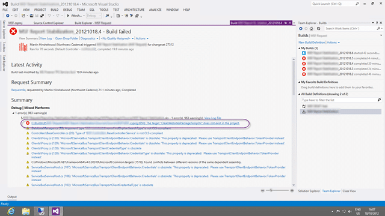
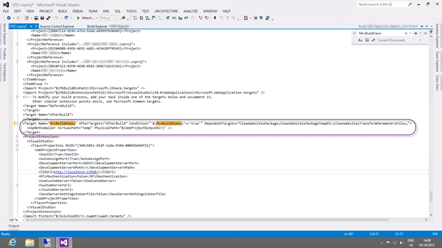

When you execute a build of a MVC3 or MVC2 project from 2010 in Team Foundation Build 2012 you get an error of “The target ‘CleanWorkspacePackageTempDir’ does not exist in the project”.

I was working with a customer that upgraded directly from Team Foundation Server 2008 to Team Foundation Server 2012 and that wanted to take advantage of the power of Continuous Integration. However their Solutions and Projects files we upgrades from previous versions of Visual Studio and this caused an interesting issue…

  
{ .post-img }
**Figure: The target “CleanWorkspacePackageTempDir” does not exist in the project**

### Applies to

- Team Foundation Build 2012
- ASP.NET MVC 2
- ASP.NET MVC 3
- ASP.NET MVC 3 Update

### Findings

After some time looking into what might be missing from the build server it looks like this is more due to MvcBuildViews conflicting with Web Deploy packaging:

- [Using MvcBuildViews with One-click Publish and Deployment Packages](http://21below.blogspot.com/2011/03/using-mvcbuildviews-with-one-click.html)
- [MVC3 project build fails because of web.config in obj folder](http://stackoverflow.com/questions/7388359/mvc3-project-build-fails-because-of-web-config-in-obj-folder)
- [Compiling MVC Views In A Build Environment](http://haacked.com/archive/2011/05/09/compiling-mvc-views-in-a-build-environment.aspx)

When we first installed the build server we did not add anything other than Visual Studio 2010 Ultimate to allow for building of out of the box applications. However, when we additionally needed to build and MVC3 application that is deployed to Azure we installed those tools and SDK’s using the recommended approach of using the [Web Platform Installer](http://www.microsoft.com/web/downloads/platform.aspx).

  
{ .post-img }
**Figure: Web Platform Installer install updates MVC and removes CleanWorkspacePackageTempDir**

This does however also install the Web Deploy packaging process as a pre-requisite and thus we have a new problem on out build server. Why you might ask?

Well, it looks like when you wanted to precompile your Views with MVC2 and you enabled “MvcBuildViews” you also had to add a “DependsOnTargets” attribute with “CleanWorkspacePackage; CleanWorkspacePackageTempDir; CleanWebsitesTranformParametersFiles;” to make it all work.

This was fixed by an update to MVC3 that even removed the targets. Hence the error… bummer…

So it looks like the CleanWorkspacePackage, CleanWorkspacePackageTempDir and CleanWebsitesTranformParametersFiles targets have been removed from the newer versions of the web targets file.

  
{ .post-img }
**Figure: At some point someone enabled MvcBuildViews**

So at some time in the past we wanted to enable MvcBuildViews and we added the following to our Project file:

While this worked at the time, it now caused the error that we saw.

While I initially fixed the issue, see solution below, for the MVC3 Azure build that we were trying to get working, there was a nock on affect on some of the other builds.

### Workaround – Uninstall to fix CleanWorkspacePackageTempDir in Team Foundation Build

You can try to uninstall the things that you added to the build server but this tends to be a red herring and the damage is almost always done when you install SDK’s. In addition you probably added those things for a reason and you probably still have that reason. Short of completely rebuilding the Build Server this almost never works…

### Workaround – Use old publish targets to re-enable in Team Foundation Build

As pointed out by the customer this should really have been the default, but the Azure and MVC teams have taken the approach to implicitly upgrade to the latest targets when they become available. The do however allow you to explicitly use the older targets.

As I can find no information on this online I will fall back on [Barry Schnell’s](http://www.linkedin.com/in/barryschnell) awesome investigation on the server itself to find out that the new updates created a new build target variable called “UseNewPublishTargets” that defaults to True. When this is set to true the newer version of “microsoft.web.publishing.targets” is used and the build will fail.

  
{ .post-img }
**Figure: Add the “/p:UseNewPublishTargets="false"” MSBuild Argument**

You can however set this variable to false by adding “/p:UseNewPublishTargets="false"” to the MSBuild Arguments in the Build Definition on Team Foundation Server.

### Solution – Remove target CleanWorkspacePackageTempDir for MSBuild in Team Foundation Build

It looks like the CleanWorkspacePackage, CleanWorkspacePackageTempDir and CleanWebsitesTranformParametersFiles targets have been removed from the newer versions of the web targets file and we just need to remove them from the Project file.

  
{ .post-img }
**Figure: So we can remove everything in the “DependsOnTargets”**

So we can now use the following without the “DependsOnTargets” directive:

This should solve the problem permanently, but make sure you test your application thoroughly…
