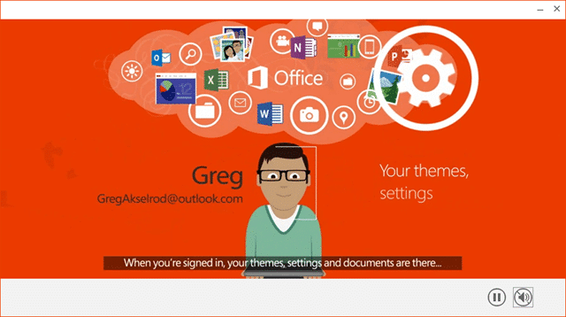
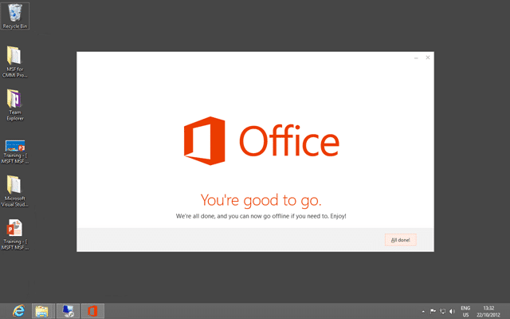
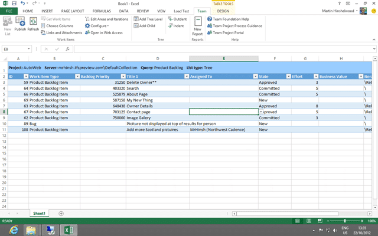

Because of the compatibility with ARM and the new Windows 8 touchscreen experience you would imagine that Office has undergone a rather complete overall and you would be right. With Office 2013 you get a fully touch capable immersive experience that is designed to work well on both the Tablet and the Desktop.

Indeed Office 2013 is the first and only application that is certified to work on both the ARM desktop & the PC Desktop.

I have been using the Technology preview for quite some time and I have found it to be both stable and much more useful. You can’t really put you finger on it, it is just… better…

While not usually though of as part of your Application Lifecycle Management (ALM) tooling in any modern application lifecycle it is essential.

### New things I like about Office 2013

Its the little things that I like. All those little touches go to improve the whole like no large features can. I guess they have taken this opportunity to improve some of the underlying engine parts. Like some of the improvements in Windows 8, they are fundamental…

- **Typing** – There is an awesome thing that happens when you are typing that you only see when you yourself are typing. Watching or explaining does not enable the understanding… only using does…
- **Less freezing** – While there is still a few areas that suffer from freezing, I am looking at you Outlook, there has been an overall improvement. Almost as if the Office team finally got time to read up on threading and asynchronous programming…

### The Install Experience

If you have Office 2013 Preview you will need to completely uninstall this first. If you “Start | ‘Unin’ | Settings | Uninstall a program” you should be able to put “2013” or “preview” into the search bar and complete the removal. And once you have it removed…

  
{ .post-img }
**Figure: Treated to the Office 2013 into video**

As usual there are tones of new things that you can do with Office 2013, no least of which is the [ability to log in with your Microsoft ID](http://blog.hinshelwood.com/allow-user-to-change-the-region-for-windows-live-id-billing/) and have all of your SkyDrive data at the tip of your fingers.

There are no install options and instead after the video you are just “done”. This is fine with me, and I think most people as everyone I know takes the default. Unless you were pushed for space, and lets face it, who is these days, then I just want to install everything anyway.

  
{ .post-img }
**Figure: You are good to go with Office 2013**

The install is so ridiculously easy that not a single person can get it wrong…

### Why PowerPoint 2013 is an ALM tool

You would not immediately consider PowerPoint 2013 to be an ALM tool, but it is, and a darn good one. You can easily mock up interactions or storyboards and use animations to express to either your Stakeholders or to your Development Team exactly what it is that you are trying to make.

  
{ .post-img }
**Figure: Storyboarding with PowerPoint 2013**

This is an invaluable tool in your arsenal and if you have access to at least the Microsoft Test Professional SKU for Visual Studio 2012 you can access additional tools to help you make your story boards awesome.

Installing the tools (available in Visual Studio 2012 Test Professional , Visual Studio 2012 Premium and Visual Studio 2012 Ultimate) give you access to many development Storyboarding Shapes and adds the ability to connect your Storyboarding to work items in TFS.

### Why Excel 2013 is an ALM tool

Team Foundation Server seamlessly integrates its operational store with Excel and this is the tool of choice when you are either bulk editing your work items, or if you are creating reports against the Data Warehouse and Cube. While the new web UI in Visual Studio 2012 is awesome, nothing can compete with the graphing, editing, functions and reporting that you can do right out of the box.

  
{ .post-img }
**Figure: Access your TFS operational store from within Excel 2013**

This makes Excel 2013 a premier reporting and data manipulation tool in the ALM space.

### Conclusion

The new Office 2013 gives us the same awesome tool is a slicker faster package and there is no way that I will be complaining about that…
