Now that SharePoint 2013 is out I want to make sure that I can integrate SharePoint 2013 with Team Foundation Server 2012 without any trouble. I and some of my customers have been holding off on deploying SharePoint; waiting for this release.

I previously posted on [Integrating SharePoint 2010 with Team Foundation Server 2010](http://blog.hinshelwood.com/integrate-sharepoint-2010-with-team-foundation-server-2010/) as it became available after the Team Foundation Server 2010 launch and now we are in the same position for SharePoint 2013. So what do you need to do to configure this integration… well not much. If you get the chance to install SharePoint 2013 first the Team Foundation Server 2012 installer will install and configure everything for you. So the only time you need to do this manually is if you are adding SharePoint 2013 to the mix post deployment.

- Related [Integrating SharePoint 2013 with Team Foundation Server 2013](http://nkdagility.com/integrate-sharepoint-2013-with-team-foundation-server-2013/)
- Related [Integrating SharePoint 2010 with Team Foundation Server 2010](http://blog.hinshelwood.com/integrate-sharepoint-2010-with-team-foundation-server-2010/)

So lets be about it…

### Run all Windows Updates before installing SharePoint 2013

Remember that this box already has [Windows Server 2012, SQL Server 2012 & Team Foundation Server 2012](http://blog.hinshelwood.com/installing-tfs-2012-on-server-2012-with-sql-2012/) as I previously posted about and where I found that SharePoint 2010 is not and would never be supported on Windows Server 2012. Now we can have SharePoint…

Installing updates are the one key step that will prevent tantrums from SharePoint and hair pulling from you. Always, and I do mean always, install of the required updates and ideally the optional ones too. And not just for Windows.

[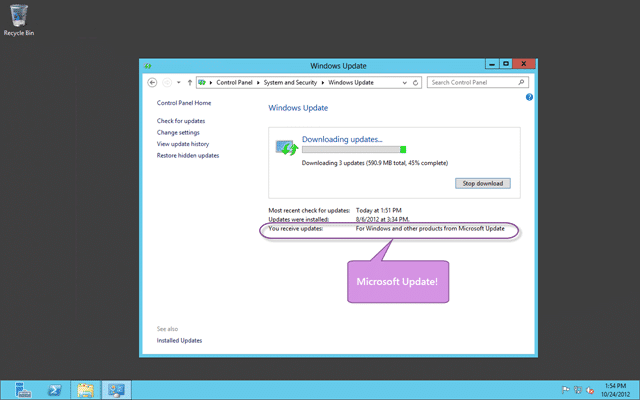](http://blog.hinshelwood.com/files/2012/10/image46.png)  
{ .post-img }
**Figure: Run all Microsoft & Windows Updates before installing SharePoint 2013**

Make sure that you are using “Microsoft Update” so that you get updates for other Microsoft products as well. Otherwise it will miss that Visual Studio or SQL Server service pack that you need. This may take a while, so get a cup of tea.

Note: I follow Microsoft internal policy and have all updates automatically installed at 3am with an auto-reboot. It just gets things done and no one forgets.

### Install SharePoint 2013

They have really slicked up the installation process for SharePoint, but you may open the ISO and think that running setup would be a good idea! You would be wrong…

  
{ .post-img }
**Figure: Don’t run setup for SharePoint 2013 from the ISO**

Instead use the auto-run that comes from running the CD directly, or you can just run the “prerequisiteinstaller” from the root first.

  
{ .post-img }
**Figure: Install the prerequisite for SharePoint 2013**

Once the prerequisites are complete you can start the installation proper and enter your key and accept the licence agreement. That's the simple stuff, now for the hard questions….

  
{ .post-img }
**Figure: A complete install is the only option for SharePoint 2013**

This is really the make or break fork… if you get this wrong you will be next completing an uninstall to pick the right option. See the red above? Avoid express at all costs and in this case we already have Team Foundation Server 2012 installed and  we already have SQL Server 2012 installed.

[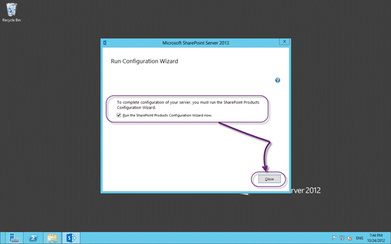](http://blog.hinshelwood.com/files/2012/10/image50.png)  
{ .post-img }
**Figure: Run the Configuration Wizard for SharePoint 2013**

The configuration wizard will lead you through the custom config but if like me you are running on a local computer with no domain, like me, then you will have to run a command line to generate the database before you proceed. Follow [Issue SharePoint 2013: The username is invalid. The account must be a valid domain account](http://blog.hinshelwood.com/issue-sharepoint-2013-the-username-is-invalid-the-account-must-be-a-valid-domain-account/) and you will be up and running in no time.

  
{ .post-img }
**Figure: Do not disconnect from the SharePoint 2013 farm**

Now that we have a farm we can complete the configuration. Just work though the wizard as you please, although you are on your own if you select kerberos… you know who you are…

SharePoint 2013 will then run though its 9 configuration steps and give you a functional, but blank SharePoint environment. At the end you get a simple Finish button and some instructions that you need to follow for getting your site to render in a browser.

Note: SharePoint now works just fine in Chrome and other non Microsoft browsers… woot!

Now that we have configured SharePoint 2013 we need to…erm… configure it? Again?

[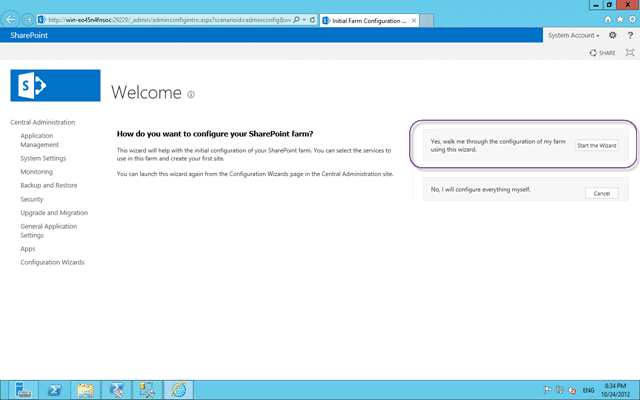](http://blog.hinshelwood.com/files/2012/10/image52.png)  
{ .post-img }
**Figure: Yes please don’t make me configure everything myself!**

At this point you get circa 20 services that you can chose to install or not. If you leave them all ticked then you will get about 10 new databases in SQL, but I always do leave them checked… Call me lazy but its too hard to figure out what the dependencies are and what you need and I really don’t want to configure anything later…if this was an enterprise deployment I would take more care but…

> Can we please get a better description for the services? Maybe with a nice link to what they are, what you get and what you don’t if you choose not to install/configure it. A description of “Performs automated machine translation” is just not good enough for the “Machine Translation Service”. WTF!  
> **\-Suggestion to SharePoint Product Team**

One you have chosen your fate you need to wait again while a little spinner does a little dance for you… no really… they are “Working on it…” and it “Shouldn’t take long” at all…

…mmm tea….

  
{ .post-img }
**Figure: Phooey… Errors in my SharePoint 2013 farm**

If you are unlucky like me you may have some errors to deal with, but for me, I forced a non domain account so I am only mildly irritated…and to be honest… I don’t really care for the purpose I am here for… I less I get more kablouie’s…

  
{ .post-img }
**Figure: Configure a root site and you are done**

At this point we can view our root site, but that is about it.

[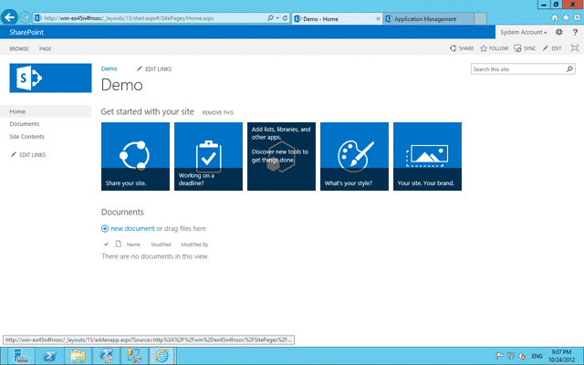](http://blog.hinshelwood.com/files/2012/10/image55.png)  
{ .post-img }
**Figure: New SharePoint 2013 Team Site**

And a nice site it is… but that's for another day..

### Configure Extensions for SharePoint Products

Now that we have SharePoint 2013 all configured we need to do two things. The first is to install and configure the Extensions for SharePoint Products so that SharePoint 2013 knows all about TFS 2012. If you have installed SharePoint on a separate server you will need to install the “Extensions for SharePoint Products” that are on the Visual Studio 2012 Team Foundation Server ISO, but if you have a single server environment like me it is all already there.

[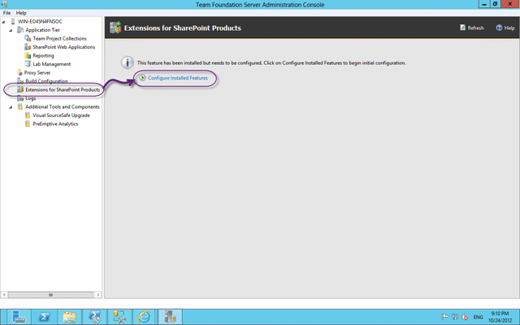](http://blog.hinshelwood.com/files/2012/10/image56.png)  
{ .post-img }
**Figure: Configure Extensions for SharePoint Products**

Lets first launch the wizard and walk through the process.

  
{ .post-img }
**Figure: SharePoint Extensions Configuration Wizard**

The wizard will lead you through the complicated and arduous list of steps… um… oh… only one step then 
{ .post-img }

  
{ .post-img }
**Figure: Oh FFS a TF255466. I require a reboot**

I will be right back…

  
{ .post-img }
**Figure: If the verification of the SharePoint configuration passes then configuration should work**

Now the extending and configuring processes can be long and will add solution into SharePoint. We already have the API’s for TFS by virtue of the install, but now we have the custom site and bits we need.

There will be a site template added but as it will likely look… well… nasty in the nice new SharePoint 2013 interface we will need to create the site manually.

[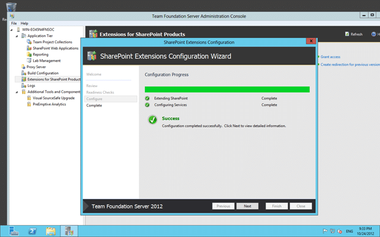](http://blog.hinshelwood.com/files/2012/10/image60.png)  
{ .post-img }
**Figure: Configuration completed successfully**

Now that the SharePoint bits have been setup we will have a default link setup between SharePoint and Team Foundation Server. Although if we had a separate Team Foundation Server instance we would need to tell it where the TFS server is.

Note: You will also require to install the Extensions for SharePoint Products on every front end server for your SharePoint farm.

[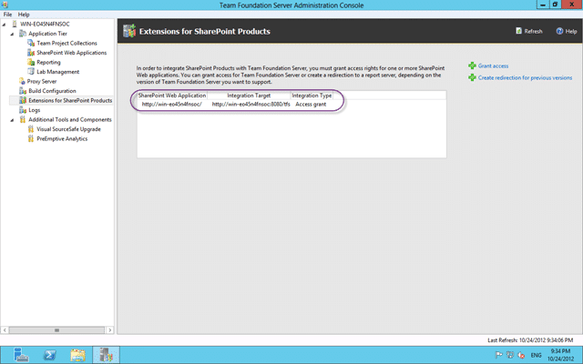](http://blog.hinshelwood.com/files/2012/10/image61.png)  
{ .post-img }
**Figure: Default mapping has been configured**

### Configure SharePoint Web Applications in Team Foundation Server 2012

Now we have installed and configured the bits for SharePoint as well as telling it where the TFS server is we now need to tell TFS where to go.

Again… as this is a single server this has been done for you (I love the TFS Product Team).

[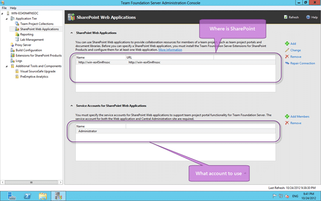](http://blog.hinshelwood.com/files/2012/10/image62.png)  
{ .post-img }
**Figure: Configure SharePoint Web Applications**

You may have noticed that there is no account listed as an administrator! As I am lazy and I am using the BuiltinAdministrator user as both the TFS Service Account and the SharePoint Farm Admin you don’t need one.

And that's almost us done! But not quite complete… SharePoint knows all bout TFS and TFS now knows all about SharePoint so we can now create some sites…

### Configure Collection Site

In order to have different sites for different collection and enable the ability to have the same Team Project name in multiple collection then you need to create a root collection site under the main site. Some folks like to create this at the ^/sites/\[collection\] level, but I always create the collection site as a sub site of the root. This have the benefit of creating automatic navigation between the sites…

[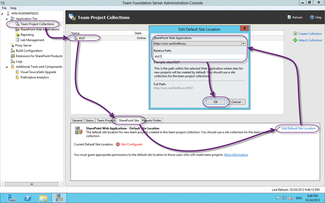](http://blog.hinshelwood.com/files/2012/10/image63.png)  
{ .post-img }
**Figure: Configure the TFS Collection default SharePoint site**

This is also the final test as when you click OK the Admin Console will go off and try to hook into, or create a site for us. if you do want to have a greater degree of separation between the sites and have them in different collections you can indeed do that as well. You may want to do that if you are planning to separate collection to multiple environments, but I can think of very few reasons that you would want to do that.

### Create a new Team Project Site

If we create a new team project the template from the Process Template that you selected will be used to create the new site. These templates are designed to work in any version of SharePoint but they may look… well… nasty in 2013.

  
{ .post-img }
**Figure: I have one Team Project called “Demo1”**

This team project was created before there was ever a SharePoint server so it has no portal. Lets go ahead and create one manually.

They have moved things around a little in SharePoint and we now create new sub sites from the “View Content” menu.

[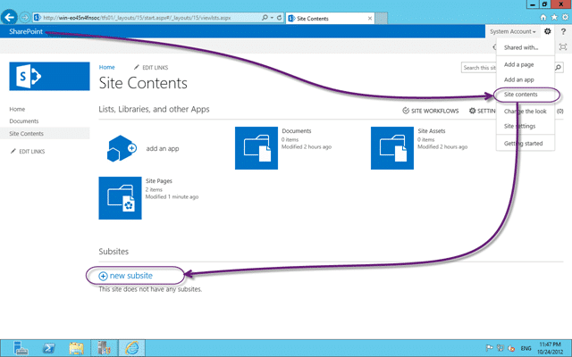](http://blog.hinshelwood.com/files/2012/10/image65.png)  
{ .post-img }
**Figure: Create new sub site from the Site Content page in SharePoint 2013**

This, while much more hidden is really not something you do every day. You are much more likely to be adding apps to an existing site so having this more clicks away is not a big deal.

  
{ .post-img }
**Figure: Team Foundation Project Portal for SharePoint 2013**

When we care the new site we have two options. We can create it using the provided “Team Foundation Project Portal” bit it results in a slightly ugly site, or you can use the default “Team Site” template to get a more native 2013 feel.

  
{ .post-img }
**Figure: The Team Foundation Project Portal is a little empty**

This is due to the features not yet being enables… so head on over to “cog | Site Settings | Site Actions | Manage site features” to enable them.

You can enable one of:

- **Agile Dashboards with Excel Reporting** – for the MSF for Agile Software Development 6.x Process Template
- **CMMI Dashboards with Excel Reports** – for the MSF for CMMI Software Development 6.x Process Template
- **Scrum Dashboards with Reporting** – for the Visual Studio Scrum 2.xRecommended Process Template

The one you pick depends on the Process Template that you used to create the Team Project. I will activate the Scrum one as I used the Visual Studio Scrum 2.0Recommended Process Template which I heartily recommend. You will have noticed that here are 2 or 3 for each of the “Agile | SMMI | Scrum” monikers and this is due to the different capabilities that you might have. For example:

- **Agile Dashboards** – I have TFS with no Reporting Services or Analysis Services
- **Agile Dashboards with Basic Reporting** – I have Reporting Services and Analysis Services but not SharePoint Enterprise
- **Agile Dashboards with Excel Reporting** – I have Everything! Reporting Services, Analysis Services and SharePoint Enterprise

If you enable the highest level of the one you want it will figure out the one that you can run  and in this case I can do “Scrum Dashboards with Reporting”.
{ .post-img }

[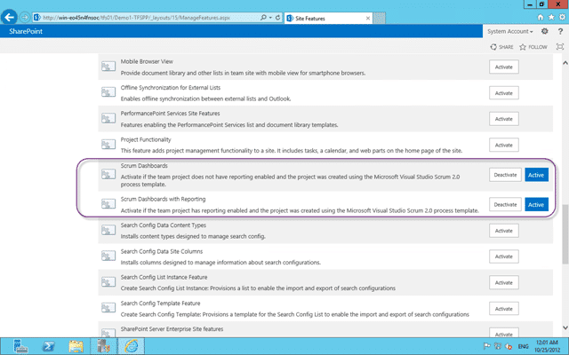](http://blog.hinshelwood.com/files/2012/10/image68.png)  
{ .post-img }
**Figure: Enabling Scrum Dashboards with Reporting in SharePoint 2013**

The Scrum template does not have any built in Excel Reports, but it does have Reporting Services reports. Now when I return to the homepage I get the same/similar portal you would have seen in SharePoint 2010.

  
{ .post-img }
**Figure: The Scrum Dashboard in SharePoint 2013**

### Conclusion

And that's us done… we have installed and configured SharePoint 2013. We have integrated SharePoint 2013 with Team Foundation Server 2012 and we have manually created our Team Project Portal site.

Note: If you create a new Team Project the SharePoint 2013 portal will be created for you and pre-actived.

Awesome… go forth and 2013!
