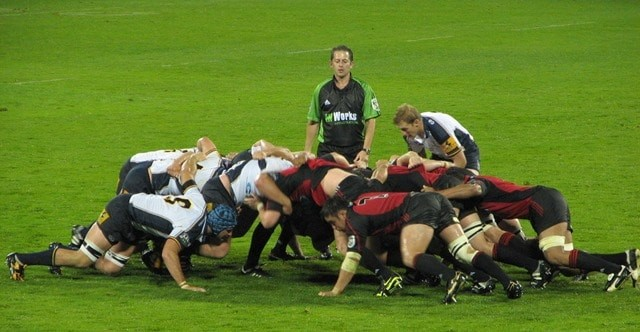
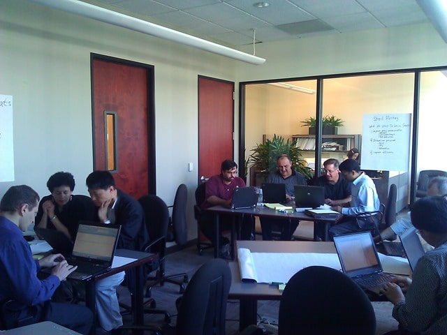
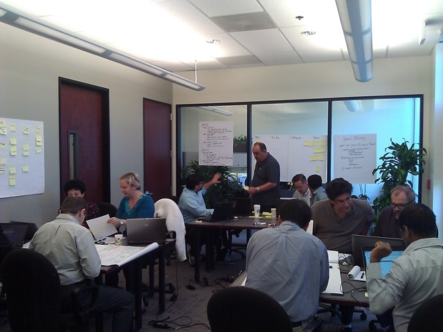
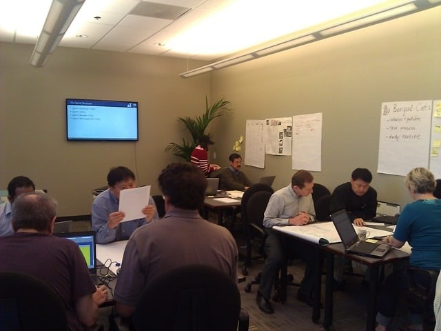
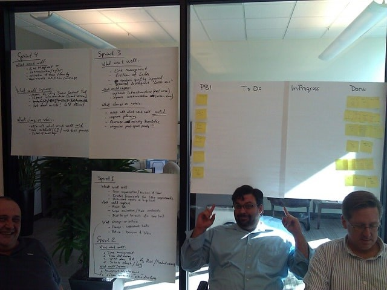

Professional Scrum Foundations is my favourite course to teach as it balances fun and learning with practical experience.The [Professional Scrum Foundations](http://blog.hinshelwood.com/training/) course is from [Scrum.org](http://scrum.org) and, over two days covers all of the core concepts of Scrum.

With the core learning objective being Self-Organisation, the course is broken into 4 sprints with respective lecture. But the value is in the order, the sprints always come first. Remember that this course is not just for coders, or even the Development Team. It is the venue for all of the people in your organisation, no mater where they are or what they do, that are involved in ay way, no mater how loosely , with the software development and delivery cycle to get a taste of what might be required of them for the process to be successful.

When I ran the [Professional Scrum Foundations in Salt Lake City, Utah](http://blog.hinshelwood.com/professional-scrum-foundations-in-salt-lake-city-utah/) I had everyone from the CIO to the Development Team through to the Stakeholder that would be providing feedback. You need all of these folks involved to be successful…

### Team Identity in Professional Scrum Foundations

For most Scrum based courses I always see students broken down into smaller teams that are designed to work together and this is no exception. I had 16 students and I ended up with:

- Bengal Cats
- Lamas
- Giraffe Dinosaur
- Stupid Monkey

While these teams seam silly they are meaningful to creating a “team” mentality. Think of the game of Rugby where the team needs to work together to do battle for possession of the ball…

  
{ .post-img }
**Figure: The battle for possession of the ball**

…And then once they obtain possession to move as one up the field to gain ground until the next Scrum. The Rugby Scrum and ceremony of the same name in the process perform the same function and is the inspect and adapt for the team to figure out how to move as one to the goal based on what they have currently achieved.

We need well practiced, tight nit teams to be able to do this…

### Team Stupid Monkey

Once the teams are formed there is always the obligatory  “What do you want to learn”. To be honest it is always the same at the start of the course and really services and an ice cutter or conversation starter.

")  
{ .post-img }
**Figure: Team Stupid Monkey’s What we want to learn list**

The beauty of the Professional Scrum Foundations course is that everything is the other way around from what the attendees are expecting. Remember this is a practical course designed to invoke both mussel memory for the process and instil unto the team a “We can do this” mentality that no amount of lecture can.

To achieve this we need to get them actually building software, yes building software during the two day course , remember this is not a theory course…
{ .post-img }

### Sprint 1 – Yes, ship in 30 minutes!

All software projects start with Sprint 1 and all Sprint 1’s should deliver some amount of working software.

  
{ .post-img }
**Figure: Sprint 1 in the Professional Scrum Foundations course**

I usually just throw the teams into building their first increment right of the bat and see how they do with little or no direction  I know… meanie… but it does show something... it shows that you can indeed build software with little or no direction except for a list of wants and needs of users. It is that easy….
{ .post-img }

…Do you build good software? No, of course not, but you are able to get started and show stakeholders and users that you are indeed able to deliver. You build that trust sprint on sprint with early feedback and the most relevant software for your users will emerge from your backlog into your software.

I have never had even a single team fail to deliver in Sprint 1 but some deliver more and other less… it is about the learning, not just the doing and after Sprint 1 we delve into the wonderful world of the Scrum framework, as well as the Roles, Artefacts and Events that are part of that framework.

### Sprint 2 – Now I know what I am doing

Sprint 2 is usually the best Sprint of the Professional Scrum Foundations course. Now that the teams know a little of what is expected of them they start to conform to the framework as a set of scaffolding around which they begin to build their own process for delivering software. This is the main reason that Scrum is not considered a methodology. It does not provide the details on how to achieve the goal, only a core set of guiding rules within which we are reasonably sure we are still heading in the right direction.

  
{ .post-img }
**Figure: Sprint 2 in the Professional Scrum Foundations gets structure**

Now teams have built a Scrum Board and are guided, but not instructed, towards using it to control their flow and maintain a running total of the work that is remaining to complete the Sprint. As with production Sprints we do both a Sprint Review and Retrospective.

The Sprint Review is where we analyse what was completed and how we need to modify the backlog so that it still reflects what we have left to do to achieve the goal/vision. This is the inspect and adapt opportunity for both the Product Owner and to a greater extent the Stakeholders. Yes… Stakeholders should be at the Sprint Review… indeed you should invite everyone and anyone that will fit in the room. This is the last Inspect & Adapt cycle before you move in to the next Sprint and thus the only chance for stakeholders to their feedback head and the backlog re-ordered. Well, until the next sprint…

### Sprint 3 – Strategy in addition to structure

Sprint three is usually where teams suffer. They now know too much and begin to over think things but they will however get over it and it is an excellent learning experience.

  
{ .post-img }
**Figure: Sprint 3 in the Professional Scrum Foundations gets strategy**

After another awesome Sprint we discussed many of the strategies that go into a successful Scrum implementation. It is not enough to follow the framework. Its not enough to add to create your own methods around that framework. You need additional strategies like Planning Poker, Story Points, Emergent Architecture, Test First-Development, Acceptance Test Driven Development & Continuous Delivery all add to your ability to deliver working high quality software in just 30 days. Do you need to do all of them? No, but you do need to adopt the ones that make sense for your company, your environment and your delivery cadence.

### Sprint 4 – The curveball

Hitting sprint 4 we now have a bunch more information on what it is that we need to do to help us deliver software quickly with the desired quality level. Some teams are now leveraging Scrum Masters and Scrum Boards effectively while others are doing Planning Poker. They are starting to identify impediments and find their own solutions for then. Wither it is limited development resources or collaboration impediments or anything else that is preventing the teams from delivering they are solving the problems themselves. Occasionally they ask questions of me, the coach, and occasionally I even answer them.

  
{ .post-img }
**Figure: The final Sprint of the Professional Scrum Foundations**

We then head into the world of how to get started with this Scrum thing and how to maintain it going forward. How do we prevent ourselves falling back into old habits? How do we identify the things that we need to do to change effectively?

### Conclusion

The actionable backlog is the single most valuable output from the course. With the requirements fresh in their mind and a fresh understanding of what the impediments are going to be the teams create actionable things that need to be done in order to implement Scrum in their organisation.

- Executive sponsorship of new process needs to be clear to everyone
- Select a Project for pilot Scrum implementation
- Train Business to break PBI’s down into smaller chunks
- Create a passion for Unit Testing
- Clearly define coding standards

And these are but a few of the items that you may find on this backlog. As long as you take this backlog, which represents the things that your employees see as being required for success, and execute on it then you should have a chance at success.

Nothing in life is guaranteed…
