I have recently been playing a lot with the new Office 2013 release and part of that is Project Server 2013. With the new Project Server Extensions being an integral part of any enterprise Team Foundation Server deployment I thought that I should kick the tires.

Update - I have figured out my blocking issue and resolved it. See [Project Server 2013 Issue – TF294012: Cannot access the following enterprise project](http://blog.hinshelwood.com/project-server-2013-issue-tf294012-cannot-access-the-following-enterprise-project/ "Project Server 2013 Issue – TF294012: Cannot access the following enterprise project")

I usually have a complete abhorrence of Project Server that is born of its constant misuse. Project Server is first and foremost an **_earned value_** management system, although many people try to use it to facilitate micro-management or to do time tracking. Neither of these things are a good idea regardless of tool and time tracking while loosely supported by Project Server 2013 is not meant to be done there. Don’t get me wrong, there value in time tracking; How else might you amortise or capitalise your development costs? But you do not however need to account explicitly for every hour nor use it to punish employees for not logging enough hours…

Anyway.. There are a bunch of thing that need to happen in order to get Project Server 2013 up and running, first of which is actually installing SQL, TFS and SharePoint which I will just link to and get on with the real meat:

1. [Installing TFS 2012 on Server 2012 with SQL 2012](http://blog.hinshelwood.com/installing-tfs-2012-on-server-2012-with-sql-2012/)
2. [Integrate SharePoint 2013 with Team Foundation Server 2012](http://blog.hinshelwood.com/integrate-sharepoint-2013-with-team-foundation-server-2012/)
3. DONE – Install, configure & configure Project Server 2013
4. DONE – Set-up Project Server 2013
5. DONE - Install Team Foundation Server 2012 Project Server Extensions
6. DONE - Integrate Project Server 2013 with Team Foundation Server 2012

I found the MSDN documentation for installing and configuring Project Server 2013 totally cryptic and I ended up with so many read hearings and dead ends that I had to just figure it out for myself. This is the result of me poking at Project Server 2013 until I got a stable instance which I then blew away to repeat here  
{ .post-img }

### Install Project Server 2013

Just like with SharePoint 2013 you have three stages to the process. Install, Configuration and Configuration… What? Yea, In know… don't ask…

I am going to lump the first two items together and they are the only two bits that need to be done on every front end server in your farm. They install and prep your SharePoint 2013 servers for creating your first Project Server Portal which is done one or more times through the SharePoint 2013 Administration Portal.

  
{ .post-img }
**Figure: The Project Server 2013 installation wizard looks just like SharePoint 2013**

You will have deja vu when you see the install as it follows the SharePoint 2013 pattern. make sure that you install the prerequisites first to have an easy time.

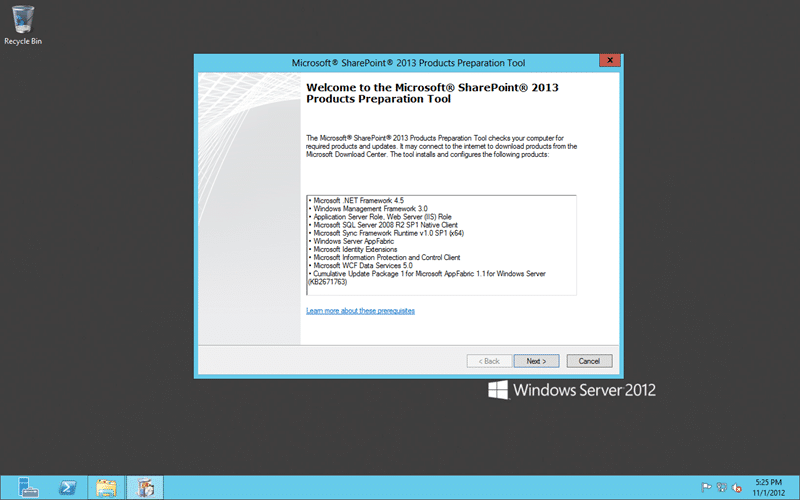  
{ .post-img }
**Figure: Install the Prerequisites for Project Server 2013 using the built in tool**

Some of the prerequisites for Project Server 2013 are the same as the SharePoint 2013 ones so the checks and installs are few and far between:

- Microsoft .NET Framework 4.5
- Windows Management Framework 3.0
- Application Server Role, Web Server (IIS) Role
- Microsoft SQL Server 2008 R2 SP1 Native Client
- Microsoft Sync Framework Runtime v1.0 SP1 (x64
- Windows Server AppFabric
- Microsoft Identity Extensions
- **Microsoft Information Protection and Control Client**
- Microsoft WCF Data Services 5.0
- **Cumulative Update Package 1 for Microsoft AppFabric 1.1 for Windows Server (KB2671763)**

There were only a couple of installs that I have highlighted above.

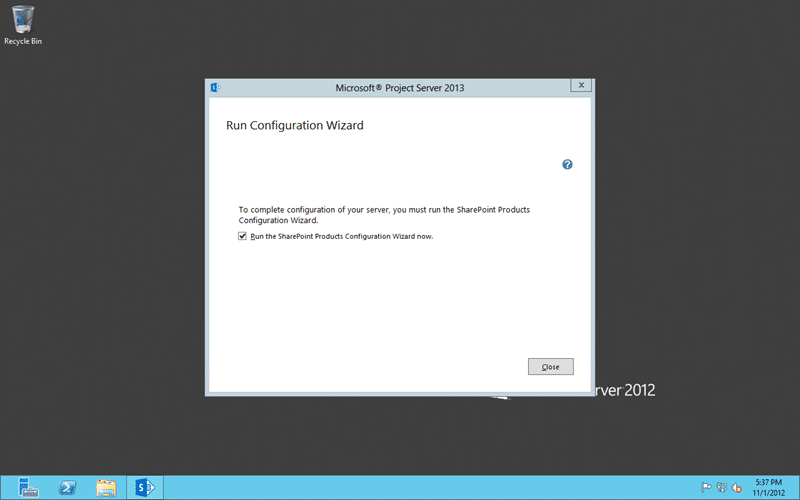  
{ .post-img }
**Figure: Run the Configuration Wizard to complete the installation of Project Server 2013**

With the first step complete we can now run the first configuration that will integrate the bits that we just installed into SharePoint and make sure that SharePoint at least accepts them.

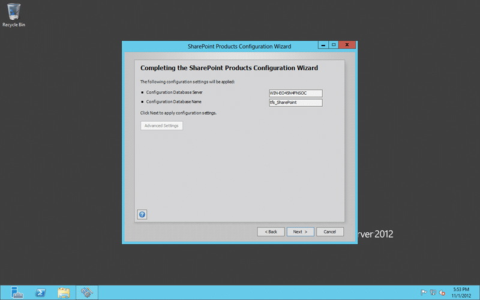  
{ .post-img }
**Figure: Limited configuration for Project Server 2013**

We are really just running the exact same SharePoint wizard, but with an additional step.

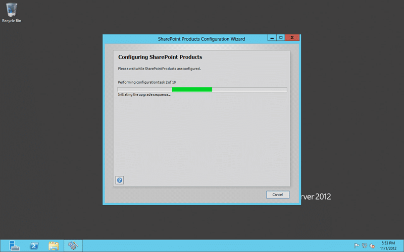  
{ .post-img }
**Figure: The 10 step configuration process for SharePoint & Project Server 2013**

When we ran the SharePoint 2013 configuration when we only had SharePoint installed we only had 9 steps, now we have 10… some secret sauce…

And that is the per-server configuration complete.. on to the SharePoint configuration…

  
{ .post-img }
**Figure: The other configuration wizard for SharePoint & Project Server 2013**

Now we can move onto the configuring the services that run inside of SharePoint. This config only needs to be run once per farm.

  
{ .post-img }
**Figure: Adding Project Application Services for SharePoint 2013**

I have no idea what this step does except that at the end of this one you get about 20 more databases in your SQL Server. This time however I am only expecting the one new Project Server databases and configuration to be added.

### Set-up Project Server 2013

Phew.. so that means that we can get down and dirty with Project Server 2013 now? Well… no… not yet. We need to configure a couple of the things that we have just provisioned so head on over to the SharePoint Administration page.

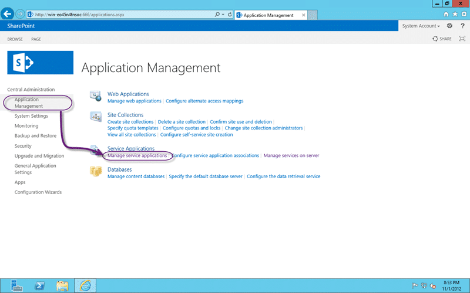  
{ .post-img }
**Figure: Manage service applications for SharePoint 2013**

Head on over to “Application Management | Manage service applications” to see a list of all of the “Applications” that are available as part of the core SharePoint 2013 deliverable.

  
{ .post-img }
**Figure: Configure the Project Server Service Application**

We have just added one called “Project Server Service Application” and that is where we are going now.

[****](http://blog.hinshelwood.com/files/2012/11/image9.png)  
{ .post-img }
**Figure: Create Project Web App Instance**

Now that we are deep in the darkest depths of SharePoint we can create a new Project Web App instance. This will essentially create a new site that will be an instance of the Project Server 2013 UI application that lets us look inside of the project server data.

  
{ .post-img }
**Figure: Defaults for Create Project Web App Instance in Project Server 2013**

I am just taking the defaults here, but it is effectively saying that I want to create a new site called “PWA” under the default portal and where I what the database to go and what it should be called. As with all sites you can set quotas at this point, but I don’t need to on a demo box.

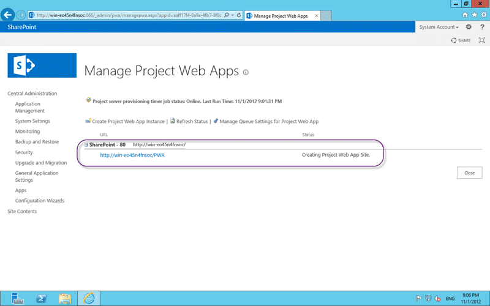  
{ .post-img }
Figure:

Once you click OK you will go back the  provisioning page where you can monitor the background process that is doing a bunch of goodness knows what behind the scenes. It takes a few minutes but goes through:

1. Waiting for Resources
2. Creating Project Web App Site
3. Provisioning Database
4. Configuring the new Project Web App Site
5. Provisioned

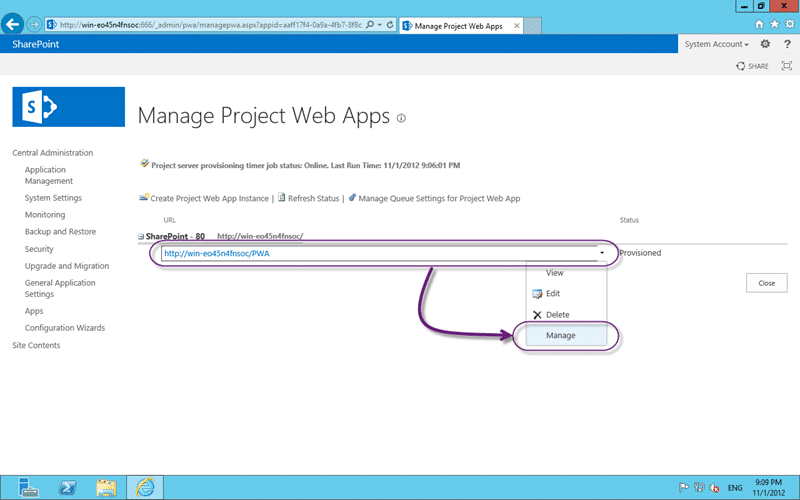  
{ .post-img }
**Figure: You can mange the sire that you created for your Project Server 2013 instance**

You can get into the individual Project Web App configuration and settings by selecting the drop-down and hitting the “Mange” option.

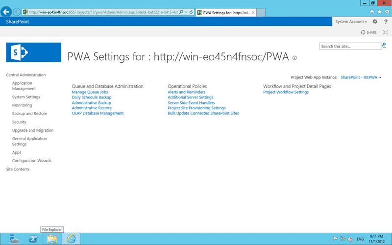  
{ .post-img }
**Figure: Operational Policies, Queue and Workflow settings for Project Server 2013**

I am not really interested in tinkering with these options, but I am sure that in a production / live deployment I would need to tweak some mystery undocumented setting to make things shine 
{ .post-img }

Let visit our new portal…

  
{ .post-img }
**Figure: Project Server 2013 portal homepage in SharePoint 2013**

I am sure that I will be back to set something up later, but just look at that modern goodness…

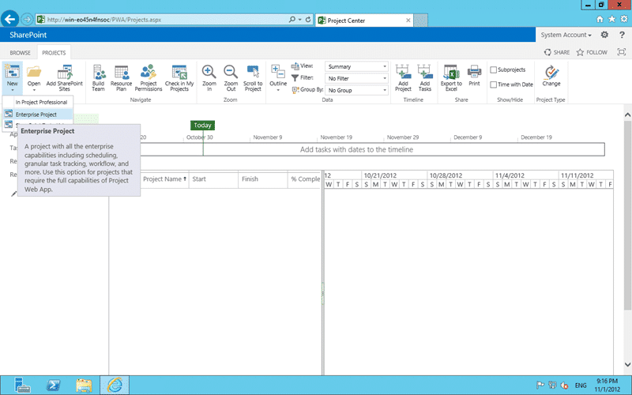  
{ .post-img }
**Figure: Setting up your first Project in Project Server 2013**

Done – We have successfully installed, configured, configured, deployed and provisioned our first SharePoint 2013 portal for Project Server 2013… now for TFS…

### Install Team Foundation Server 2012 Project Server Extensions

Now that we have Project Server 2013 all set-up we can look to getting it integrated with Team Foundation Server. In order to achieve that we need to both install and configure some extensions. These extensions are similar to the SharePoint Extensions for Team Foundation Server 2012 and need to be installed on all of the front end servers in your SharePoint farm that is supporting Project Server 2012.

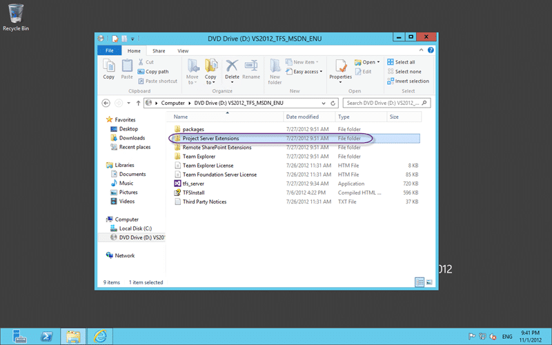  
{ .post-img }
**Figure: The Project Server Extensions are on the TFS 2012 ISO**

On the Visual Studio 2012 Team Foundation Server ISO there is a folder that contains the goodies that we are looking for.

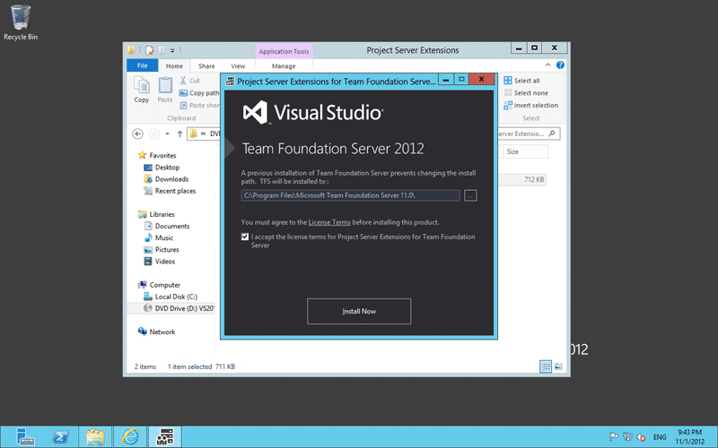  
{ .post-img }
**Figure: Project Server Extensions for Team Foundation Server 2012**

Well that was easy… the install detects Project Server 2013 and completes without any hassle.

### Integrate Project Server 2013 with Team Foundation Server 2012

We now need to [Enable Data Flow Between Team Foundation Server and Microsoft Project Server](http://msdn.microsoft.com/en-us/library/gg455680.aspx) and effectively plug the correct part of our TFS Team Project into the correct Project in Project Server.

There are five mini tasks that we needs to perform to get the data flowing:

1. Register an instance of PWA
2. Map the PWA instance with a team project collection
3. Upload default field mappings
4. Associate an enterprise project plan with a team project
5. Add team members to the enterprise resource pool

The first three are easy as I have everything ready…

```
TfsAdmin ProjectServer /RegisterPWA /pwa:http://win-eo45n4fnsoc/PWA /tfs:http://win-eo45n4fnsoc:8080/tfs/
TfsAdmin ProjectServer /MapPWAToCollection /pwa:http://win-eo45n4fnsoc/PWA /collection:http://win-eo45n4fnsoc:8080/tfs/tfs01
TfsAdmin ProjectServer /UploadFieldMappings /collection:http://win-eo45n4fnsoc:8080/tfs/tfs01 /useDefaultFieldMappings

```

**Figure: Register, map to collection and load mappings**

The next has some prerequisites. I need a Team Project and a Project Plan in Project Server 2013.

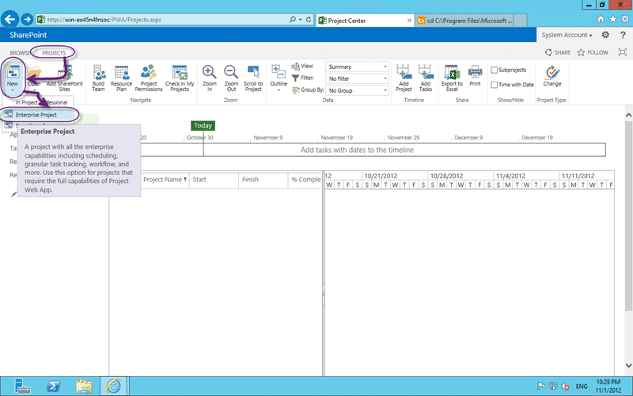  
{ .post-img }
**Figure: Create an Enterprise Project Plan to start us off**

Create the Enterprise Project Plan, give it a name and same it to start the process.

  
{ .post-img }
**Figure: I now have a MyFirstEP in Project Server 2013**

With that new Enterprise Project Plan created I now need to create a Team Project in Team Foundation Server to map it to.

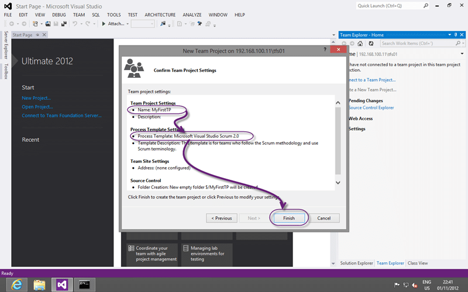  
{ .post-img }
**Figure: Creating MyFirstTP is just as easy in Team Foundation Server 2012**

Now all we need to do is take both the names and stick them together with the key Work Item Types that will be managed. In the case of the Visual Studio Scrum template it would be the Product Backlog Item, Task & Bug.

Why Bug you might ask… well the Product Owners are going to be ordering Bugs along with PBI’s to reflect what needs to be done so they should be part of the rollup. Even if you are not pushing these Bugs to Project Server you do need the system to roll up any sub data. For other Process Template and for custom ones check the “Requirements Category” and the “Task Category” in the categories XML file for the full lists.

```
TfsAdmin ProjectServer  /MapPlanToTeamProject 
                        /collection:http://win-eo45n4fnsoc:8080/tfs/tfs01/ 
                        /enterpriseproject:MyFirstEP 
                        /teamproject:MyFirstTP 
                        /workitemtypes:"Product Backlog Item,Bug,Task"

```

**Figure: Wire up the two containers**

Now you don’t need to run these commands against the TFS Server from the server itself. In fact if, like me, you never install Visual Studio or even Team Explorer onto your TFS server then you will need a client box to do this from.

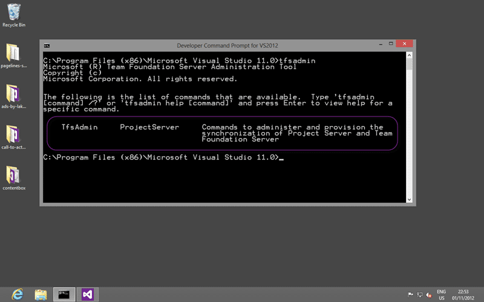  
{ .post-img }
**Figure: The TfsAdmin command has the magic sauce**

In running those commands I ran into a little fun. After all this is the crescendo to all that we have been set to and where else would murphy strike if here! So I dutifully got the trunsion out to sort out both Project Server and TFS:

- [Project Server 2013 Issue – TF294003: Cannot access the following PWA instance](http://blog.hinshelwood.com/project-server-2013-issue-tf294003-cannot-access-the-following-pwa-instance/)
- [Project Server 2013 Issue – TF294026: The following work item field does not exist](http://blog.hinshelwood.com/project-server-2013-issue-tf294026-the-following-work-item-field-does-not-exist/)

Running the last command.. the one to match up the Team Project with the Enterprise Project plan I ran into an error that I have not yet been able to fix.

> TF294012: Cannot access the following enterprise project: MyFirstEP. Verify that the project exists, has been published and that the necessary permissions have been granted to the service account for the team project collection to access the project.

This completely blocked me for a while as the documentation is rather confusing and the defaults in Project Server 2013 mean that the options that you require do not even exist and you need to change the Project Server security model for it to work.

- [Project Server 2013 Issue – TF294012: Cannot access the following enterprise project](http://blog.hinshelwood.com/project-server-2013-issue-tf294012-cannot-access-the-following-enterprise-project/)

### Conclusion

Just because I am blocked on my test environment does not mean that while not encompassing all of the options this should give you a start into creating Enterprise Project Plans in Project Server 2013 and syncing data between it and Team Projects in Team Foundation Server 2012.

It is not the easiest thing in the world to integrate Project Server 2013 with Team Foundation Server 2012 but the benefits, when coupled with solid agile processes can be powerful. Leaving the Tasks to the Development Team and the low level PBI’s to the Product Owner and concentrating on organising and ordering the big rocks can be hard for many PMO offices that are use to task down management, but it is necessary. Your teams can and will surprise you.


