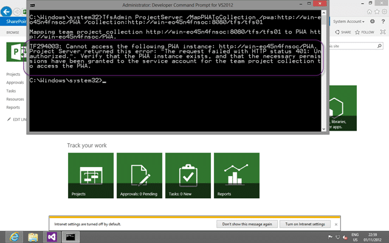
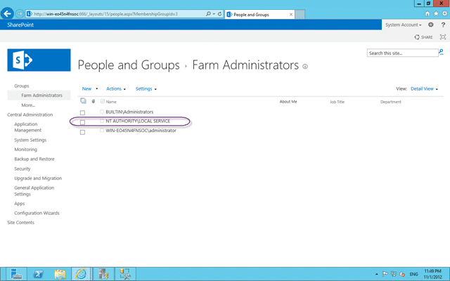

When you try to call the binding command to map a Team Project Collection in Team Foundation Server 2012 to a Project Server 2013 Web Instance you can get a “TF294003” error.

  
{ .post-img }
**Figure: TF294003: Cannot access the following PWA instance**

You get:

> TF294003: Cannot access the following PWA instance: [http://win-eo45n4fnsoc/PWA](http://win-eo45n4fnsoc/PWA "http://win-eo45n4fnsoc/PWA") Project Server returned this error: "The request failed with HTTP status 401: Unauthorized.". Verify that the PWA instance exists, and that the necessary permissions have been granted to the service account for the team project collection to access the PWA

### Applies to

- Project Server 2013
- Team Foundation Server 2012
- Project Server Extensions for Team Foundation Server

### Findings

If you have followed all of the directions in [Assign Permissions to Support Integration of Project Server and Team Foundation Server](http://msdn.microsoft.com/en-us/library/gg412653.aspx#GrantTFSPermissions) but but you are still having issues you should check:

- [TF294003: Cannot access the following PWA instance](http://social.msdn.microsoft.com/Forums/en-US/tfsprojectsrvint/thread/254feac8-806e-4677-9784-3e5df31f4f44/)

After consulting with that and many other sites I went spelunking on the servers and following all of the leads in the aforementioned sites. As it turns out I installed Team Foundation Server 2012 with the default options and this resulted in TFS running under the “NT AuthorityLocal Service” which does not have permission to SharePoint.

I was concentrating so much on making sure that the “BUILTINAdministrator” account, that I am using for everything else, has permission that I missed the account that TFS was using.

### Solution

In this case it was simple to change the service account for Team Foundation Server to be the “BUILTINAdministrator” account instead of the “NT AuthorityLocal Service”.

  
{ .post-img }
**Figure: Changing the TFS Account is easy**

As I change the account TFS will nicely go off and update everything else for me. Including the Farm Administrators group.

  
{ .post-img }
**Figure: Updating the TFS Service Account everywhere**

This got me to thinking that is I changes it back to “NT AuthorityLocal Service” it would do the same, and sure enough…

  
{ .post-img }
**Figure: Local Service is now a Farm Administrator**

I can almost hear generations of SharePoint administrator rolling over in their graves at this, but this is a demo box that I am using to prove out the technology and not a production setup . You should always use a different Domain Account for every individual service in both TFS and SharePoint if it were…
{ .post-img }

  
{ .post-img }
**Figure: The mapping of Collection to Project Server 2013 Instance now works**

This was a simple solution to a confusing problem…
