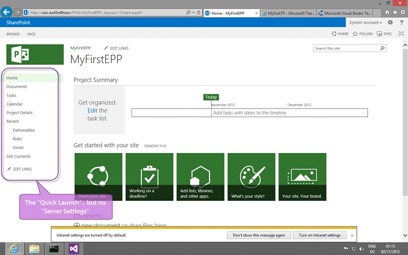
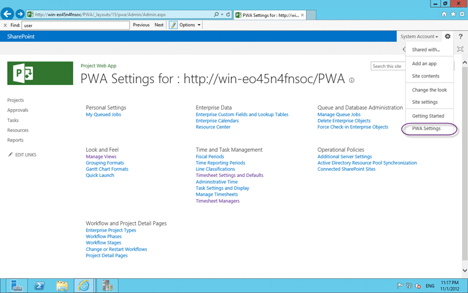
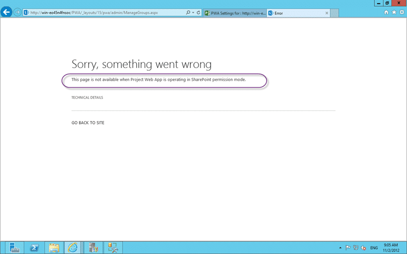

When you try to map an individual Enterprise Project to a specific Team Project you get a TF294012: Cannot access the following enterprise project error that you can’t resolve.

  
{ .post-img }
**Figure: TF294012: Cannot access the following enterprise project**

With the message:

> _TF294012: Cannot access the following enterprise project: MyFirstEP. Verify that the project exists, has been published and that the necessary permissions have been granted to the service account for the team project collection to access the project._

Following the documentation does not help.

### Applies to

- Project Server 2013
- Team Foundation Server 2012
- Project Server Extensions for Team Foundation Server

### Findings

If you look at the documentation you will see an instruction over and over again that will frustrate the hell out of you!

> _From the home page for PWA, in the Quick Launch area, click Server Settings._

But no matter how much you look you cant find “Server Settings”.

  
{ .post-img }
**Figure: So where is that Server Settings on the Quick Launch in Project Server 2013**

You expect it to be in the Quick Launch as noted, but it is devoid of anything that looks like “Server Settings”. So in your despair you start hunting for any sort of settings and combing through every piece of text and hover that you can find.

  
{ .post-img }
**Figure: Oh..Oh.. “PWA Settings”?**

But no… not there… I don't see the required “Manage Categories” or “Manage Users” options.

  
{ .post-img }
**Figure: There is always Site Setting in SharePoint 2013**

But no… not there either… I still don't see the required “Manage Categories” or “Manage Users” options.

After some moping around and a little self mutilation I finally got a hold of a working Project Server 2010 instance and stole the URL to the Manage Groups page.

- [http://win-eo45n4fnsoc/PWA/\_layouts/15/pwa/admin/ManageGroups.aspx](http://win-eo45n4fnsoc/PWA/_layouts/15/pwa/admin/ManageGroups.aspx "http://win-eo45n4fnsoc/PWA/_layouts/15/pwa/admin/ManageGroups.aspx")

So if you add “/PWA/\_layouts/15/pwa/admin/ManageGroups.aspx” to the URL and hit it we get…

  
{ .post-img }
**Figure: This page is not available when Project Web App is operating in SharePoint permission mode**

Now I have something to look for!

So I looked through all of the instructions for  [Enable Data Flow Between Team Foundation Server and Microsoft Project Server](http://msdn.microsoft.com/en-us/library/gg455680.aspx) and could not find any information on the Permissions 
{ .post-img }

But it does look like there are two permission modes that you have to choose between when you create your Collection and I must have chosen “SharePoint Permission Management” when I needed “Classic Permission Management”.

Now why did I not know that 
{ .post-img }

### Solution – Switch to SharePoint Permission Management

You can switch the permissions at the Project Server level but there are warnings all over the place that this will delete all permissions and you would need to build them manually .
{ .post-img }

- [Change permission management in Project Web App for Project Online](http://office.microsoft.com/en-us/office365-project-online-help/change-permission-management-in-project-web-app-for-project-online-HA103433509.aspx)
- [SharePoint Permissions Mode default permissions for Project Server 2013 SharePoint groups](<http://technet.microsoft.com/en-us/library/jj219510(v=office.15).aspx>)
- [Plan user access in Project Server 2013](<http://technet.microsoft.com/en-us/library/fp161361(v=office.15).aspx>)
- [Set-SPProjectPermissionMode](<http://technet.microsoft.com/en-us/library/jj219486(v=office.15).aspx>)

So lets bite the bullet now before we get any users on there!

You need to follow the documentation to switch to Project Server mode so that TFS will work with it. The SharePoint mode is new for Project Server 2013 and I do not think that the Project Server Extensions for Team Foundation Server 2013 currently work with it.

```
Set-SPPRojectPermissionMode –Url http://win-eo45n4fnsoc/PWA/
                            -AdministratorAccount win-eo45n4fnsocadministrator
                            -Mode ProjectServer

```

**Figure: Execute some PowerShell to make the switch**

And that should be it…

  
{ .post-img }
**Figure: Now running Project Web Access in Project Server Permission mode**

Lets check the UI…

  
{ .post-img }
**Figure: Now I get Manage Users and Manage Groups for Project Server 2013**

I hope this helps you solve your problem, but remember that mine are very specific and this solution may not fit your problem…
