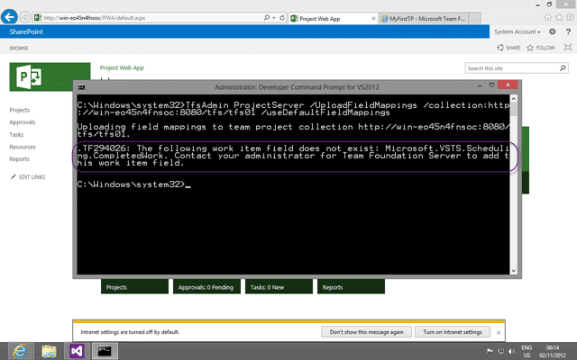
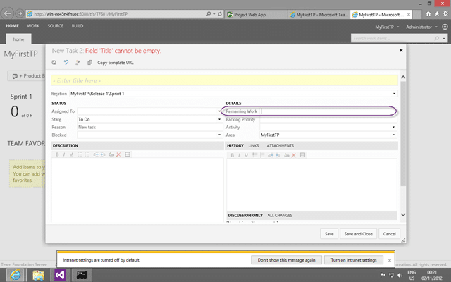

When you try to upload the default field mappings for Project Server 2013 integration with Team Foundation Server 2012 you can encounter a TF294026: The following work item field does not exist error.

[](http://blog.hinshelwood.com/files/2012/11/image26.png)  
{ .post-img }
**Figure: TF294026: The following work item field does not exist**

With the message:

> _TF294026: The following work item field does not exist: Microsoft.VSTS.Scheduling.CompletedWork. Contact your administrator for Team Foundation Server to add this work item field._

You are unable to continue without fixing…

### Applies to

- Project Server 2013
- Team Foundation Server 2012
- Project Server Extensions for Team Foundation Server

### Findings

Project Server requires that you have data for Remaining Work, Completed Work and Original Estimate for it to function correctly.

[](http://blog.hinshelwood.com/files/2012/11/image27.png)  
{ .post-img }
**Figure: The Task Work Item Type only includes Remaining Work**

The Visual Studio Scrum Process Template however does not include these as they are not required for Scrum.

### Solution

Use the instructions on [Required Changes to Make When Mapping to a Team Project That Was Created From the Scrum Process Template](http://msdn.microsoft.com/en-us/library/gg412658.aspx#scrummodifications) to update the Task Work Item Type for the Visual Studio Scrum 2.0 template to add both the Completed Work and Original Estimate fields.

Warning The documentation on MSDN is currently out of date and misses two fields that need to be added. Make sure that you also add the Start and End dates.

```
   The number of units of work that have been spent on this task


   Initial value for Remaining Work - set once, when work begins.


```

**Figure: Add both Original Estimate and Completed Work**

Although we are adding these fields to the Task type we are not necessarily adding them to the UI for users to fill out. We can leave them available for Project Server, while out Team Members of a Scrum Team would be blissfully ignorant of their existence.
