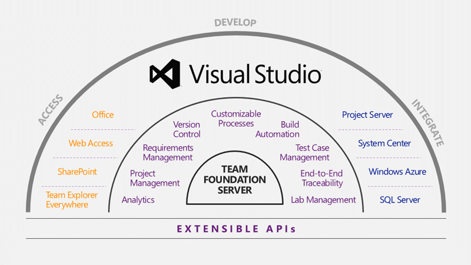

I have talked before on the [new normal for software development](http://blog.hinshelwood.com/the-new-normal-of-the-modern-application-lifecycle/) as part of the Visual Studio 2012 launch events and Microsoft in itself is not immune to this change.

We as consumers will no longer stand for applications that make us wait for 6 months for a new version let alone 2 years. New features need to be delivered much more frequently to the consumer and the biggest blocker to this is the culture of both the organisation releasing the software and their customers.

The tradition of delivering software every two years so as to minimise disruption to our customer is a fallacy that fear and poor quality have driven us to. It is time to recant on these old poor practices and fix the underlying issues that we have been papering over tissue paper.

This, by the way, is one of the underlying reasons that the Scrum Framework asks us to create working deployable software at least every 30 days.

Most companies however don’t believe this and in my experience I hear one of the following:

- “We are not a software company”
- “That does not work with our software”
- “not even Microsoft can do this, so how can we”

These are all just a “cop out” for organisations that do not want, or think that they do not need to suck it up and fix the underlying problems with their software. Well, Microsoft has decided to not just join the party, but lead the way very publically.

So, you know how big Visual Studio is? Well there is Visual Studio IDE, then there is Team Foundation Server and Office integration and… well you get the picture.

  
{ .post-img }
**Figure: Visual Studio 2012 Platform**

Microsoft is now leading the way with Visual Studio and Visual Studio is on of the most complex applications I can think of.

They have moved both the [Visual Studio IDE and Team Foundation Server to continuous delivery](http://blogs.msdn.com/b/bharry/archive/2012/08/28/tfs-shipping-cadence.aspx) with a 3 monthly cadence. Yes, that means that you should now be upgrading your Team Foundation Server every Quarter and that your developers should be updating their client. But you know what… they don’t have to.

With the move to continuous delivery comes many problems that need solving that you just have to fix. We have always know that we had these problem but rather than fix them, we implemented dysfunctional behaviour around them to reduce their impact.

- How to deploy with minimal production impact?
- How to update the database without hours of down time?
- How to update different components of our application on different cadences?
- What if I update one and not the other?

If you solve these problems not only will you be able to deliver more frequently, but what you will deliver will be in smaller chucks and thus of less risk. Not only that, in solving your deployment problems and essentially continuously practicing them you minimise the risk of delivering to production. The result is happy consumers…

And guess what…

Just 3 months after RTM and barely 6 weeks after the Visual Studio 2012 launch the first quarterly update, [Visual Studio 2012 Update 1](http://blogs.msdn.com/b/bharry/archive/2012/11/26/visual-studio-2012-update-1-is-available.aspx), became available and planning for Visual Studio 2012 Update 2 started.

And that is not even the end of the story, with the launch of [Visual Studio Team Foundation Service](http://tfs.visualstudio.com/) the Team Foundation Server team, arguably responsible for the most complex component of Visual Studio are delivering even more frequently. They are effectively on a 3 week Sprint cycle and are delivering new features to production to goodness knows how many instances in the cloud every three weeks as well as hotfixes every Monday if needed. This is the new normal…

And not only is this a Visual Studio thing; [Apollo Plus](http://www.zdnet.com/apollo-plus-is-this-microsofts-first-windows-phone-8-update-7000007926/) (Windows Phone 8 Update 1) is due almost exactly 3 months after the RTM of Windows Phone 8.

I for one have high hopes of new features for all of Microsoft's products every quarter but some products have more technical debt to pay of than others…
