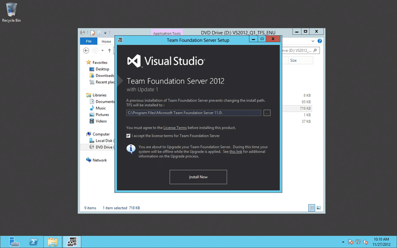
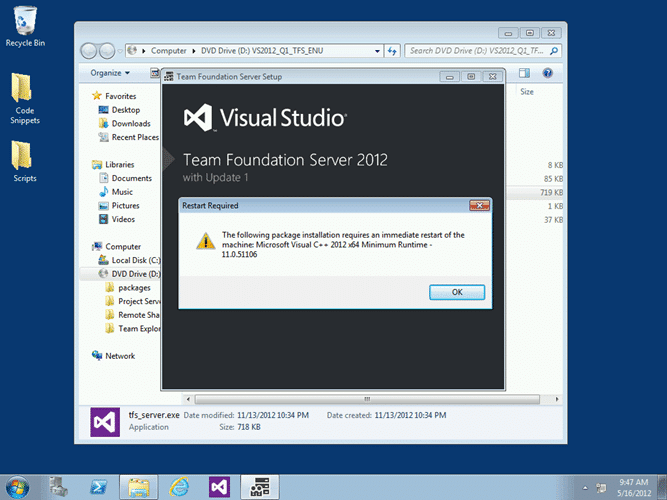
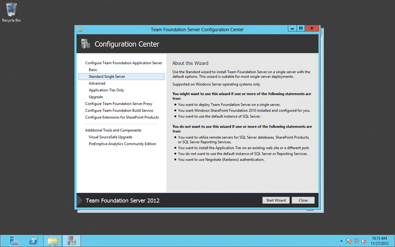
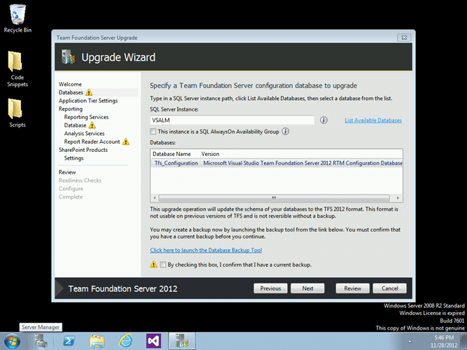
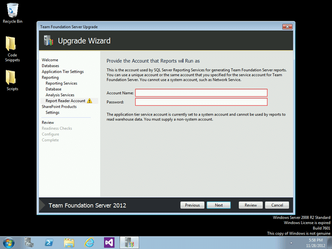

As usual I am going to update my local Team Foundation Server environment to Team Foundation Server 2012 Update 1 first and with Windows 8 and Hyper-V that is easy. If you are creating a new Team Foundation Server 2012 instance you can just install directly from the Update 1 media. Its all there…

- Update 2012-12 - new post: [Upgrading to Team Foundation Server 2012 Update 1 in production – DONE](http://blog.hinshelwood.com/upgrading-to-team-foundation-server-2012-update-1-in-production-done/)

  
{ .post-img }
**Figure: Revert your snapshot before you install Team Foundation Server 2012 Update 1**

If you are installing against a production box make sure that you take a snapshot before you proceed. You can delete it after we have tested the upgrade but you should always take the snapshot.

  
{ .post-img }
**Figure: Team Foundation Server 2012 Update 1 includes the full install**  
One of the main things to note is that this is a full copy of Team Foundation Server 2012 that includes Update 1. So if you are installing Team Foundation Server from scratch then this install replaces the previous one and you can no longer download Team Foundation Server without Update 1.

  
{ .post-img }
**Figure: Upgrading to Team Foundation Server 2012 Update 1**

The install is easy and it will detect wither you have an existing install of Team foundation Server before proceeding.

If you have Team Foundation Server 2008 or 2010 it will ask you to uninstall this first (don’t worry your data would still be intact) and then it would launch a choice of wizards. If you already have Team Foundation Server 2012 it will run through the upgrade process and present you with the upgrade wizard.

  
{ .post-img }
**Figure: Upgrading the Brian Keller VM to Team Foundation Server 2012 Update 1**

Depending on what else you have installed and which version of your OS you are running on you may get asked to reboot. This is what messed up many folks installing the update on Brian Keller's VM.  The trick there is to disable the date manipulation scripts that run on start-up prior to any reboots.

You should however [wait until Brian adds Visual Studio 2012 Update 1 to the ALM Virtual Machine](http://blogs.msdn.com/b/briankel/archive/2012/11/27/visual-studio-2012-update-1-and-the-alm-virtual-machine.aspx "http://blogs.msdn.com/b/briankel/archive/2012/11/27/visual-studio-2012-update-1-and-the-alm-virtual-machine.aspx") this week.

But I digress…

### Configuration of Team Foundation Server 2012 Update 1

Once you run the install and maybe do a couple of reboot you will be done…

  
{ .post-img }
**Figure: Upgrade of an un-configured TFS 2012 or TFS 2008/2010 to Update 1**

As I mentioned before if you are upgrading from a previous version it will present you with the main Configuration Center where you can choose what you want to do… Upgrade being the correct choice  unless you have a more complex install then do an “Advanced” install and then a “tfsconfig /import” command to pull in and upgrade your 2008 or 2010 detached collections.
{ .post-img }

  
{ .post-img }
**Figure: Upgrade of an TFS 2012 RTM to Team Foundation Server 2012 Update 1**

However with an existing TFS 2012 instance you will automatically be presented with the Upgrade wizard as it can kina guess what you want…

  
{ .post-img }
**Figure: Choosing your database for upgrade to Team Foundation Server 2012 Update 1**

Now, just as you would do for any upgrade you will need to verify all of the configuration details, but it will default to the existing ones. One unfortunate thing is that you will need to know the passwords for any custom accounts that you are using.

  
{ .post-img }
**Figure: Enter your Report Reader Account for Team Foundation Server 2012 Update 1**

At a minimum you will need your Report Reader Account password and maybe your TFS Service account password. This is a security restriction but we are hoping that Microsoft will allow us to use the same values that are already stored, but for now we need to fill it out… this is the primary reason that we even get the wizard…

In the real world I dought that many folks will be changing their settings as part of this type of upgrade, but I guess it could happen…

  
{ .post-img }
**Figure: All green an good with the Team Foundation Server 2012 Update 1**

This is an easy update with very low risk and can be done in place if you are upgrading from the 2012 RTM.

It takes a little more planning to go from 2008 or 2010 to 2012, but it is ultimately just as easy.
