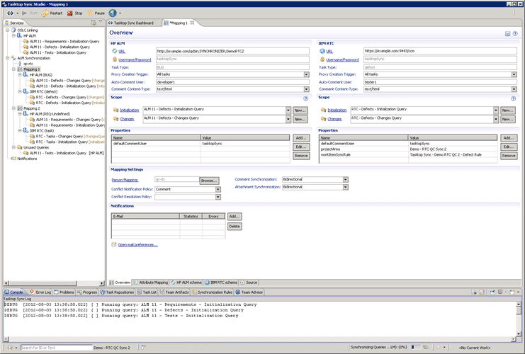

We have had a large number of customers over the years that desperately want to move from Quality Centre (now HP ALM) to… well… anything else to be honest. The current leader in the ALM space just happens to be my favourite tool, Team Foundation Server, and so I am continuously on the lookout for tools that can help us migrate from whatever the customer is using to Team Foundation Server.

  
{ .post-img }
**Figure: Gartner rates Team Foundation Server as top ALM tool**

There are currently three third party , one Microsoft and one HP tool in the migration and sync space for Quality Centre to Team Foundation Server and all of them have their drawbacks… there never is a perfect solution for migration or synchronisation, but there are a few tools in the Synchronisation space that are worth it and for Quality Centre there is one tool that can cut the Migration mustard.

But first there are a number of questions that we need to ask ourselves:

1. Do we want to just Sync the content or Migrate it?
2. Do we want history or TIP?
3. Do we want unidirectional or bidirectional?

And that is just part of the puzzle; So lets look at the players in this space…

### TFS Integration Platform - [http://tfsintegration.codeplex.com/](http://tfsintegration.codeplex.com/ "http://tfsintegration.codeplex.com/")

The TFS Integration Platform is an ALM Rangers project that is supported by a few guys on the product team and includes a bi-directional syncing engine that can handle both Migrations and Synchronisations between ultimately any platform and any other platform. It does this by allowing you to create an adapter for whatever system that you need and comes with a number of out-of-the-box adapters:

- TFS 2008
- TFS 2010
- TFS 2012
- SubVersion
- Rational ClearCase
- Rational ClearQuest

Unfortunately this is a high maintenance system that is really only usable by experienced consultants for all but the most simple of tasks. In addition, **to support HP Quality Centre would require the creation of a custom adapter** that in my experience would take many weeks to perfect. If the TFS Integration Platform were more fully supported or there were more adapters available it could be a real contender in this space. As it is I have created a number of customer Adapters for it and it has a clunky API that is difficult to extent.

This is not the solution for us in this case… but it should be!

### OpsHub - [http://www.opshub.com](http://www.opshub.com "http://www.opshub.com")

_(I was unable to get a “trial” version of this software and I am inherently cynical about any vendor that does not provide working software!)_

It currently looks like OpsHub is the top player with both Synchronisation and full history Migration but it is difficult to tell as they do not provide a downloadable trial. I don’t know about you, but unless I can run and verify a feature myself I take claim of capabilities with a pinch of salt. To date I have only seen evidence to claim synchronisation and not migration which is just fine. What is the difference you might ask, surely if you can do one you can do the other… well kind of.. more on that later…

  
{ .post-img }
**Figure: OpsHub integration**

OpsHub Integrates with [many companies products](http://www.opshub.com/main/index.php/2012-08-31-18-28-21/partners) and if they can do half of what they claim then it will be a very powerful tool…

### TaskTop Sync - [http://tasktop.com/sync](http://tasktop.com/sync "http://tasktop.com/sync")

_(I was unable to get a “trial” version of this software and I am inherently cynical about any vendor that does not provide working software!)_

TaskTop is the new kid on the block and now provides a solution called TaskTop Sync that allows us to Sync data on the server side between many systems. This is not migration and it will not take history, but it does allow you to access data from many ALM system from a single UI and to allow you to sync limited data between these systems.

  
{ .post-img }
**Figure: Configuring TaskTop Sync**

- Team Foundation Server
- IBM Rational
- Borland StarTeam
- HP Quality Centre
- VersionOne
- ScrumWorks
- [Many more…](http://tasktop.com/connectors)

If you have a very fragmented set of systems and you have no intention of consolidating them then a Sync tool is for you. I would always prefer to rationalise down to as few product sets as I can get away with but many organisation find this almost impossible within their existing culture. If you are in that situation then TaskTop provides many of those at the Work Item Tracking layer as it allows you to map only specified fields between the different products. That way you are only mapping what you need…

I am however unsure how it supports Work Item Types as the only demos show mapping of Defects in HP to Tasks in TFS. This is not how I would map anything and I have not seen how configurable it is…

### Scrat

Scrat is specifically designed to move data easily from Quality Centre to Team Foundation Server. I have worked with this tool before and I have a number of customers that have used it to successfully migrate all of their data to TFS. It has been a while since I used it, but I found it to be a very easy to follow process even accounting for all of the mappings that you are asked to provide.

  
{ .post-img }
**Figure: Scrat configuration**

This is the only tool that I can confirm that is capable of moving Test Steps as part of the migration.

### HP ALM Synchronizer

HP themselves provide a synchronisation tool but there are many fields that they just can’t map. This tool was designed by HP to make sure that it was impossible to be used to “migrate” from HP to another system. This, if you think about it, makes perfect sense. It is however very free…

  
{ .post-img }
**Figure: Mapping TFS and HP entities**

The tool supports a number of other ALM tools:

- HP Application Lifecycle Management 11.00 and HP Quality Center 10.00.
- Rational ClearQuest 2003.06.15; 2003.06.16; 7.0; 7.0.1; and 7.1.
- Rational RequisitePro 2003.06.15; 2003.06.16; 7.0; 7.0.1; and 7.1.
- Microsoft Team Foundation Server 2008 and 2010.

It will allow for limited Syncing of content between the two systems. If this is all you need then it may be of use to you…

## Conclusion for Quality Centre to Team Foundation Server

So there are three third party , one Microsoft and one HP tool that can move data in some fashion between Quality Centre and Team Foundation Server: TFS Integration Platform, OpsHub, TaskTop Sync, Scrat and HP ALM Synchronizer. Most of these are synchronisation tools but one stands out as a Migration tool.

It is inherently not in the best interests of a Synchronisation tool to allow you to migrate data from one system to another. Once you do that, why would you need the synchronisation tool any more. The whole idea is to lock you into keeping both tools and thus extending your need for the synchronisation tool. In my honest opinion if you want to remove the need for the other tools, whatever that may be, you need to be looking at Migration tools and not synchronisation tools.

Migration is the ability to move from one system to another without requiring to keep the old one around. You may need it anyway for audit or fuzzies, but it is not required for function. This would be a true migration where you bring all of the data, maybe the history, and pull it across into another system.

Synchronisation is the ability to have two different items in two different systems linked in some way and have certain specified data points updated dynamically between them. With synchronisation we are not really concerned with unique data points to the individual systems as not only are we keeping them around but these uniqueness's are normally why we are doing so.

<table style="float: right; width: 200px;"><tbody><tr><td></td><td>Supported</td></tr><tr><td></td><td>Not-supported</td></tr><tr><td></td><td>Kind-of-supported</td></tr></tbody></table>

Lets try and break this down into some sort of capability grid:

<table class="wrapable"><tbody><tr><td>&nbsp;</td><td><strong>TFS IP</strong></td><td><strong>OpsHub</strong></td><td><strong>TaskTop Sync</strong></td><td><strong>Scrat</strong></td><td><strong>HP ALM Synchronizer</strong></td></tr><tr><td>
<strong>Out-of-Box Support</strong>

Does this product have out of the box support for Quality Centre.
</td><td></td><td></td><td></td><td></td><td></td></tr><tr><td>
<strong>Easy to use</strong>

Does this software require a consultant to implement? Often software (like SAP) will say that you need a consultant as it requires “configuration” when they indeed mean that you need a developer to implement the feature that they told you that it supported.
</td><td></td><td></td><td> 10 days of professional services</td><td></td><td></td></tr><tr><td>
<strong>Supports Sync</strong>

Synchronisation allows you to choose which fields in data source A you want to map to data source B and have that data maintained between those two systems. The result would be two systems with identical, or near identical data.
</td><td> Code Required</td><td></td><td></td><td></td><td></td></tr><tr><td>
<strong>Supports Migration</strong>

Migration comes in two flavours, history or Tip. In both circumstances it is usually a one-way one-time push of the entirety of data from a source system to a target system with the goal to remove any necessity to keep the source system around.
</td><td> Code Required</td><td> Unproven</td><td></td><td></td><td></td></tr><tr><td>
<strong>Supports Test Case Steps</strong>

While many system will sync / migrate simple work item data there is specialist knowledge in producing and mapping the Test Steps (stored as an XML blob) to and from Team Foundation Server.
</td><td> Code Required</td><td> Unproven</td><td></td><td></td><td></td></tr><tr><td>
<strong>Runs server side</strong>

Does this tool run unattended as a service on the server
</td><td></td><td></td><td></td><td> One-off</td><td></td></tr><tr><td>
<strong>Supports History</strong>

History is one of the hardest things to support for both synchronisation and migration. Very few system support going back in time and replaying all of the changes from the source system against the target system and it is not always required.
</td><td> Code Required</td><td> Depends on adapter</td><td></td><td></td><td></td></tr><tr><td>
<strong>Done – One time use</strong>

Is this a one time run or is it a multi run migration/ sync.
</td><td> Code Required</td><td></td><td></td><td></td><td></td></tr><tr><td>
<strong>Rough Cost</strong>

This is by no means scientific, but represents a rough cost guideline.
</td><td>0$</td><td>~$15k</td><td>$299/usr +Jump Start</td><td>$3k-$10k+</td><td>0$</td></tr></tbody></table>

**Figure: Comparison of products**

So if you just want to synchronise I would recommend starting with “**HP ALM Synchronizer**” and verifying if the features meet you needs. If not then push out to “**OpsHub”** as it looks to have the better feature set and widest support for tools. If you are Migrating your Quality Centre implementation to TFS then the only choice is **Scrat**.
