Did you know that you can use Teams without areas using a team field in TFS? There are numerous reasons to do this but the decision should not be taken lightly.

Although not the default it will give you greater versatility in configuring for a [single Team Project](http://blog.hinshelwood.com/one-team-project/) with the ability to then use area solely for Product. Lets say that you have a bunch of products and four teams that work on those products. No team particularly owns those Products as you have many more Products than Teams and you have a single backlog of ordered work that represents work across all of those products.

- Update Microsoft has now added MSDN documentation for [Customize a team project to support team fields](http://msdn.microsoft.com/en-us/library/vstudio/dn144940.aspx)
- Update Another Visual Studio ALM MVP, Rene van Osnabrugge has created a walk through for [customising the reports to support 'team field'](http://osnabrugge.wordpress.com/2013/05/13/teams-without-areasfixing-the-reports/).
- Breaking newsWith [TFS 2013 Update 3 (TFS 2013.3)](http://support.microsoft.com/kb/2933779) the Test team have converted Test Plan and Test Suit to Work Items and enabled Team Field support. Awesome!

<table width="528" border="0" cellspacing="0" cellpadding="2"><tbody><tr><td valign="top" width="188"><strong>Area</strong></td><td valign="top" width="183"><strong>Iteration</strong></td><td valign="top" width="155"><strong>Team</strong></td></tr><tr><td valign="top" width="188">&nbsp;&nbsp;&nbsp; |—Product 1</td><td valign="top" width="183">&nbsp;&nbsp;&nbsp; |—Release 1</td><td valign="top" width="155">Team 1</td></tr><tr><td valign="top" width="188">&nbsp;&nbsp;&nbsp; |&nbsp;&nbsp;&nbsp;&nbsp;&nbsp;&nbsp; |—Component 1</td><td valign="top" width="183">&nbsp;&nbsp;&nbsp; |&nbsp;&nbsp;&nbsp;&nbsp;&nbsp;&nbsp; |—Sprint 1</td><td valign="top" width="155">Team 2</td></tr><tr><td valign="top" width="188">&nbsp;&nbsp;&nbsp; |&nbsp;&nbsp;&nbsp;&nbsp;&nbsp;&nbsp; |—Component 2</td><td valign="top" width="183">&nbsp;&nbsp;&nbsp; |&nbsp;&nbsp;&nbsp;&nbsp;&nbsp;&nbsp; |—Sprint 2</td><td valign="top" width="155">Team 3</td></tr><tr><td valign="top" width="188">&nbsp;&nbsp;&nbsp; |&nbsp;&nbsp;&nbsp;&nbsp;&nbsp;&nbsp; |—Component 3</td><td valign="top" width="183">&nbsp;&nbsp;&nbsp; |&nbsp;&nbsp;&nbsp;&nbsp;&nbsp;&nbsp; |—Sprint 3</td><td valign="top" width="155">Team 4</td></tr><tr><td valign="top" width="188">&nbsp;&nbsp;&nbsp; |—Product 2</td><td valign="top" width="183">&nbsp;&nbsp;&nbsp; |—Release 2</td><td valign="top" width="155">&nbsp;</td></tr><tr><td valign="top" width="188">&nbsp;&nbsp;&nbsp; |&nbsp;&nbsp;&nbsp;&nbsp;&nbsp;&nbsp; |—Component 1</td><td valign="top" width="183">&nbsp;&nbsp;&nbsp; |&nbsp;&nbsp;&nbsp;&nbsp;&nbsp;&nbsp; |—Sprint 4</td><td valign="top" width="155">&nbsp;</td></tr><tr><td valign="top" width="188">&nbsp;&nbsp;&nbsp; |&nbsp;&nbsp;&nbsp;&nbsp;&nbsp;&nbsp; |—Component 2</td><td valign="top" width="183">&nbsp;&nbsp;&nbsp; |&nbsp;&nbsp;&nbsp;&nbsp;&nbsp;&nbsp; |—Sprint 5</td><td valign="top" width="155">&nbsp;</td></tr><tr><td valign="top" width="188">&nbsp;&nbsp;&nbsp; |&nbsp;&nbsp;&nbsp;&nbsp;&nbsp;&nbsp; |—Component 3</td><td valign="top" width="183">&nbsp;&nbsp;&nbsp; |&nbsp;&nbsp;&nbsp;&nbsp;&nbsp;&nbsp; |—Sprint 6</td><td valign="top" width="155">&nbsp;</td></tr><tr><td valign="top" width="188">&nbsp;&nbsp;&nbsp; |—Product 3</td><td valign="top" width="183">&nbsp;&nbsp;&nbsp; |&nbsp;&nbsp;&nbsp;&nbsp;&nbsp;&nbsp; |—Sprint 7</td><td valign="top" width="155">&nbsp;</td></tr><tr><td valign="top" width="188">&nbsp;&nbsp;&nbsp; |—Product 4</td><td valign="top" width="183">&nbsp;&nbsp;&nbsp; |&nbsp;&nbsp;&nbsp;&nbsp;&nbsp;&nbsp; |—Sprint 8</td><td valign="top" width="155">&nbsp;</td></tr><tr><td valign="top" width="188">&nbsp;&nbsp;&nbsp; |—Product 5</td><td valign="top" width="183">&nbsp;&nbsp;&nbsp; |—Release 3</td><td valign="top" width="155">&nbsp;</td></tr><tr><td valign="top" width="188">&nbsp;&nbsp;&nbsp; |—Product 6</td><td valign="top" width="183">&nbsp;&nbsp;&nbsp; |&nbsp;&nbsp;&nbsp;&nbsp;&nbsp;&nbsp; |—Sprint 9</td><td valign="top" width="155">&nbsp;</td></tr><tr><td valign="top" width="188">&nbsp;&nbsp;&nbsp; |—Product 7</td><td valign="top" width="183">&nbsp;&nbsp;&nbsp; |&nbsp;&nbsp;&nbsp;&nbsp;&nbsp;&nbsp; |—Sprint 10</td><td valign="top" width="155">&nbsp;</td></tr></tbody></table>

Indeed within a single Sprint a Team may touch multiple products and they are all released on the same cadence. Is this ideal… well no.. it can be hard to create working software against a single piece of software let alone multiple. But lets for a moment assume that all your products were built using TDD, they have a full automated UI suite of tests and every manual test is automated by the end of every sprint. Not only that but you have an automated and tested deployment that has been proven in Development, Quality Assurance and Production environments.

In short you have continuous delivery and you are good at it.

Now, while in this is a fantasy world for most companies there are yet others for which this is a reality. Look at the new 3 week shipping cadence of the Developer Division at Microsoft or the 6 week cycle for Chrome from Google.

You can’t ship code to production in the form described above unless you are that good. If you are not then good then you may think about working on one Product for a release and then moving that team to another product for the next release. That would be an easier way and allow your teams to focus on one thing for a release. Still problematic but a little more manageable.

There are only a few simple steps to achieve Teams without Areas with team field:

1. DONE Create a Global List for 'team field' 
2. DONE Add the 'team field' field to PBI & Bug
3. DONE Change the CommonProcessConfig.xml file to use 'team field'
4. DONE Configure Team settings per 'team field'

So lets get started.

Warning Never make changes against a production TFS… Ever… Always test out your changes in a test server first

Info If you are really awesome you should create CodedUI tests for all your common TFS user scenarios so that you can be sure that you have not broken anyone’s workflow without intent.

## Create a Global List for the 'team field'

We first want to create a Global List to hold our list of Teams. This is really for two reasons. First in the Visual Studio Scrum 2.1 process template both PBI and Bug are owned by team members and appear on the backlog so a Global List need only be updated once for both Fields. Second we can easily build a tool to add items to the list and even if doing it manually we are not in danger of radically changing our Work Item Type Definition ever time we want to add something.

  
{ .post-img }
**Figure: Creating a Global List for the 'team field'**

If your TFS server has not yet been in use for builds and you have never created a global list then you will be presented with an intuitive empty box.

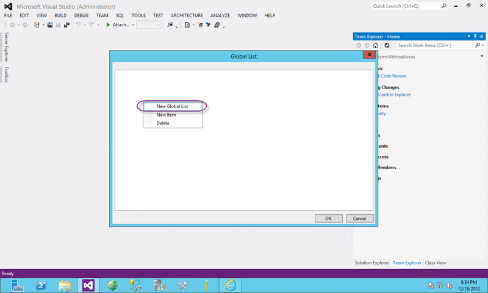  
{ .post-img }
**Figure: Create a new global list for the 'team field'**

If you right click in the open space you will see a menu that you can use to first add a Global List and then populate it.

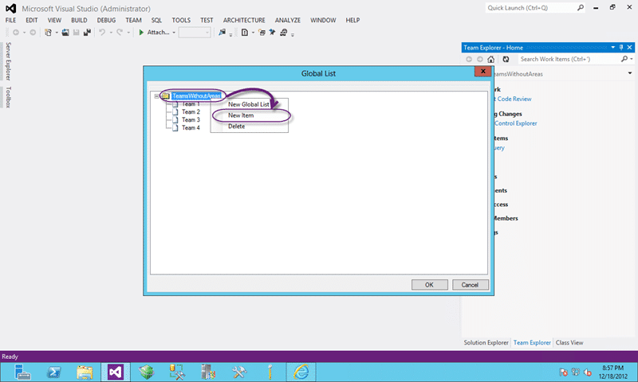  
{ .post-img }
**Figure: Add all of the Teams to the global list**

Once you have populated your global list we can then move on to adding the custom field to the work item type definitions so that we can both select it in the UI and set the administration configuration for it.

You can export your global list from the command line or through the UI for use on your production server once you have decided that this is the way for you.

Info Always store your changes in Version Control so that you never loose them. Preferable not in the server that you are modifying. [http://tfs.visualstudio.com](http://tfs.visualstudio.com) is perfect for this.

## Add the 'team field' to PBI & Bug

Now we need to add a custom field to all of the work item types that are defined in the  “Requirement Types” section of the Categories.xml file.  In the case of the Visual Studio Scrum process template this is both the Product Backlog Team and Bug.

```
witadmin exportcategories /collection:http://kraken:8080/tfs/Tfs01/ /p:TeamsWithoutAreas /f:c:tempcategories.xml

```

**Figure: Command line call to export categories**

If you look in the file you will see an entry for “Requirement Category” that contains the things that we are looking for.

**Figure: Requirement Category for Visual Studio Scrum 2.1**

We need to update both or we will get an error, however we will be making the same change to both.

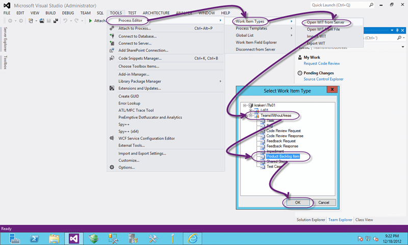  
{ .post-img }
**Figure: Edit the PBI to add the 'team field'**

This will open the Product Backlog Item Work Item Type Definition from our test project in a UI tool that will make it faster to get all of the way through the changes. The nice thing about the UI is that it has listed all of the options and I don’t have to Google or remember them… I am pretty lazy aren't I…

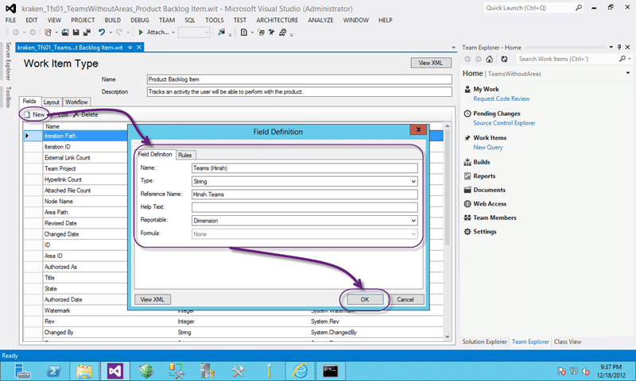  
{ .post-img }
**Figure: Add the 'team field' to the PBI**

I always follow the same format for creating custom fields. I think that most of the ALM MVP’s and Consultants out there do the same so…

The Name should be in the format “\[what you want\] (\[comapny\])”. This allows you to see which are custom fields in the cube. The reference name should be just the opposite with no spaces or special characters. So it becomes \[company\].\[CamelCaseName\] and allows me to also identify it easily.

I am setting this as a Dimension so that I can use it to slice any of my reports. You will need to modify the OOB reports to add this to them, but anything that you create you can add this out of the gate.

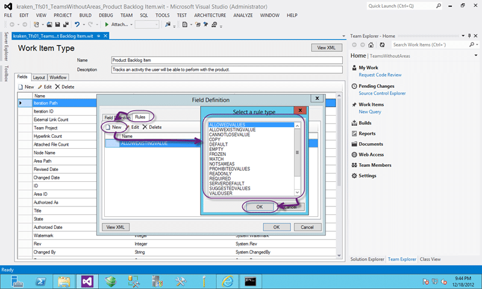  
{ .post-img }
**Figure: Adding the Rules to the 'team field'**

I am adding two specific rules and you may add more but this is the basics. First add AllowExistingValues so that if you delete a team in the future you are not left with Work Items in a broken state. Then we need to get to the meat and add the AllowedValues.

  
{ .post-img }
**Figure: Add the 'team field' global list to the allowed values**

The global list should appear in the UI and be selectable. This will load the values and create a drop down list on the UI (once we have added it) to allow users to select Team.

**Figure: Xml for the 'team field'**

But we are not done yet. we still need to add the field to the UI.

  
{ .post-img }
**Figure: Where to put the 'team field'**

In the PBI form there is a nice little space below Reason that I want to utilise. So lets add the field to the UI.

  
{ .post-img }
**Figure: Add a new control for the 'team field' data**

We just need to add a new generic control to the UI where we want it. Most of the layout is taken care of automatically so we only have a few fields to fill out…

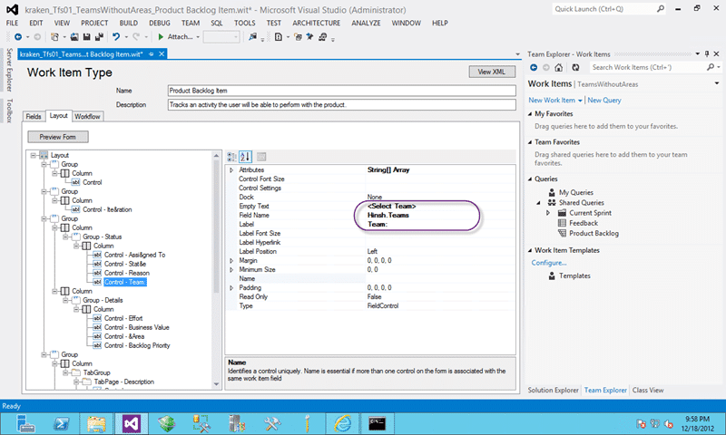  
{ .post-img }
**Figure: Set the field name and the label for the 'team field' to show**

We have only added a simple reference to the data and Team Foundation Server will figure out how to render it on both Web and thick client alike.

**Figure: The new control XML for the 'team field'**

Once you have added this you will need to refresh the cache in Visual Studio before you will see the new list on the Work Items.

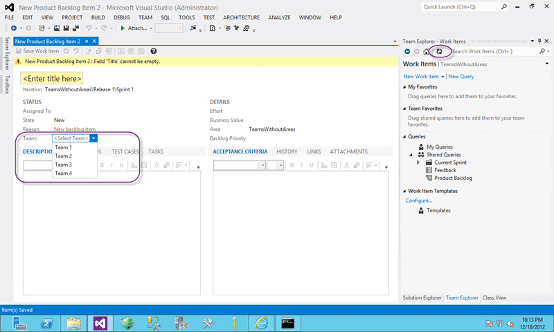  
{ .post-img }
**Figure: New 'team field' is now on the form**

Warning Remember that this field and control will need added to all of the Requirement Types that you have set for your process template.

Info The easy way to add this field to other work item types is to export the XML and add it manually.

```
witadmin exportwitd /collection:http://kraken:8080/tfs/Tfs01/ /p:TeamsWithoutAreas /n:"Product Backlog Item" /f:c:temppbi.xml
witadmin exportwitd /collection:http://kraken:8080/tfs/Tfs01/ /p:TeamsWithoutAreas /n:"Bug" /f:c:tempbug.xml
witadmin importwitd /collection:http://kraken:8080/tfs/Tfs01/ /p:TeamsWithoutAreas /f:c:tempbug.xml

```

**Figure: Export both, edit the bug and then import it to add team without areas**

Once you have added these changes to all of the Requirement Types that you have configured you can move on to configuring TFS to look at this new field and not Area.

## Change the CommonProcessConfig.xml file to use the 'team field'

We now need to tell Team Foundation Server to use this new field by changing the Common Processing Configuration that the web access uses to figure out what is going on with a particular process template.

```
witadmin exportcommonprocessconfig /collection:http://kraken:8080/tfs/Tfs01/ /p:TeamsWithoutAreas /f:c:tempcpc.xml

```

**Figure: Export the common process config to xml**

Once you have the xml file you can open it in your favourite IDE and find the TypeField with the Type of Team.

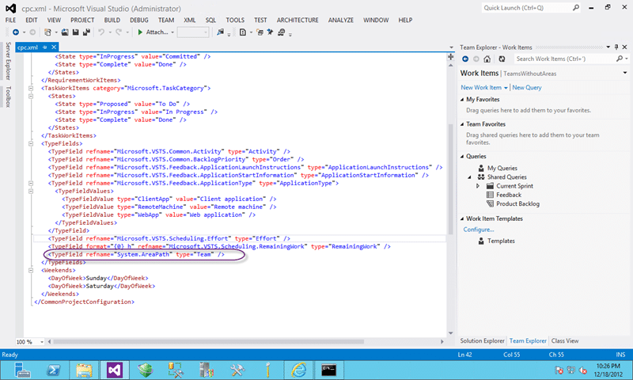  
{ .post-img }
**Figure: Edit the TypeField for Team to use the new 'team field'**

You can literally just change the refname from the current Area Path value..

**Figure: Original Team value for TypeField**

To the new Teams field that we created earlier..

**Figure: New Team value for TypeField**

Now save and import the new common process configuration we are nearly there.

```
witadmin importcommonprocessconfig /collection:http://kraken:8080/tfs/Tfs01/ /p:TeamsWithoutAreas /f:c:tempcpc.xml

```

**Figure: Import new common process configuiration file**

And we are almost done. we now need to go to the Web Interface and tell it for each team, what value is theirs…

## Configure Team settings per Team without Areas

This is the final part of the configuration and once you go into your Team boards of backlog you will get a lovely message:

> TF400512: You have not selected any areas for your team. You must select at least one area before you can use features such as the product backlog, the task board or tiles.

Well lets do what it says and head over to the administration pages for this team by clicking the nicely provided “Select team’s areas” link.

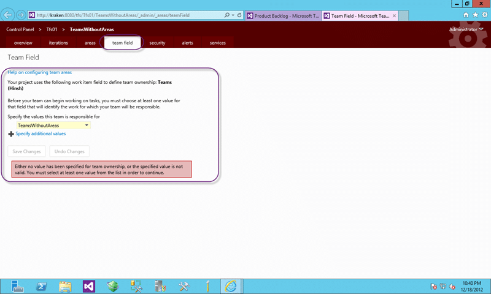  
{ .post-img }
**Figure: New Team Field tab has been added to the Administration**

We now have a brand new tab on our administration section for “team field” so that we can select one or more “areas” from our new field values that this team is responsible for.

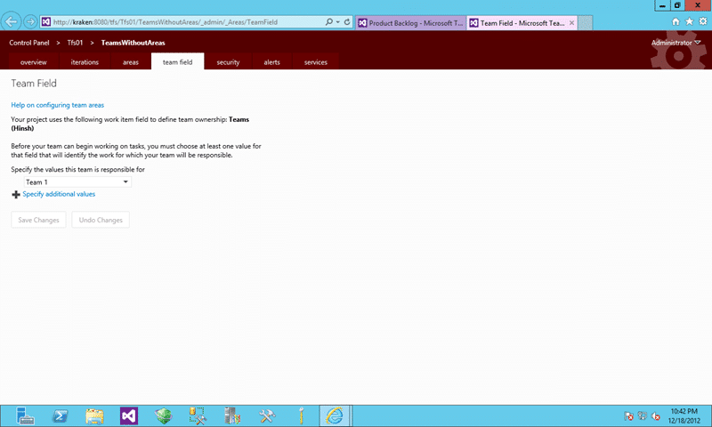  
{ .post-img }
**Figure: This is Team 1 from the list**

Now when we create new work items as part of this team they will default to selecting this drop down and not our Product hierarchy that is in Area Path.

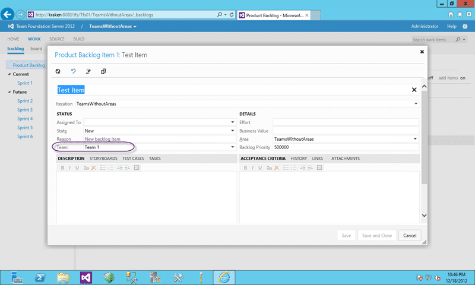  
{ .post-img }
**Figure: Team is now set instead of Area Path by default**

If you were using this new drop down for Product rather than Team you may want to have multiple values owned by this team and that is allowed in the configuration. I would only recommend that however when you really need hierarchical teams that Area Path can provide or at least simulate.

## Conclusion

This has merit when the situation dictates and I have recommended it twice now with some of my colleagues coming around to the idea.

And remember that any changes to your process template should be well thought out as you don’t want to end up with fragmented templates if you have more than one Team Project or worse, end up with a frankin-template that no one wants to use.

Just be careful out there…


