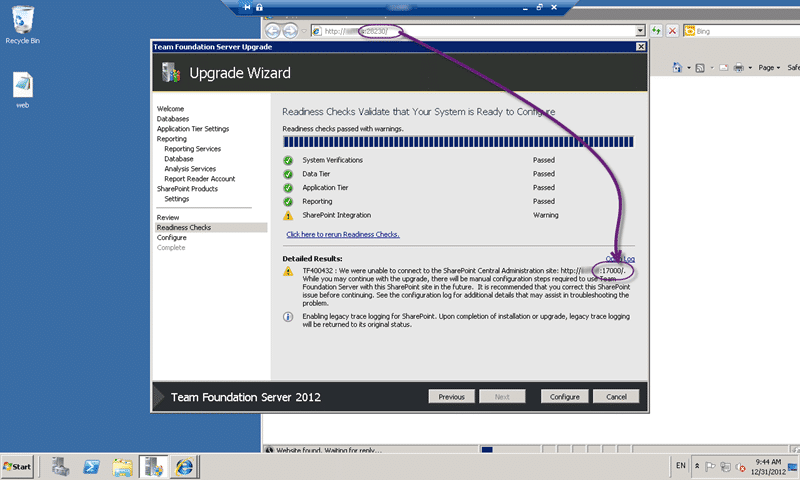
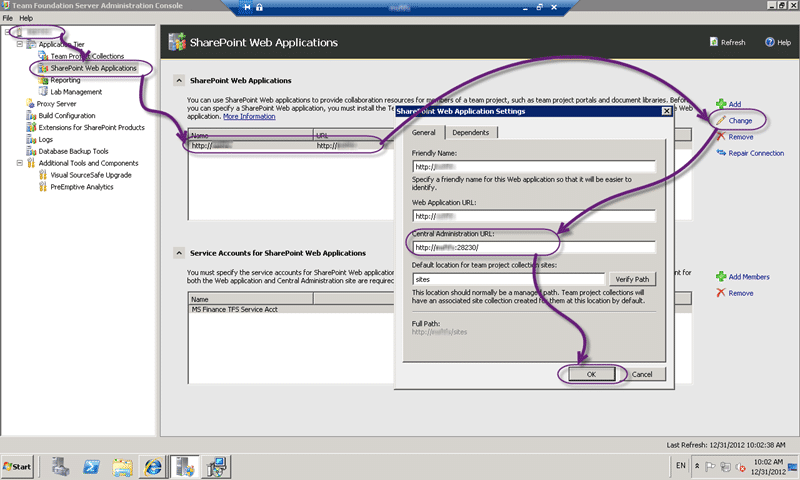

When running the upgrade from Team Foundation Server 2012 to Team Foundation Server 2012 Update 1 you get a TF400432 error stating that the Team Foundation Server configuration was unable to connect to SharePoint administration site.

  
{ .post-img }
**Figure: TF400432 : We were unable to connect to the SharePoint Central Administration site**

You get the error:

> TF400432 : We were unable to connect to the SharePoint Central Administration site: [http://tfsserver:17000/](http://tfsserver:17000/).  While you may continue with the upgrade, there will be manual configuration steps required to use Team Foundation Server with this SharePoint site in the future.  It is recommended that you correct this SharePoint issue before continuing. See the configuration log for additional details that may assist in troubleshooting the problem.

### Applies to:

- Team Foundation Server 2012
- Team Foundation Server 2012 Update 1

### Findings for TF400432

It looks like at some point the port for SharePoint Administration was changed but never updated in the Team Foundation Server configuration. While Team Foundation Server thinks that the port is 17000 the actual port is 28230.

### Solution for TF400432

There are two options. I can change SharePoint to be the same port that Team Foundation Server is expecting, or I can update Team Foundation Server to use the correct port.

  
{ .post-img }
**Figure: Update the SharePoint link from Team Foundation Server to the correct value**

In this case updating Team Foundation Server was easier than messing with SharePoint. You can update the Central Administration URL from “Team Foundation Server Administration Console | Application Tier | SharePoint Web Application | Select Site | Change” and then update the URL and click OK.
