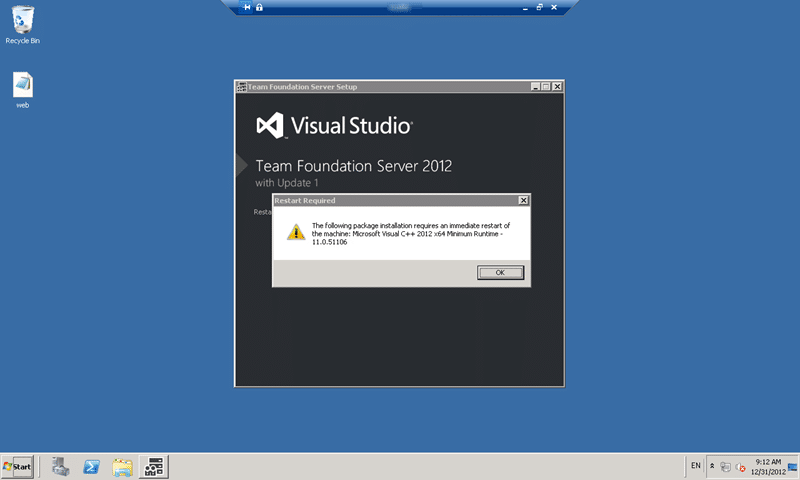
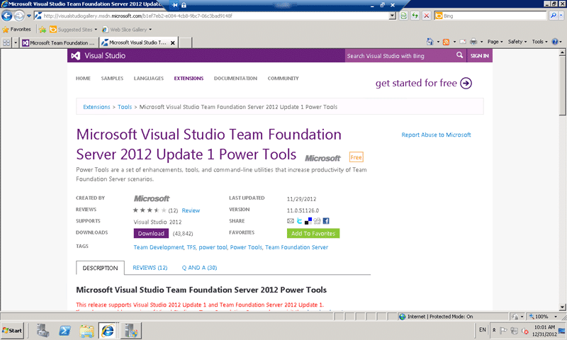
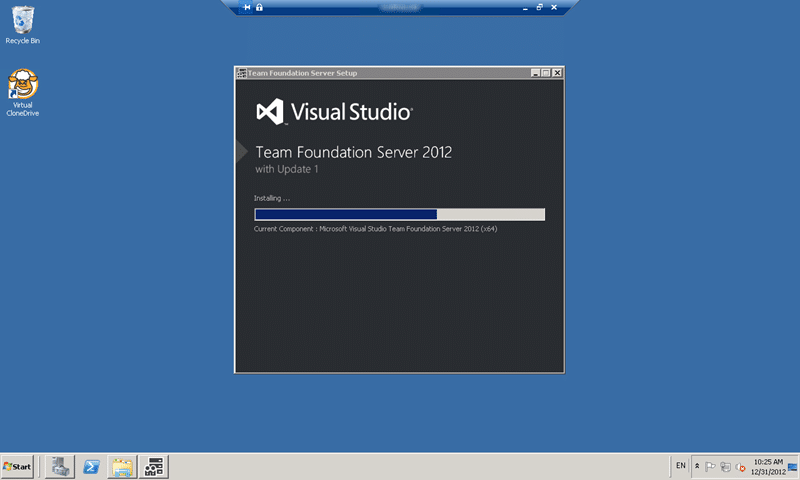

Although many of my customers have been having a go at installing Visual Studio Team Foundation Server 2012 Update 1 themselves one or two have had issues. While these issues are easily resolved it is sometimes nice to have someone else who has done the same thing a bunch of times take the rains.

- [TFS 2012 Update 1 – TF255430: the database was partially upgraded during a failed upgrade](http://blog.hinshelwood.com/tfs-2012-update-1-tf255430-the-database-was-partially-upgraded-during-a-failed-upgrade/)

This upgrade should take no more than 3 hours as I have only two servers to worry about and 40GB of data.

There are a couple of pre-requisites that you can get out of the way to make your install and upgrade a lot smother and if you are upgrading from a previous version of TFS this is exactly the same procedure. You can go strait from Team Foundation Server 2008 SP1 or Team Foundation Server 2010 SP1 to Team Foundation Server 2012 Update 1 without much trouble. I would however suggest that for a full version upgrade that you “move to new hardware” as part of the upgrade. This will give you a chance to upgrade SharePoint, SQL Server and whatever other components you have on there and more notably you get to clean all the plaque off your crusty server for a nice shiny.

Things to Read:

- Read: [Upgrade Team Foundation Server](http://msdn.microsoft.com/en-us/library/vstudio/jj620933.aspx "http://msdn.microsoft.com/en-us/library/vstudio/jj620933.aspx") (MSDN)
- Read: [Upgrading Team Foundation Server 2008 to 2010](http://blog.hinshelwood.com/upgrading-team-foundation-server-2008-to-2010/ "http://blog.hinshelwood.com/upgrading-team-foundation-server-2008-to-2010/") (2008->2010 easy)
- Read: [Upgrading from TFS 2008 and WSS v3.0 with SfTSv2 to TFS 2010 and SF 2010 with SfTSv3](http://blog.hinshelwood.com/upgrading-from-tfs-2008-and-wss-v3-0-with-sftsv2-to-tfs-2010-and-sf-2010-with-sftsv3/ "http://blog.hinshelwood.com/upgrading-from-tfs-2008-and-wss-v3-0-with-sftsv2-to-tfs-2010-and-sf-2010-with-sftsv3/") (2008->2010 hard)
- Read: [Upgrading TFS 2010 to TFS 2012 with VSS Migration and Process Template consolidation](http://blog.hinshelwood.com/upgrading-tfs-2010-to-tfs-2012-with-vss-migration-and-process-template-consolidation/ "http://blog.hinshelwood.com/upgrading-tfs-2010-to-tfs-2012-with-vss-migration-and-process-template-consolidation/")
- Read: [Installing TFS 2012 on Server 2012 with SQL 2012](http://blog.hinshelwood.com/installing-tfs-2012-on-server-2012-with-sql-2012/ "http://blog.hinshelwood.com/installing-tfs-2012-on-server-2012-with-sql-2012/") (Lab)
- Read: [Upgrading to Team Foundation Server 2012 Update 1](http://blog.hinshelwood.com/upgrading-to-team-foundation-server-2012-update-1/ "http://blog.hinshelwood.com/upgrading-to-team-foundation-server-2012-update-1/") (Lab)

Note You can’t upgrade TFS 2005 to TFS 2012. You will need to go to TFS 2008 or TFS 2010 first.

Things to take into consideration:

- Read: [Team Foundation Server 2012 Teams without Areas](http://blog.hinshelwood.com/team-foundation-server-2012-teams-without-areas/ "http://blog.hinshelwood.com/team-foundation-server-2012-teams-without-areas/")
- Read: [Upgrading your Process Template in Team Foundation Server](http://blog.hinshelwood.com/do-you-know-how-to-upgrade-a-process-template-but-still-keep-your-data-intact/ "http://blog.hinshelwood.com/do-you-know-how-to-upgrade-a-process-template-but-still-keep-your-data-intact/")

For the satellite systems:

- Read: [Integrate SharePoint 2013 with Team Foundation Server 2012](http://blog.hinshelwood.com/integrate-sharepoint-2013-with-team-foundation-server-2012/ "http://blog.hinshelwood.com/integrate-sharepoint-2013-with-team-foundation-server-2012/")
- Read: [Integrating Project Server 2013 with Team Foundation Server 2012](http://blog.hinshelwood.com/integrating-project-server-2013-with-team-foundation-server-2012/ "http://blog.hinshelwood.com/integrating-project-server-2013-with-team-foundation-server-2012/")

Things you will need:

- **Disk space**  
    You should make sure that you have at least 20GB of free space at any time on your primary partition. This usually looks like 100GB primary and 100GB secondary depending on how big your data is.
- **Accounts**  
    Make sure that you have access to all of the usernames and passwords that you may be using in your environment. This means the TFS Setup, TFS Service & TFS Reports as well as any Build, Test or Lab management accounts that were used
- **Media**  
    Depending on what you have installed you will need all of the media that correlates to that installation. You may be thinking that you can just download it on the fly, but what if the internet goes down or is just slow. I have been onsite with very slow connections.

Once you have all of these things ready and confirmed you can run the upgrade. Refer to the more detailed documentation for previous version of TFS, here I am doing a Team Foundation Server 2012 to Team Foundation Server 2012 Update 1 upgrade only.

## Checklist for Upgrading to Team Foundation Server 2012 Update 1

I always like to have a short measurable checklist

1. DONE **Free up disk space for Team Foundation Server 2012 Update 1 (added 1.5 hours to Upgrade)**
    
    This server has limited disk space so I had to uninstall a bunch of things that did not need to be there… like Visual Studio 2012 Ultimate.
    
2. DONE **Backup before Team Foundation Server 2012 Update 1 (15 minutes)** 
    
    This is imperative and not optional in any way. Even better take the backup off server!
    
3. DONE **Upgrade Application Tier to Team Foundation Server 2012 Update 1 (30 minutes)**
4. DONE **Configure Application Tier and upgrade Schema to Team Foundation Server 2012 Update 1 (30 minutes)**
5. DONE **Upgrade Build Server to Team Foundation Build 2012 Update 1 (XX minutes)**

Lets get going…

## Free up disk space for Team Foundation Server 2012 Update 1

There are a number of things that folks like to install on there Team Foundation Server that have no business there. The first and most common thing is client tools. Do not install Visual Studio or any variant of it on your production Team Foundation Server. This takes up tons of disk space and complicates any upgrade as you need to worry about also patching Visual Studio to the same level. If you don’t have Visual Studio and Team Foundation Server patched to the same level you can get “unstable” behaviour from your system. Don’t take the risk and don’t install it here.

Any client tools that you do need can be installed locally on your workstation or on a build server where you have to install the client tools anyway. Another option that I often use is to have a Windows 7/8 VM in your environment that is all setup with the client tools and is specifically for Administration and configuration of TFS. So it would have the Power Tools, Sidekicks and anything else that you might need.

## Backup before Team Foundation Server 2012 Update 1

The easiest way to backup TFS is to use the add-on from the product team that comes with the power tools. This tool takes care of the heavy lifting and as it is from the TFS Product Team works great.

- [Creating a backup in Team Foundation Server 2010 using the Power Tools](http://blog.hinshelwood.com/creating-a-backup-in-team-foundation-server-2010-using-the-power-tools/ "http://blog.hinshelwood.com/creating-a-backup-in-team-foundation-server-2010-using-the-power-tools/")

If you are using the Database Backup Tools then all you need to do is take a Full Backup before you get started.

  
{ .post-img }
**Figure: Backup before Team Foundation Server 2012 Update 1**

The backup here takes a backup of all of the databases associated with TFS, Reporting Services and SharePoint so you have a full reference. The only database of any size is the Collection database which in this case is around 40GB of data which is mostly in Version Control.

  
{ .post-img }
**Figure: Verify backups before installing Team Foundation Server 2012 Update 1**

Once the backup is complete and you have verified that the files exist (I am paranoid) then you can start with the upgrade.

## Upgrade Application Tier to Team Foundation Server 2012 Update 1

The upgrade process is mostly automated with a little bit of configuration that would would do for any upgrade whatever version of Team Foundation Server you are upgrading from.

  
{ .post-img }
**Figure: Upgrade components to Team Foundation Server 2012 Update 1**

The installer will handle removing the old components and installing the new ones for you. You will then however need to do the configuration of this new App Tier to talk to your existing data tier and that's where the real upgrade starts.

  
{ .post-img }
**Figure: You may be asked to reboot a bunch for Team Foundation Server 2012 Update 1**

Many of the components that both Team Foundation Server and the Operating System relies on will be updated as part of this process so you may be asked to restart. In this case I had to bounce the server twice and the installation automatically restarted once I logged in.

Note The installation restarts for the first user with admin that logs onto the server. I had one case of the ops team wondering why the server was bouncing and they logged onto the console in the data centre before we could remotely. Took us 10 minutes to figure out what went wrong and then had to talk the operations team through the process without being able to see the screen.

This part of the upgrade while fairly fast can take a good 15-30 minutes depending on the  speed of your system and the components that you have installed.

## Configure Application Tier and upgrade Schema to Team Foundation Server 2012 Update 1

Once the installation has completed we are presented with the usual Configuration Wizard page but it has defaulted to an Upgrade.

  
{ .post-img }
**Figure: Team Foundation Server 2012 Update 1 Upgrade Wizard**

For security reasons the wizard will NOT populate the same account that you used previously. You will need to manually specify each account, in this case the TFS Service & TFS Reports accounts as well as enter the password.

  
{ .post-img }
**Figure: Select the database to upgrade to Team Foundation Server 2012 Update 1**

As you may have more than one TFS instance in the same database you need to tell TFS which one is yours. In this case I only have one anyway but it does tell me the version of the database that I will be upgrading. Again we have the obligatory “I confirm that I have a current backup” to make sure that you have. No really… don’t just tick it.. make sure, verify again, that you indeed have  backup of all of your TFS databases. I have indeed needed to restore a database and re-run the upgrade.

  
{ .post-img }
**Figure: Select the Warehouse to upgrade to Team Foundation Server 2012 Update 1**

Again there could be more than one warehouse and unlike previous version of Team Foundation Server, Team Foundation Server 2012 will upgrade the warehouse so that you don't have to spend so long recreating it and are back up and running quicker.

  
{ .post-img }
**Figure: Verification checks found TF400432 during upgrade to Team Foundation Server 2012 Update 1**

During the upgrade I found an issue with communicating with SharePoint but it was very easy to solve.

- [TFS 2012 Update 1 – TF400432 We were unable to connect to the SharePoint Central Administration](http://blog.hinshelwood.com/tfs-2012-update-1-tf400432-we-were-unable-to-connect-to-the-sharepoint-central-administration/ "http://blog.hinshelwood.com/tfs-2012-update-1-tf400432-we-were-unable-to-connect-to-the-sharepoint-central-administration/")

I fixed this after the upgrade was complete so there is no reason to stop and try to fix it during the upgrade. You may however need to manually fix something.

  
{ .post-img }
**Figure: Successful upgrade to Team Foundation Server 2012 Update 1**

The upgrade completed successfully, but it was not able to add the TFS account to the SharePoint Farm Administrators group which makes perfect sense as it has the wrong post for the Administration Site.

  
{ .post-img }
**Figure: Verify that you have Team Foundation Server 2012 Update 1**

Now for a couple of checks:

1. Version in TFS Administration Console is correct
2. Web access is up and running

Awesome…

The last thing that I did was to update the Power Tools to the latest version so that there was no mismatch.

  
{ .post-img }
**Figure: Get and install the Power Tools that match the version you installed**

Now that the Team Foundation Server is upgraded we only have the Build Server to do in this configuration.

## Upgrade Build Server to Team Foundation Build 2012 Update 1

On the build server you run the upgrade in exactly the same way that you did for the Application Tier. This takes a while as the same C++ components require a restart or two.

### Part 1 – Recreate the Controller (TFS Application Tier)

Because we reinstalled the TFS Server where ther controller was configured we do need to reconfigure that controller. When you run the wizard it will ask you it you want to keep the configuration the same as what was previously configured. In essence replace the existing item.

  
{ .post-img }
**Figure: Replace the old controller with the new one**

This will reactivate the same controller instance that you had before with the same configuration.

### Part 2 – Recreate the Agents (TFS Build Server)

With our controller now configured on the TFS Application Tier we now need to activate the agents on the build server. First we upgrade the build server to Update 1.

  
{ .post-img }
**Figure: Installing Team Foundation Server 2012 Update 1**

On the build agents you will just be presented with the generic “pick a wizard” page and you should select the “Configure a build service”.

  
{ .post-img }
**Figure: Select Configure a build service for Team Foundation Server 2012 Update 1**

Now you go through the same configuration that you would for creating a new set of Agents. As with the controller you will be asked if you want to maintain the configuration from before for this server and all you need to do is say “Yes” and it will be configured for you in the same way.

## Conclusion

Upgrading from Team Foundation Server 2012 to Team Foundation Server 2012 Update 1 is a fairly strait forward task but as with anything to do with TFS there can be a lot of moving parts. I would describe this as a simple installation and there were few gotchas.

Other installations and upgrade are not quite so simple…

