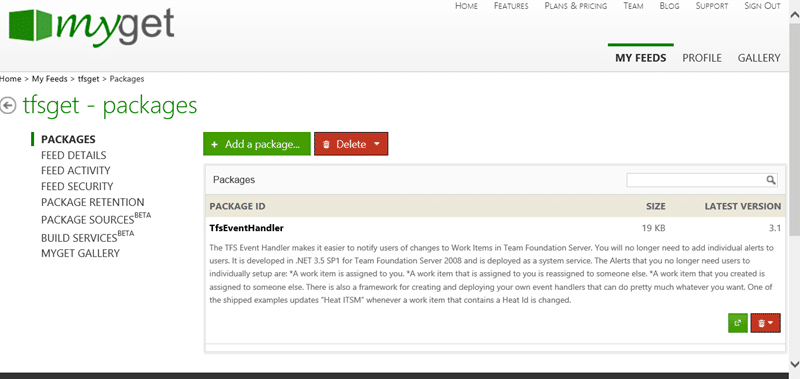
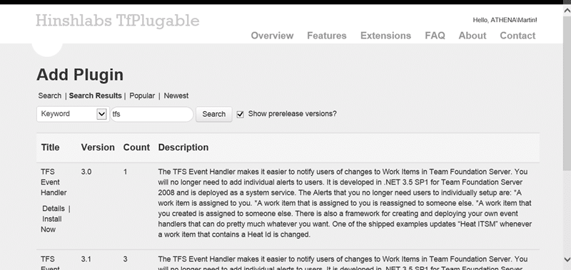

The TFS Automation Platform is dead, long live the TfPlugable! It has been a long time since I have talked about the [TFS Automation Platform](http://blog.hinshelwood.com/what-is-the-tfs-automation-platform/) that I had almost forgotten about it myself. It was almost two years ago that I spoke to [Willy](http://blogs.msdn.com/b/willy-peter_schaub/) about an ALM Rangers project to build a solution to dynamically deploy plug-ins for TFS, kind of like Nuget for TFS Extensions.

When we first attempted to get this off the ground way back in 2011 we had a [team of rock star Rangers](http://blogs.msdn.com/b/willy-peter_schaub/archive/2011/02/20/new-rangers-project-tfs-iteration-automation.aspx) that ended up having no bandwidth for yet another project and it faded and died after a few sprints. I was sad, but what can you do…

## The Problem

However recently I have seen more and more customers wanting their TFS servers to have custom automation as part of their deployment. There are quite a few things that come out of the box but there are still many things that could be done. From Admin tasks to simple rollup or email alerts for your entire organisation there are a plethora of extensions for Team Foundation Server that would be useful but are currently hidden away in the back of your TFS cupboards and never see the light of day.

I would like to do for Team Foundation Server what NuGet has done for distributing and popularising shared assemblies. We need a store for Team Foundation Server where we can pick and choose what extensions we want. Now this already exists for Visual Studio in the [Visual Studio Gallery](http://visualstudiogallery.msdn.microsoft.com/) but there is nothing for Team Foundation Server. I can’t find Check-In Policies for TFS and it is hard to install them, although there is a little love from the Power Tools. I can’t find background operations for TFS… oh I can search for them and find them on blogs, Codeplex or GitHub… but I want the same thing that [NuGet](http://nuget.org/) or [Chocolatey](http://chocolatey.org/) provides.

It is easy to create to create extensions for Team Foundation Server, but it is hard to deploy and manage them. Here are the key integration points that we will be looking at:

1. **TF Job** – These jobs can be schedules or one off and run within the context of the TFS Server Itself. They are a compiled DLL that has to be deployed to a particular folder on the TF Server in order to be loaded and registered with TFS.
2. **TF Event Sink** – Events are fired on the TF Server as a result of Work Item, Build, Source Code changes and implement the ISubscriber interface. Again they need to have the containing DLL dropped into the correct folder on the TF Server.
3. **Custom Controls** – Sometimes you want to extend the UI of  work items capability to display data and this requires both server side and client side components to be deployed.
4. **Check-in Policy** – These policies are evaluated at check-in both on the Client and on a Build Server as part of a Gated Check-in. They need to be registered in the system register to be executed but have no special folder.
5. **Soap Events** – These are like TF Event Sinks but they are more disconnected from TFS. They do need to be registered with TFS, but it is a SOAP registration rather than integral to the server itself. With the introduction of TF Event Sinks there is little need for this, but if you want to have events from TFS 2008 or TFS 2010 then it may be a viable solution for backward compatibility.

With our Team Foundation Server more commonly being managed by infrastructure teams there is less access to those servers to install and update those extensions. In essence they are very rarely productionised. While it is a fantastic thing to have what amounts to better supported server we still need to be able to add these extensions.

I want to be able to go to a webpage on my Team Foundation Server that allows me to search for and find extensions that can then be selected and installed.

## The Plan

This sounds simple, but in-fact it can be fairly complex. We plan to create this delivery mechanism and create documentation on how to create packages to do all of these things… will we have everything from day-one? No way… we will be iteratively adding functionality  we get feedback on what we have delivered and changing our roadmap to incorporate that feedback.

1.  **DONE - Create ability to publish and manage packages**
    We decided to use myget as it provides a lot of services including permissions and a web UI that we do not need to build.

        

    { .post-img }
    **Figure: Using MyGet to provide hosted NuGet-as-a-service**

2.  **DONE - Create ability to search for and install packages**
    We have already added some features to the application and it will already allow installs of packages and pass the information required for deployment to the packages.

        

    { .post-img }
    **Figure: Search for Team Foundation Server extensions**

3.  **Create ability to customise configuration**
4.  **Create ability to create custom configurations**

We plan on having the first release soon with #1 & #2 above and include everything that you can install server side. As Extension creators and Extension users express a need for additional features we will prioritise them and include those requests over time. This will be a single install for your TFS server that makes all of the available extensions just a click away.

## The Team

I have a couple of folks helping me on this little project and we are always looking for others that can help add value.

- **   
  { .post-img }
  James Tupper**, ALM Consultant & ALM Champ
- **  
  { .post-img }
  Andrew Clear**, ALM Developer

I am open for others to join and you would only need to contribute around 2 hours a week to participate.
