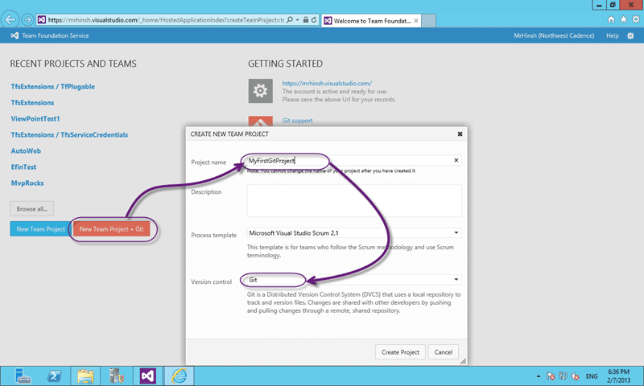
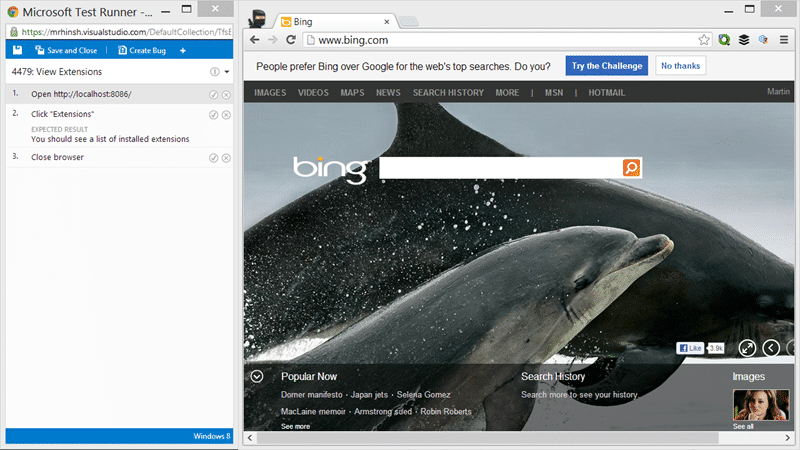
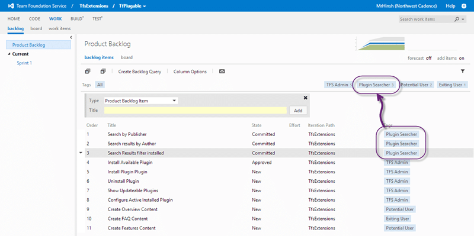
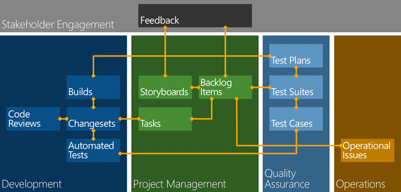

There were many new improvements in Visual Studio ALM that were announced at this years ALM Summit event that I can only pick a few to highlight as my favourites. [Brian Harry did the keynote](http://channel9.msdn.com/Events/ALM-Summit/ALM-Summit-3/Building-an-Engineering-Organization-for-Continuous-Delivery) on the second day and almost immediately announced Visual Studio 2012.2 CTP 2  and a bunch of new features some of which were made available in TF Service ([http://tfs.visualstudio.com](http://tfs.visualstudio.com)) immediately.

Although most of these features are available now on TF Service you will have to wait for some of them until TF Server 2012.2 RTM’s or even TF Server 201x (Dev12). So what are these fabulous features that have been made available:

## DVCS (Distributed Version Control System)

Full fidelity implementation of Git to allow Visual Studio to natively support Git repositories and for you to choose to use Git as your DVCS version control of choice in TF Service. You will however need to wait until Dev12 (TF Server 201x) to see it on premises.

- [Git init VS](http://blogs.msdn.com/b/bharry/archive/2013/01/30/git-init-vs.aspx "http://blogs.msdn.com/b/bharry/archive/2013/01/30/git-init-vs.aspx") - Brian Harry
- [Building an Engineering Organization for Continuous Delivery (Git Announcement)](http://channel9.msdn.com/Events/ALM-Summit/ALM-Summit-3/Building-an-Engineering-Organization-for-Continuous-Delivery "http://channel9.msdn.com/Events/ALM-Summit/ALM-Summit-3/Building-an-Engineering-Organization-for-Continuous-Delivery") – MVP Summit

  
{ .post-img }
**Figure: Creating a Team Project with DVCS**

NoteMy favourite way to use this is to [create a local Git repository](https://tfs.visualstudio.com/en-us/learn/code/create-code-project-vs-git) with Visual Studio but publish changes to TF Server. Unfortunate for now you need to use the command line until an option is added to the UI which should not be long at the current pace of development.

## Quality Enablement Improvements in Visual Studio ALM

Did you wonder why you cant create and manage your test case infrastructure just like in Microsoft Test Manager but from the web? Well now you can not only create and manage Test Plans, Settings and Cases but you also get a web based Test Runner to allow you to run your manual tests on any platform and collate that data.

  
{ .post-img }
**Figure: Test Hub in Action**

This Test Hub in the web access makes adopting Acceptance Test Driven Development (ATDD) or just doing some functional testing trivial. Say goodbye to excel as your test recording tool and be part of the awesome tractability in Team Foundation Server.

  
{ .post-img }
**Figure: Web Test Runner in Chrome**

You can use this test runner to record your test results on any platform that can render html5 and JavaScript so the supported platform list just expanded.

## Kanban swim lanes

If you have used the current incarnation of Kanban implemented in Update 1 you will know there is still an issue of having the accordion like states that Kanban likes without breaking TFS. With Update 2 for TF Server the team has added the ability to have those multiple swim lanes that allow you to model your current process without being forced to add all of your states to your process and rewrite all of your reports.

  
{ .post-img }
**Figure: You can Customise the columns**

Adding new columns is so easy as you can simply free text them up and map them to an existing state of your Backlog work items. This allows you to stack out as many states as you need to support your process.

I am not sure yet what will happen if you add 20 columns, but hopefully you will already have gone through some of process improvement initiative and decided that having 20 states is a little… confusing…

## Work Item Tagging

A Work Item Tracking tagging system that allows you not only to tag work items with any text you like, but to filter your queries by those tags. Live on TF Service and coming in TF Server 2012.2

  
{ .post-img }
**Figure: Adding Tags for each of my Personas**

This is massive as it allows me to add data to my work item without having to go an edit the work item type. In most cases we just want an extra piece of information attached to our work items so that we can filter search results and more easily find what we want. This is a good start at that and allows us to filter our backlogs and queries when we have many, or just more focus on one area.

## Conclusion

There were so many new features that it is hard to pick out a clear favourite. Indeed there are three categories of wins that are available right now. First is the reduction in the requirement to customise templates that results from the introduction of tagging. Second is the addition of the web based Test Management that will bring many more teams into Team Foundation Server. But the last is perhaps the biggest from an adoption perspective as many teams want to use Git either as individuals or as small teams, but still leverage the massive benefits of the Visual Studio ALM platform.

  
{ .post-img }
**Figure: Traceability in Team Foundation Server**

We are starting to see the enablement of the traceability story for a wider audience and across more platforms.
