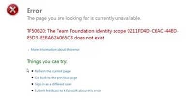

If you are cloning your TFS collection then you have to run ChangeServerId. It is reasonably well documented for this senario but what other reasons might you have to run it.

Well if you are upgrading your TFS server you may want to create a duplicate of your environment, run the upgrade and have a few folks connect and try things out. This is where we need to talk about GUIDs. GUIDs are used everywhere in side TFS. Your server has a GUID, your collections have GUIDs and even your Team Projects have GUIDs.

So if you take a backup of your production environment and restore it to another for upgrade it will have the same GUIDs. But why is this important. Well, when you connect to another server with the same GUIDs your client applications that connect to TFS will automatically transfer all of your cache and workspaces to the new server. This gives your users continuity of use as they can easily transition to the new environment even if it has a new name.

However if any users connect to your test / trial upgrade environment the same thing will happen and they could start to see some pretty strange results… you know… weird things like getting the wrong files when you do a get from source control, SharePoint sites created on the wrong servers and even errors when editing or querying work items.

The way that you solve this is the same as for cloning your collection. You need to make a call to ChangeServerId.

```
TFSConfig ChangeServerID /SQLInstance:ServerName] /DatabaseName:ConfigurationDatabaseName [/ProjectCollectionsOnly] [/ConfigDBOnly] [/usesqlalwayson]

```

**Figure: ChangeServerID command**

Now usually I would do this as soon as I stood up the new instance, but this instance was stood up by a customer that did not know about the GUID issues. They had just sent out an email to many of their users to try out and validate the new environment so unfortunately I recommended that they immediately change the server ID so that they don’t have problems later.

Why do I say unfortunately… its all in the messages and there is one when you try to run ChangeServerID that my customer, as everyone does, breezed over this morning:

> _The command ChangeServerId should only be run against a set of Team Foundation Server databases that have no application tiers configured. Do you want to continue with this operation? (Yes/No)_

While this is absolutely explicit you and I likely did what they also did which was focus on the last sentence and the questions that it contains…

Now if you do go ahead and say ‘yes’ then you will end up with a few problems.

  
{ .post-img }
**Figure: TF31001: Cannot connect to Team Foundation Server**

woops, lets hope this is just a client issue and check the web access…

  
{ .post-img }
**Figure: TF50620: The  Team Foundation identity scope does not exist**

Oh… well a reboot will likely solve that…

  
{ .post-img }
**Figure: TF30046: The instance information does not match**

Dam..

Checking the event log on the server reveals lost of errors of the TF30046 variety but logs on the server reveal nothing. Even checking the ChangeServerId log reveals nothing but success.

To the rescue is Vladimir Khvostov from the product team who pointed me at the RegisterDB and the cause.

```
TFSConfig RegisterDB /SQLInstance:ServerName [/usesqlalwayson]

```

**Figure: Setting the server strait**

In the bowless of the web.config for the TFS web services there lies an “applicationid” key that should be the new GUID but has not been updated. Hence the warning when running the command.

Running RegisterDB command will update setting in the "C:Program FilesMicrosoft Team Foundation Server 11.0Application TierWeb Servicesweb.config" and allow the server to work again.

To save time I went ahead and updated it manually and WOW everything worked again.

**Lesson: Heed all Team Foundation warnings**
