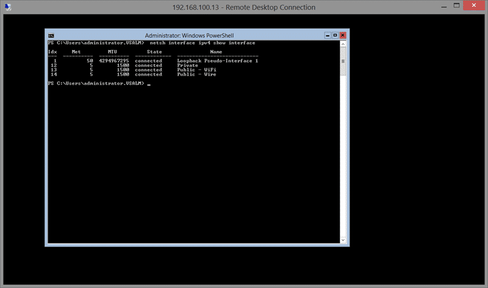
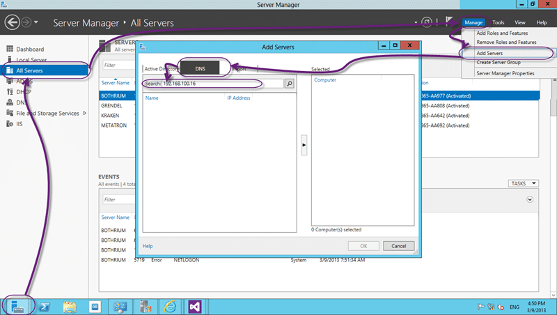
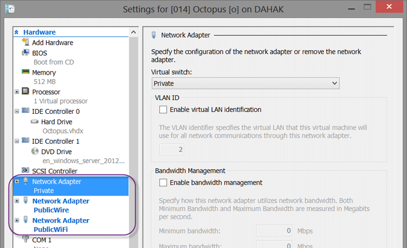

This is a short idiots guide to setting up Windows Server 2012 Core. Windows Server 2012 Core allows you to use less memory by getting rid of some peskie UI bits and bobs. Setting it up however is a little more challenging.

- **Update 2013-03-18 -** After all my hard work Shad told me that this was the old-school way and why did I not use "sconfig".   
   **Figure: Arrrrr**
  { .post-img }
      It does not have all of the commands I might need, but it does have many.

While I pride myself on having a past as a developer I did dabble in thee dark side once upon a time. My first to jobs out of university ended up with me maintaining domains and computers for the organisations that I worked for even though I would rather have not.

  
{ .post-img }
**Figure: You only get a command window**

The first issue that you run into when using Windows Server 2012 Core is the dreaded command line. Where it used to be hard to script activities in Windows, the existence of Core has made it trivial if you know the commands. Now if you like the command line you may never install another version of windows again… but if like me you like… you know… Windows… then you can use another server or you can install the admin tools on Windows 8 or Windows 7.

So to get this running there are a bunch of activities that can only be achieved through the command line:

1. **DONE - Enable Remote Desktop for Windows Server 2012 Core**
2. **DONE - Registering Windows on Windows Server 2012 Core**
3. **DONE - Remotely managing Windows Server 2012 Core**
4. **DONE - Updating Windows Server 2012 Core**
5. **DONE - Renaming your Windows Server 2012 Core**
6. **DONE - Set network details for your Windows Server 2012 Core**
7. **DONE - Opening Firewall ports on Windows Server 2012 Core**
8. **DONE - Domain join your Windows Server 2012 Core**

I may add to this list, but this was all I needed to setup and configure separate Domain Controller, Web Application Server, Database Server and TFS server. All but my TFS server are currently Core servers and that only because it already existed.

## Enable Remote Desktop for Windows Server 2012 Core

The first thing that I want to do with my servers is to connect remotely. While the Hyper-V console is awesome it does not support Cut & Past which frustrated me no end. Luckily it is very easy to enable remote desktop connections to your new server.

```
cscript C:WindowsSystem32Scregedit.wsf /ar 0

```

**Figure: Enable Remote Desktop via the command line for Windows Server 2012 Core**

You will see as we go through that the technologies for managing your server are a little fragmented still. Its not that this cant be done with PowerShell, its that it is much harder than the script above to [Enabling Remote Desktop with PowerShell](http://blogs.technet.com/b/jamesone/archive/2009/01/31/checking-and-enabling-remote-desktop-with-powershell.aspx).

I am sure there will be more parity in the future.

## Registering Windows on Windows Server 2012 Core

This is the only way to register Server Core if you do not have an internal registration server. Indeed you need this to register Windows 8 Enterprise as well as there is no UI for it anyway.

```
slmgr.vbs /ipk [your windows key]

```

**Figure: Register Windows visa the command line for Windows Server 2012 Core**

And look… a Visual Basic Script call…. awww….

## Remotely managing Windows Server 2012 Core

This was the single most vexing and frustrating thing to configure. If you are setting up core within a domain then you just join the local computer to your existing domain and you can then add that server to a computer with server manager. But if you have a workgroup as you would before you created your domain controller then you are a little hosed.

You have to tell the target core server to trust the incoming server manager connection and the server with server manager to trust the target core server. Phew…

To do this you need to add the other side to each sides “TrustedHosts” list and to do that you need to enable PowerShell as this is our first PowerShell call.

```
powershell
Set-Item wsman:localhostClientTrustedHosts KRAKEN -Concatenate -Force

```

**Figure: Adding trusted hosts via the command line for Windows Server 2012 Core**

While the server manager ports are supposed to be available by default between both the servers I did have to turn the firewall off. It may be that I just got mixed up, but there are many other circumstances that I can think of to turn the firewall of so…

```
NetSh Advfirewall set allprofiles state off

```

**Figure: Disable the firewall via the command line** **for Windows Server 2012 Core**

As well as remotely managing my servers I also want to be able to ping my servers. Call me old fashioned but a ‘ping’, which is disabled by default, has help me out many a time.. So I also want to enable that:

```
netsh advfirewall firewall add rule name="All ICMP V4" dir=in action=allow protocol=icmpv4

```

**Figure: Enable ping via the command line for Windows Server 2012 Core**

While not really required it does tend to help you out when you can ping through your firewall.

Now that you have the Trusted Hosts set and you can get through the firewall you can add your server to the management console.

  
{ .post-img }
**Figure: Add your new Windows Server 2012 Core to the Server Manager**

If you got a bunch of errors stating that the server does not exist then you need to disable the firewall. If you get a bunch of messages about “TrustedHosts” then you should make sure you have added each server to the others Trusted Host list.

## Updating Windows Server 2012 Core

And what about Windows Updates? How the heck do we see or configure them. Well there are a bunch of commands for this, unfortunately I just don’t care. Or more precisely… I don’t want to have to care. I’m a 3am kinda guys and thats what I want.

```
net stop wuauserv
cscript c:WindowsSystem32SCregEdit.wsf /AU 4
net start wuauserv
powershell
set-service wuauserv -startuptype "Automatic"

```

**Figure: Enable Windows Update via the command line for Windows Server 2012 Core**

There is a script that you can install for [Searching, Downloading, and Installing Updates](<http://msdn.microsoft.com/en-us/library/aa387102(VS.85).aspx>) but that is way more hassle than I want. In the past there were updates, specifically 1.1 .NET Framework updates that were installed automatically and broke some custom applications that companies had. Because of that burn they don’t like auto-updates.

The facts though are that the only reason the applications broke were that they were poorly built and maintained. Is this the fault of the update tool? Or the Developers and support teams for not keeping up to date. Barring an emergency ‘OMG-OMG Look at that security hole’ it takes around three months for updates to get onto Windows Update. All that testing that needs done is also testing that your organisation needs to do and turning automatic updates of prevents that testing.

How about a compromise. All non Production servers are set to Auto-Update and we Update production deliberately. When we release new versions of our software all updates currently applied in non-Production are applied to production. An easy way to keep progression and stave of disaster…

## Renaming your Windows Server 2012 Core

Next you probably want to give your server a name other than than the silly default almost-guid crap that gets set.

  
{ .post-img }
**Figure: The silly default name for your Windows Server 2012 Core**

Why ‘win-fv6da60d6cs’ would ever be considered a good name for a server I do not know 
{ .post-img }

So lets fix that now…

```
netdom renamecomputer localhost /newname:Metatron /reboot

```

**Figure: Rename your Windows Server 2012 Core via the Command Line**

Whats in a name? Well my ‘metatron’ name, for my database server, is not what I would use for a company. Company servers have names that show lots of information:

> elonmaptfsp01 = **E**urope | **Lon**don | **M**icrosoft | **Ap**plication | **T**eam **F**oundation **S**erver | **P**roduction | **01**
>
> elonmsqtfsp01 = **E**urope | **Lon**don | **M**icrosoft | **SQ**L | **T**eam **F**oundation **S**erver | **P**roduction | **01**

You should be able to tell a lot by a name…

## Set network details for your Windows Server 2012 Core

When you create a new server you normally need to set some network information to get things going. Because I have a datacentre in a laptop, and my DHCP configuration skills are zip I need to set a fixed IP access.

_Note: Having 2 DHCP servers on a network if not configured properly is BAD_

So for me… adding a fixed IP address is paramount but so is setting the DNS address on the “Private” network adapter that I use.

  
{ .post-img }
**Figure: Virtual Switch Manager of your Hyper-V Host**

I always add an “Internal Only” network so that even if I am on a plane with no network my Hyper-V Guests will still be able to talk. This is where I need the fixed IP and to set the DNS to that of the Domain Controller DNS Instance.

```
netsh interface ip set address name="Ethernet" static 192.168.100.14 255.255.255.0 192.168.100.1 1
netsh interface ipv4 add dnsserver "Ethernet" 192.168.100.1 1

```

**Figure: Setting network settings for Windows Server 2012 Core via the command line**

Now this would be us done but I actually add 3 virtual adapters to my servers. Why? Well I have to bind to either WiFi or Cable and changing it on the fly is slow. I can change it quickly on each guest, but I need to do it for each guest which is… effort. So to mitigate it I add 2 additional adapters and bind to both WiFi and Wire.

  
{ .post-img }
**Figure: Settings for Hyper-V guest**

This dies mean that it can get confusing as they are, by default, named “Ethernet”, “Ethernet 2” and “Ethernet 3”. Good luck figuring that out… So I always try to change the name of the adapter. In the UI that is actually surprisingly hard and hidden, but easy in the command line.

```
netsh interface set interface name = "Ethernet" newname = "Private"
netsh interface set interface name = "Ethernet 2" newname = "Public - WiFi"
netsh interface set interface name = "Ethernet 3" newname = "Public - Wire"

```

**Figure: Setting the Interface name for your Windows Server 2012 Core via the command line**

Now we can communicate and we know how…

## Opening Firewall ports on Windows Server 2012 Core

Remembering that we turned the firewall back on there may be some applications that we want to install that require particular ports to be opened.

I have a couple of servers that I use as Tentacle’s of an Octopus Release pipeline and they need to be able to communicate on port 10933.

```
netsh advfirewall firewall add rule name="Octopus Tentacle 10933" dir=in action=allow protocol=TCP localport=10933

```

**Figure: Add a firewall rule for your Windows Server 2012 Core from the command line**

Now we can enable all of our apps.

## Domain join your Windows Server 2012 Core

Remembering to have already set a DNS server that will allow you to join the domain, you may have DHCP, we can now easily join the server to our domain.

```
netdom join localhost /domain:vsalm.com /userd:vsalmadministrator /passwordd:[password]  /reboot:0

```

**Figure: Join your Windows Server 2012 Core via the command line**

After a reboot you are kinda done. I used the remote administration to do much of the complicated configuration and to add new Features and Roles to the servers. This can be done via the command line, but it is something that is easier in the UI.

## Conclusion

There are many things in Windows Server 2012 Core that you have to do via the command line and many other things that are just easier in the UI. I have only really documented the things that I needed to use so that I would not forget. I did configure all of the Roles and Features directly in the Server Manager console as the UI lets me tick a bunch of boxes and leads me through a wizard. However if you are a scriptie kina dude then you can do that too.

Good luck with your server configurations…

_\-Do you need help deploying & configuring Team Foundation Server? Get in touch on_ [_info@nwcadence.com_](mailto:info@nwcadence.com?subject= Recommended through MrHinsh - Windows Server 2012 Core for dummies) _so that we can get started._

