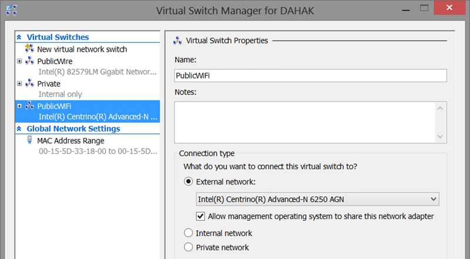
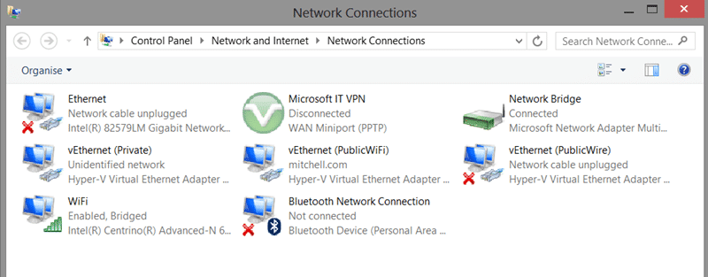
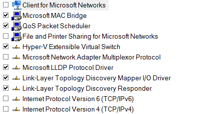

I have recently created my own local domain and now I am unable to connect to the internet with Hyper-V domain joined guest running. It gets weirder as it only affects me when I am on a Wi-Fi connection.

```
route PRINT

```

**Figure: Querying the routes**

Now while this is complete gibberish to me I can use it to try and figure stuff out.

  
{ .post-img }
**Figure: Standard Routes**

This is very annoying as I use WiFi extensively..

## Applies to

- Windows 8
- Hyper-V

## Findings

I have not really figured out what the exact problem is or why it used to work and does not now I have a domain controller as a guest. I have checked the routing table both with those computers off and on and there are no changes.

  
{ .post-img }
**Figure: Networking Setup in Windows 8 for Hyper-V**

However it worked just fine when I was cabled in so it looked like some difference between the way the Hyper-V handles cable vs WiFi.

Doing a little testing I can be on WiFi with no VM’s running and everything works… now when I turn on any of my VM’s the internet stops working…but not right away….what!

If I do a little network refresh…

```
ipconfig /release
ipconfig /renew

```

**Figure: Refresh your network settings**

…Then I see the changes immediately. So I spent an hour or so both on WiFi and on Cable spinning computers up and down and refreshing the network. This is a Wireless issue!

  
{ .post-img }
**Figure: Now that looks a little complicated**

After a bunch of research it looks like cabled connections are just wired strait through. However WiFi connections are the weird one and they require the “Network Bridge”. Now if we look at the properties for the network bridge it looks like there is a bunch of stuff not configured…

## Solution

The solution is to make sure that all of the features for your Network Bridge are configured.

  
{ .post-img }
**Figure: Default Network Bridge**

Now I want all of those things when I am on a corporate network, so I just ticked all the boxes and OK’ed the warning and wow… everything now works…
