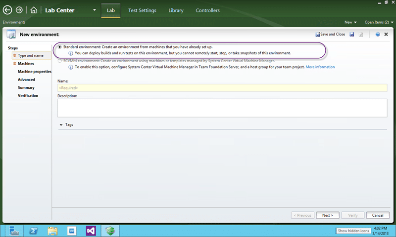
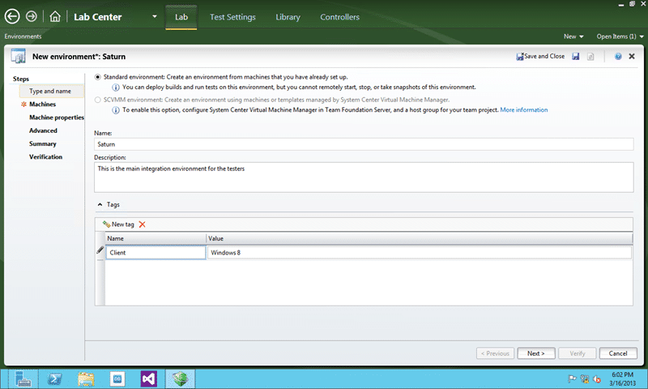
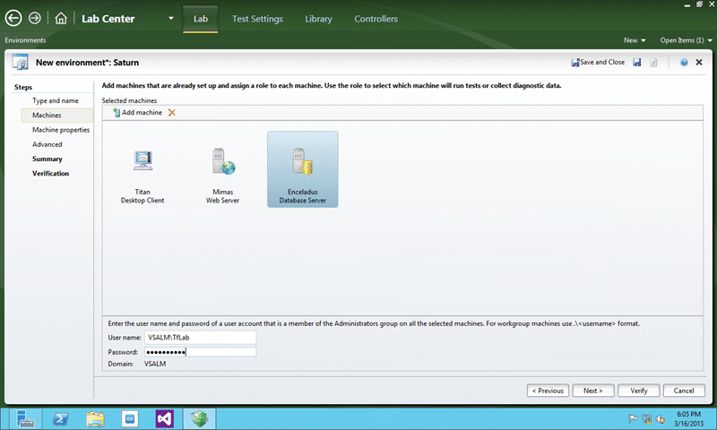
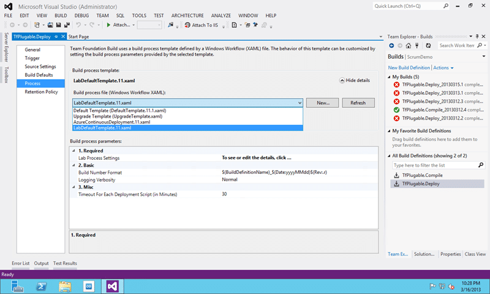
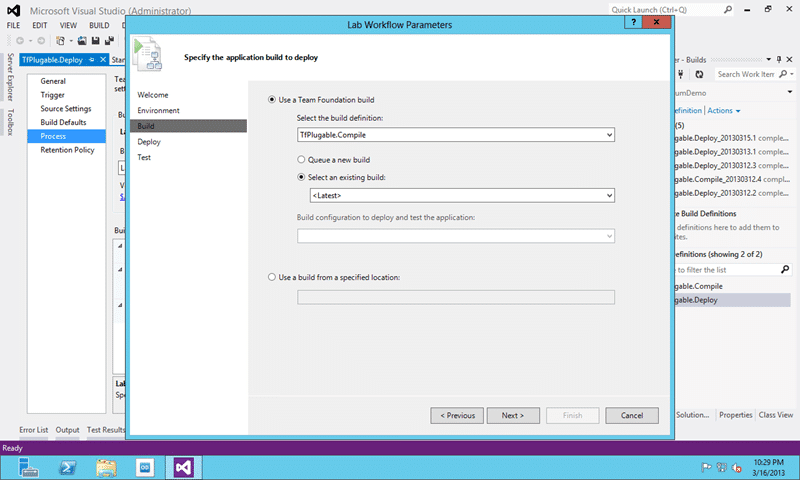
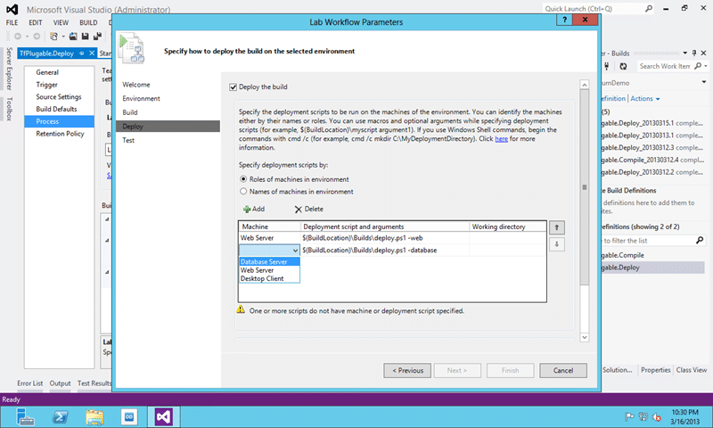
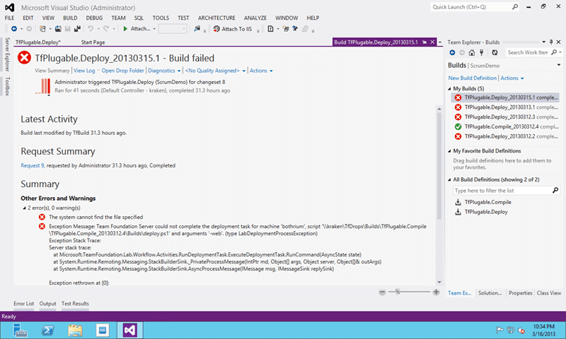

Standard Environments in Visual Studio 2012 Team Foundation Server make it possible to have an automated deployment of your software to a development or QA environment. You can then have a bunch of automated tests run in those environments, collecting data all the while.

In TFS 2010 this feature was called “Physical Environments” which is a little confusing as it just means non-Lab Management environment. It provided the ability to run tests, but you had to manually deploy which kind of sucked. What use is it unless I can do continuous delivery to it. So in Visual Studio 2012 Team Foundation Server the product team changed this to “Standard Environments” and allow you not only to monitor test execution, but also to do deployments. Better yet they also made it a snip to get existing servers up to speed…

  
{ .post-img }
**Figure: Standard Environments in Visual Studio 2012 Team Foundation Server**

The Application Lifecycle Management (ALM) community is constantly telling everyone that you should deploy in the same way to production as you do to development and testing but what we really mean is to use the same deployment mechanism, not necessarily delivery engine. As we may have different delivery engines we need to impose some standards.

We need to come up with some sort of standard interface for our Software Configuration Management (SCM) & DevOps teams to consume so that they can always have our deployments do the same thing with the same scripts. This allows us to promote the same **unit of work** from development through testing and then to production. Fortunately this interface already exists for .NET shared packages and many developers already use it; Its called Nuget.

Now while we call the searching of public packages and delivery of those components inside of Visual Studio Nuget it is really just something called “Nuget Package Manager for Visual Studio”. This package manager is just one implementation (granted the first) of Nuget and there are also a few others; Chocolatey and Octopus Deploy spring to mind as good other ones.

  
{ .post-img }
**Figure: Nuget explained**

So now we have a consistent packaging mechanism we need to have a deployment pipeline to service development and testing environments. This is where the “Standard Environments” comes in. It would be awesome if we could use the additional features of “System Centre Virtual Machine Manager (SVCMM)” that would give us built in snapshots and templating, unfortunately many  customers use VM Ware or other products that don’t yet work with Visual Studio 2012 Lab Management.

In order to setup Standard Environments we need to do a couple of things:

1. **DONE - Create your Standard Environment**
2. **DONE - Deploy to your Standard Environment**

## Create your Standard Environment

A Standard Environment is just a group of computers that you have defined as part of an environment to be monitored. These servers can be Physical or Virtual and they will have the Lab agent deployed automatically and configured to collect results from your testing.

  
{ .post-img }
**Figure: Create new environments in the Lab Centre**

If you were not previously aware you can open Microsoft Tests Manager and click the “Test Centre” title and switch over the green “Lab Centre”. The lab centre is where you manage all of your settings controllers and environments. If you are using SCVMM then you can manage your virtual environments and library's. Remember that environments are there so that we can manage ‘more than one’ machine at once. While you can do that yourself, it is a lot easier if it is done for you.

  
{ .post-img }
**Figure: Give your new environment some meta data**

You do get to set a little bit of Meta data and you can set title and you can add tags. If you have multiple client scenarios you may want to tag your environments so that you can keep track of them. You may need to have at least one environment per configuration and probably multiple so that you can have multiple testers working at the same time.

I find that al lot of organisations are resistant to creating an environment for each tester, but if you don’t then what one tester is doing can colour another. Remember if you are using the Intellitrace, Test Impact Analysis or Code Coverage data collectors then you MUST have only one tester in that environment. If you have limited resources for environments then you could use one environment to have all of your testers testing and another to verify the results.

  
{ .post-img }
**Figure: Add each machine to your environment**

I am not sure if there is a hard limit to the number of machines that you can have in any single environment but I know that in Lab Management 2010 did have a soft limit of 5. This limit was based on performance issues and my understanding was it applied to SCVMM environment's. Some experimentation may be required if you have very large environments, but if this case I only have there machines.

For each machine you need to tag with a role. This role can be used to specify scripts and to refer to the machines during a workflow.

  
{ .post-img }
**Figure: Add an administrator account**

An account needs to be added that is in the Administrators group of each of the machines but can be different per environment. This account will be used to connect to and configure those machines including installing the agents and configuring the data collection.

  
{ .post-img }
**Figure: Select the client for CodedUI test execution**

If you are wanting to run Coded UI tests and especially if you want to run them across multiple clients to speed up your tests then you need to select the machines to run the UI testing from. This will then configure those machines agents to run in interactive mode and they will log themselves in to run the tests. You can use a different account to do the login, but here I am just using the same domainTfLab account that I am using to configure and access them.

[![image[15]](images/image15_thumb-1-1.png "image[15]")](http://blog.hinshelwood.com/files/2013/03/image151.png)  
{ .post-img }
**Figure: Unable to verify that machines are accessible**

If you are unable to verify the machines are access able then try the following:

- [Windows Server 2012 Core Issue: Enable File and Printer Sharing for Lab Management Standard Environments](http://blog.hinshelwood.com/windows-server-2012-core-issue-enable-file-and-printer-sharing-for-lab-management-standard-environments/ "http://blog.hinshelwood.com/windows-server-2012-core-issue-enable-file-and-printer-sharing-for-lab-management-standard-environments/")

This should fix the machines so that you can move forward.

[![image[18]](images/image18_thumb-4-4.png "image[18]")](http://blog.hinshelwood.com/files/2013/03/image181.png)  
{ .post-img }
**Figure: We can now verify the Standard Environment**

As is usual with Team Foundation Server there are a bunch of verification checks that are performed before it ever tries to actually do the work. But once the checks are complete, which hopefully minimises any chance of errors.

  
{ .post-img }
**Figure: Auto-configuration of your machines**

After the validation and you select finish Lab Manager will go off and configure all of your machines. This includes installing the lab agent and configuring it to talk to your Team Foundation Server and indeed setting up the interactive UI test runner.

  
{ .post-img }
**Figure: Fully configured environments**

This environment is now ready.

## Deploy to your Standard Environment

Now that I have somewhere for my application to go, I need an application to go there. As I have not got all of the way through this on my servers I will just show one way that you can use this new Standard Environment.

  
{ .post-img }
**Figure: Selecting the LabDefaultTemplate**

If you have been creating custom build workflows you will know that that XAML file controls the options that are available here and the Lab XAML changes things up quite drastically. There is really only one option of consequence and that is the “Lab Process Settings”. I am not sure why this is a pop out wizard rather than a set of options to pick, but it is likely because so many of the options depend on each other.

  
{ .post-img }
**Figure: Select an Environment**

First we need to select the environment that we just created. Don’t get exited by the ‘snapshot’ option as this will only be available if your environment is hosted in a Lab Management integrated System Centre Virtual Machine Manager (SCVMM) host.

  
{ .post-img }
**Figure: Select the build you want to call**

We have bunch of options here. We can use a build or a drop folder; If we pick build we can also select wither to take the latest, a specific or to execute a new one first. I would note that if you select “Queue a new build” you will have to have a controller available that has more than one agent available.

  
{ .post-img }
**Figure: Select your deployment scripts**

It really is that simple to do a deployment. You pick the role or tag and select a script to un on that machine. That script can come from source control and it can be a simple bat file or a PowerShell. This can take your Nuget package that is the output from your build and execute it on the server. Personally I would stick all of my installs in here to so that I don’t need to do any separate configuration. The ultimate goal is configuration as code and that also means for the dependant applications that need to be installed on our servers. You could make a bunch of Chocolatey calls in the PowerShell to get your server setup and configured then run any deployment actions that you need.

  
{ .post-img }
**Figure: My build fails, yours does not have to**

I need to spend a bunch of time creating the PowerShell scripts that I need to do my deployments. But I think from this you can get the idea.

## Conclusion

So, not only can I now deploy my code, but I can have this happen automatically and have my existing regression UI automation run as part of it. Now, I do not want to do that for every checking, or maybe I do, but I may want to run a nightly build and full regression. Or if I have thousands of automation then maybe I have a permanently  rolling build that runs to the side of my core work and validates my full regression. I then only have to delve in when there is a failure.

In combination with some other mechanism to deploy to our pre-production and production environments we now have the makings of a standard deployment pipeline that obfuses the complexity of individual application deployment from SCM and DevOps teams while leaving the developers with the capability and versatility to deploy how they like.
