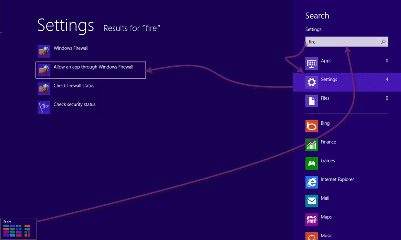
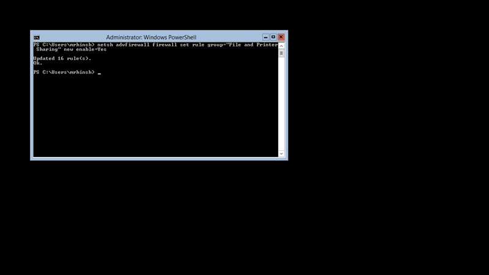
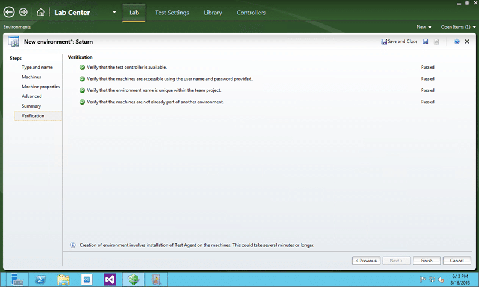

If you try to add any servers to Standard Environments in Visual Studio 2012 Lab Management you get a message that you need to enable file and printer sharing and you are unable to configure or communicate with those machines.

  
{ .post-img }
**Figure: Unable to verify that machines are accessible**

There are three main causes:

- The File and Printer Sharing exception is not enabled on these machines
- The username or password is not valid
- The machines have Windows XP

I know that the second two are not true so what to do now?

## Applies To

- Standard Environments (Visual Studio 2012 Lab Management\*)
- SCVMM Environments (Visual Studio 2012 Lab Management\*)
- Physical Environments (Visual Studio 2010 Lab Management\*)
- Windows Server 2012\*
- Windows 8\*

\* this applies to all versions of Windows that you want to use with both Visual Studio 2012 and Visual Studio 2010 Lab Management features.

## Findings

In order for Lab Management to successfully integrate with guest servers is used the file and print sharing ports of that machine. If they are not enabled or the ports are otherwise blocked then you will not otherwise be able to use those servers in environments. This

In both Windows 8 and Windows Server 2012 the File and Printer Sharing ports are blocked by default and you will need to open them up for this to work.

## Solution for Windows 8

You need to open the ports required for File & Print Sharing. This is roughly the same for doing the same on Windows Server 2012 through the UI.

1.  **Start | type “Fire” | click “Settings” | press “Enter” key**
    
    { .post-img }
    **Figure: Open the Windows Firewall Settings**
2.  **Change Settings | check “File and Printer Sharing” | OK**
    
    { .post-img }
    **Figure: Enable File and Printer Sharing on your Windows 8 firewall**

## Solution for Windows Server 2012 Core

You need to open the ports required for File & Print Sharing.

```
powershell
netsh advfirewall firewall set rule group=”File and Printer Sharing” new enable=Yes

```

**Figure: Enable File and Printer Sharing via the command line**

  
{ .post-img }
**Figure: Make sure that you run this in PowerShell**

## Conclusion

After enabling the File and Printer Sharing firewall rules everything is now green.

  
{ .post-img }
**Figure: We can now verify the Standard Environment**
