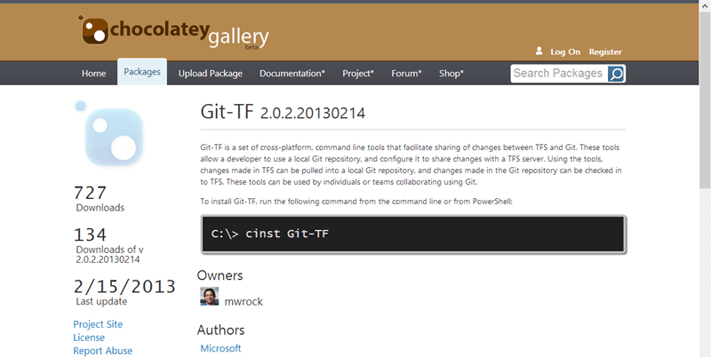

Its hard to migrate source code even from one Visual Studio 2012 Team Foundation Server to another, especially when you also want to have your history. We have been forced in the past to use some hokie migration tools that only really partially work.

- Update Anthony Borton gave me a hard time for not being able to get this working. However I had no problem with second set of code below.

With Git-Tf we can Clone a Team Foundation Server repository and with plane old Git we can do a Pull from one to the other and then push up to our target repository.

  
{ .post-img }
**Figure: Running Git from the Command Line**

The first thing we need to do in install Git-Tf and its dependencies. This will add the Git Bash command line and the TFS integration required to connect everything up. This is really me first time using Git as I have just not had time to play with it, but it looks solid so far.

  
{ .post-img }
**Figure: Install with the cint Git-Tf command line call**

When you clone a Team Foundation Server repository you can either get the tip or you can go deep. If you add the --deep  parameter on end you will effectively clone the history as well. For this particular task I only need the tip and I am really only need to go one way. You can however push source code back and fourth at will between the two servers or any other environment. A browse of the internet will also show you other source control systems that you can clone to Git. If you can clone you can pull and if you can pull you can checkin…

```
git tf clone https://mrhinsh.visualstudio.com/DefaultCollection $/TfsExtensions/TfPlugable ~/wsgitmrhinshTfPlugable
git tf clone http://kraken:8080/tfs/tfs01 $/TfsExtensions/TfPlugable  ~/wsgitkTfs01TfPlugable
git pull ~/wsgitmrhinshTfPlugable
git checkin

```

**Figure: Git commands to move from TFS to TFS**

```
git tf clone https://nakedalm.visualstudio.com/DefaultCollection $/TfsExtensions/TfPlugable c:\temp\TfPlugable
cd C:\Users\MrHinsh\Source\Repos\TfPlugable
git remote add tfplugable-tfvc-branch c:\temp\TfPlugable
git pull tfplugable-tfvc-branch master --deep
git checkin

```

**Figure: Git commands to move from TFVC to TFS Git**

The result of this is a move from my Team Foundation Service cloud account to my local test Team Foundation Server virtual machine.

If you are trying to move your source code from anything to Team Foundation Server this may be a good option. Its robust and will bring history across. I have not tested this at load but it should support reasonable sized repositories, large however will need some testing…
