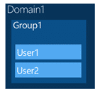
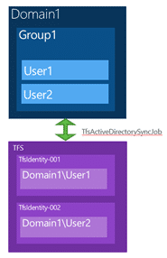

If you are moving from one domain to another, but you have lots of users you may do a batched domain migration with Visual Studio 2012 Team Foundation Server. Make suer that you read all of the fine print and don't get caught with duplicate Identities and no traceability.

In this case you need to carefully mange the users over to the new environment as Visual Studio 2012 Team Foundation Server actively syncs all domain accounts into its internal identity system. Why do you care? Well, lets suppose you have a domain group called domain1domaingroup1 and this group contains domain1user1 and domain1user2.

  
{ .post-img }
**Figure: Domain1**

Now when you add this “Group1” to Team Foundation Server it goes and syncs all of the accounts in that group. If it syncs an account that does not currently have an internal identity it creates that wrapper TFS Identity. TFS uses wrapper identities so that you can change the contents of that identity and so that you can have multiple Active Directory users with the same username, but in different domains.

  
{ .post-img }
**Figure: Domain1 Sync**

This is all fine until you try to switch domains. This is not a switch of the domain of which TFS is a member, but a switch of the domain of which the accounts are members. This usually happens at the same time, but you may move TFS from your “Department” domain to your “Corporate” domain while still maintaining trust between the two. Or you may have multiple “Departmental” or “IBoughtThisComany” domains that all have trust relationships with your “Corporate” domain and can log into TFS.

  
{ .post-img }
**Figure: Bad example, we created duplicate identities**

But at some point you want to move your users from signing in with “Domain1” credentials to using “Corporate” ones. When this happens and we do the workflow wrong we can mess up the identities in TFS and effectively have new users when we want the same ones.

This can happen when the new users are given permission, perhaps through an active directory group to your TFS server in the new domain before you have done a little work to make sure this does not happen. What we really want to happen is to change the active directory users that the TFS Identity refers to to the new domain without creating a new Identity.

**_Warning If you do end up with a duplicate identity then there is NO way to fix this! You would need to restore from backup and start your migration again making sure not to add any of the new domains users to the server._**

  
{ .post-img }
**Figure: Good example, we have mapped the user across**

If you have a lot of users you are probably going to stage or batch your users across to the new domain. So how do we manage that?

1. Move TFS Server from Domain1 to Domain2 with full trust
2. For each user:
   1. Make 100% sure that domain2User1 has NEVER been added to TFS
   2. Remove User1 from group1 in domain1
   3. Migrate User1 to Domain2 and disable account on Domain1
   4. Run TfsIdentities command line to remap the TFS Identity to the user in the new domain
   5. Add domain2user1 to TFS and remove domain1user1
   6. Add user1 to group1 of domain2

_Info You may see that under the covers TFS has created a new  Identity wrapper for the old domain1user1 account after you have mapped it across. Note that this would be a NEW TFS Identity object and we can safely ignore it. You can prevent it from being created by removing user1 from Domain1Group1 prior to running the TfsIdentity command._

If for any reason we need to back out then you can follow the reverse process. Remember that the server is joined to Domain2 at this point and it is just the users identities that we are messing with.

This is the theory, but in the real world things may be different. In the case of one customer it will take up to a year to move all users across. This poses a problem as the Active Directory migration tool automatically adds the new user to all of the existing Groups and thus the user would likely already be synced to the new server 
{ .post-img }

One way around this would be to move to TFS groups for the migration. You can create a TFS group that is equivalent to the Active Directory group and thus remove the automatic syncing as you can then remove the Active Directory groups from TFS. While this does mean that you need to manage the users that are members of those groups manually it will avoid the duplicate users.

1. Convert all Domain1 AD Groups to TFS Groups
2. Move TFS Server from Domain1 to Domain2 with full trust
3. For each user:
   1. Migrate User1 to Domain2 and disable account on Domain1
   2. Run TfsIdentities command line to remap the TFS Identity to the user in the new domain
4. Convert all TFS Groups to AD Domain Groups on Domain2

Either of these two workflows for moving users will work. It depends on how your Operations teams are moving the accounts around. However you do this, if you are batching users, it will take some time. This particular customer thinks it will take them up to a year to move all of their users and are in this for the long term.

- [In-Place upgrade of TFS 2008 to TFS 2010 with move to new domain](http://blog.hinshelwood.com/in-place-upgrade-of-tfs-2008-to-tfs-2010-with-move-to-new-domain/ "http://blog.hinshelwood.com/in-place-upgrade-of-tfs-2008-to-tfs-2010-with-move-to-new-domain/")

Hopefully your domain move goes more smoothly and that you watch out for the pitfalls.
