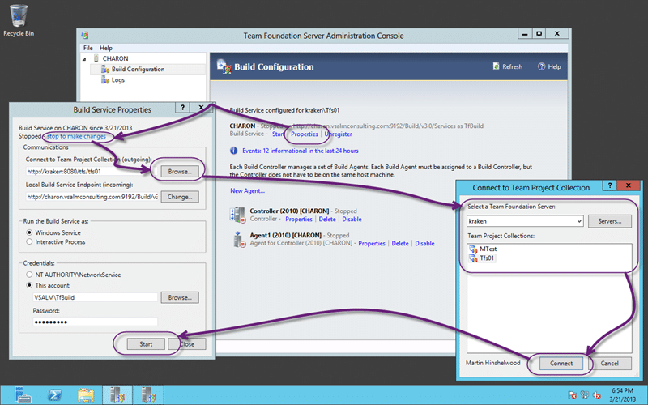
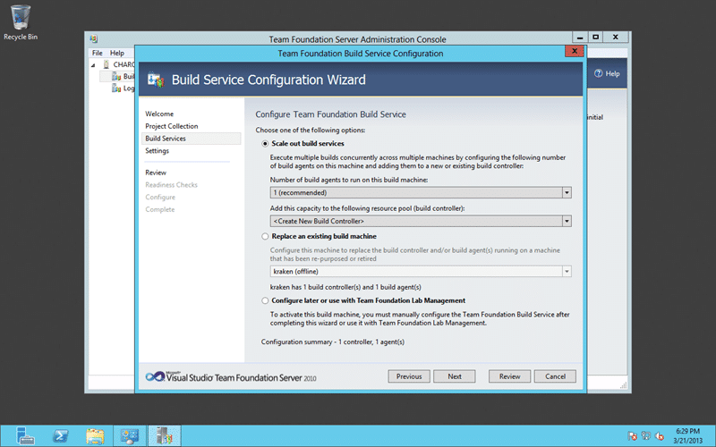
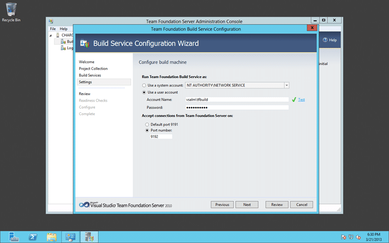
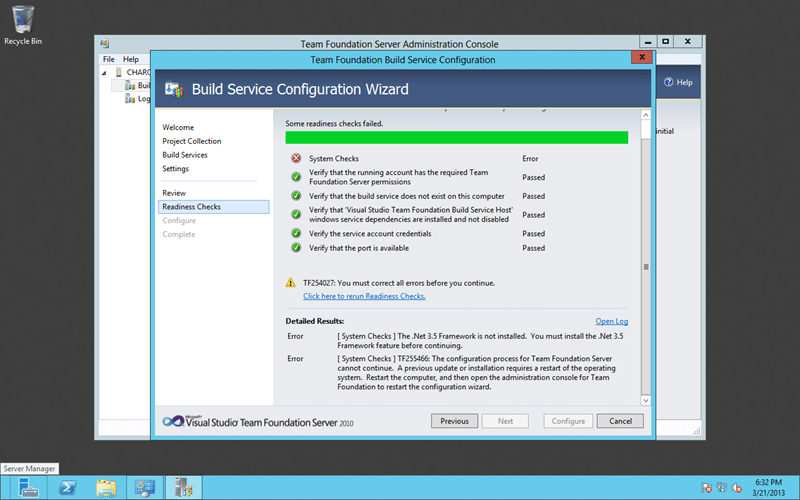
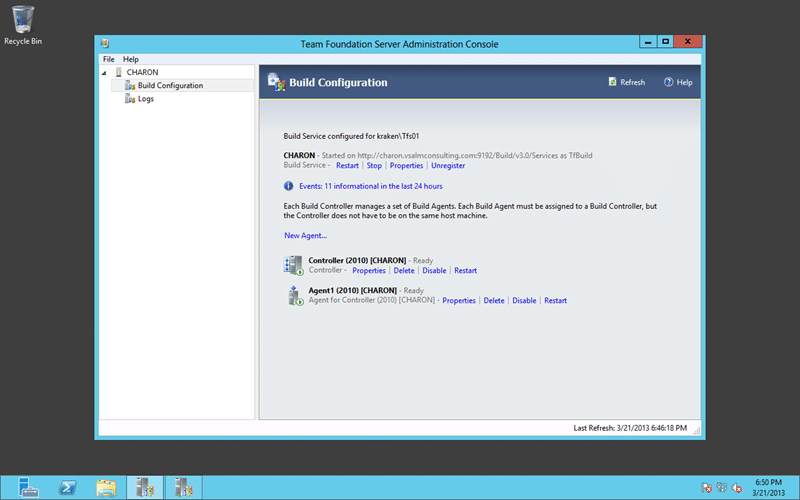
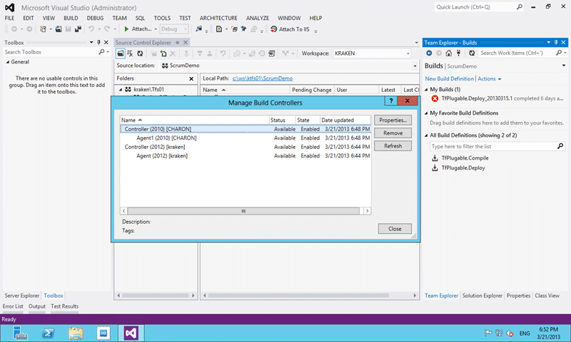

Did you know that Visual Studio 2012 Update 2 supports 2010 Build Servers? Being able to connect TF Build 2010 Controllers to TFS 2012 is opening up upgrade paths for customers that are currently blocked from upgrading to TFS 2012.

- Update - This is supported on Team Foundation Server 2013 as well as Team Foundation Server 2012 Update 2 +

Most of my customers have a small foot print for their build infrastructure (< 5 TF Build 2010 servers) and can upgrade to the latest version at the same time as their TFS Server. However a growing number of customers have substantial (> 20 TF Build 2010) server that facilitate builds across hundreds of products each with their own custom build workflow.

If you have ever tried to upgrade a workflow from 2010 to 2012 you will no that it can be a little tricky at times if you have heavy customisations. Not only do you need to rebuild all of your custom activities for the new framework, you need to get them into your XAML and test it. This can be a major undertaking.

  
{ .post-img }
**Figure: Updating all of your XAML workflows is daunting enough**

Not only that but many folks are still using Windows Server 2003 as their standard environment and are likely using 32bit. Those in the know will already have cringed as a 32bit server CAN NOT be upgraded to the Windows Server 2008 R2 64but or Windows Server 2012 64bit that are the only operating system supported by Team Foundation Build 2012. So not only do I have to move to a newer OS, but I also have to wipe and rebuild all of my build servers for a new bit’edness.

So to support this adoption blocker the build team have worked night and day to honour the existing API that your Team Foundation Build 2010 Controllers are looking for. This means that you can keep all your TF Build 2010 Controllers and Agents on the same OS but move your TFS server forward to TFS 2012 Update 2.

## Connect existing TFS 2010 Build Agent to TFS 2012

If you have upgraded your TFS 2010 server to TFS 2012 Update 2 and you have moved hardware then you will need to reconfigure each of your TF Build 2010 Controllers and Agents to talk to the new TFS 2012 Server.

  
{ .post-img }
**Figure: Change the TFS Server configured for Build**

or you can call "tfsconfig setup uninstall:all" to reset your build agent to defaults and run the wizard again. When you do you will be asked is you want to ‘replace’ and existing build machine and you can replace the one you are are current on.

Simples…

## Connect new TFS 2010 Build Agent to TFS 2012

You can have Team Foundation Build 2010 installed on any [operating system that supports it](<http://msdn.microsoft.com/en-us/library/vstudio/dd578592(v=vs.100).aspx>) which includes 32bit Windows Server 2003. If you have existing TF Build 2010 instances and you are doing either an in-place upgrade or you use a friendly name to connect then you need do nothing and everything will work seamlessly after the upgrade.

If however you are moving your TFS server to new hardware, always recommended  for major version upgrades, then you will need to reconfigure your Build Controller and Agents to talk to the new server URL.

  
{ .post-img }
**Figure: TFS 2010 Build Agent installed**

You then need to make sure that you have Service Pack 1 installed before you try to connect your server to TFS 2012. Once you have that installed, I got mine from Windows Update, you are good to go for configuration.

  
{ .post-img }
**Figure: Connect your TF Build 2010 to TFS 2012**

In this case I am using Windows Server 2012 64bit, but this works just as well on Windows Server 2003 32bit. We then come to how we want our TF Build 2010 to connect to TFS 2012. This only really applies if you are adding a new TF Build 2010 Agent to the mix.

  
{ .post-img }
**Figure: Adding a new Controller you can scale out or replace**

If you are replacing and existing controller you can select it here, or if you are adding a new 2010 Agent to a 2010 Controller that can also be selected. You do however need to make sure that you do not try to add a 2010 Agent to a 2012 Controller as that will not work.

  
{ .post-img }
**Figure: I have 2 Controllers on here so I need to change the port**

A already have a TF Build 2012 controller on this box so I am configuring this new one to work on another port. While not usually necessary it does allow this scenario. If you are going to do that in production however you want to make sure that you have enough cores and RAM to support it.

Info You can’t have both your controllers configured at the same time. I have turned my 2012 controller off to configure my 2010 on on the same server.

  
{ .post-img }
**Figure: TF255466 .NET Framework 3.5 is not installed**

If you are running on Server 2012 or Server 2008 R2 you will have to explicitly add .NET 3.5 to the stack. This is very easy with the “Add Roles & Features” wizard.

  
{ .post-img }
**Figure: Adding the .NET Framework 3.5 feature for TF Build 2010 to work**

Now that we have everything in place we can run the configuration of TF Build 2010 and plug it into our TFS 20912 server.

  
{ .post-img }
**Figure: My 2010 Controller and Agent are configured against 2012**

Now all of my existing builds will work as is with no upgrade required. I can even run TF Build 2010 on servers that do not have .NET 4.5 on them.

  
{ .post-img }
**Figure: Woot, 2010 and 2012 together having fun**

Now I can choose wither to send my build to my 2010 build system or my 2012 one.

## Conclusion

This is one of the major features of Team Foundation Server 2012 Update 2. I know that it looks like a little fix, but I have customers that were thinking that they would never be able to upgrade to TFS 2012. If your TFS server is managed by a central corporate IT department and you have many business units using it can they all take the time to upgrade all of their Custom Activities, Build Workflows and Servers all at once?

Well now they don’t have to. There is no longer any excuse not to upgrade to TFS 2012 Update 2 now!
