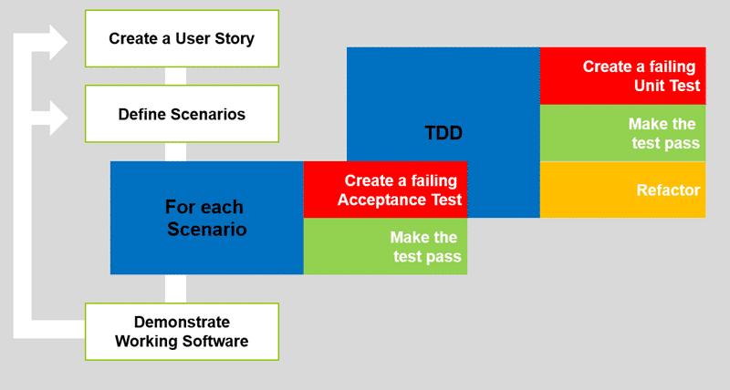

The insufficiency of Scrum is a fallacy perpetrated by teams that don’t step up their practices in concert with their planning and don't really want to make it work anyway. You can fail doing Kanban, XP, Merise and SSADM just as easily unless you have good engineering practices as well.

The goal of Agile it to have you fail sooner and for it to cost less. So what happens when you try to make your management practices more agile but forget about your engineers practices?

Well [José Manuel Nieto](http://aventuraspuntonet.wordpress.com/) contacted me on twitter after joining a team that was suffering from what he called [The Insufficiency of Scrum](http://aventuraspuntonet.wordpress.com/2013/03/16/the-insufficiency-of-scrum/) and asked for thoughts and after a conversation some advice.

<blockquote class="twitter-tweet">
@<a href="https://twitter.com/mrhinsh" target="_blank">mrhinsh</a> Hi What do you think about the thoughts I published? "The Insufficiency of SCRUM" <a title="http://wp.me/p33ULi-5k" href="http://t.co/piKoVTO9YM" target="_blank">wp.me/p33ULi-5k</a>

— José Manuel Nieto (@SuperJMN) <a href="https://twitter.com/SuperJMN/status/315446020039397378" target="_blank">March 23, 2013</a>
</blockquote>

When we fail at something it is only human to look for something to blame other than ourselves as the implementers and the things that we did not take care of.

We have to accept the fact that no process is perfect and that we will need to work hard at anything to make it work. Unfortunately we worked at traditional software development for over 40 years to prove that it did not work. But that is not really true…. it works in the small scale or if we are building something simple. I can’t think of any modern software that is either of those things. However Agile is not a silver bullet. I will say that again… **Agile is not a silver bullet** and you should read [Scrum is hard to adopt and disruptive to your organisation](http://blog.hinshelwood.com/scrum-is-hard-to-adopt-and-disruptive-to-your-organisation/ "http://blog.hinshelwood.com/scrum-is-hard-to-adopt-and-disruptive-to-your-organisation/").

<blockquote class="twitter-tweet">
@<a href="https://twitter.com/mrhinsh" target="_blank">mrhinsh</a> It WAS agile until bugs started to riddle the app. SCRUM only has short-term planning.

— José Manuel Nieto (@SuperJMN) <a href="https://twitter.com/SuperJMN/status/315513979948642304" target="_blank">March 23, 2013</a>
</blockquote>

Most of the Agile Frameworks only cater for planning the ‘what’ and tells you to let the team decide on ‘how’ to build the software. Scrum, Kanban & Scaled Agile all focus on the Management process not the engineering practices. This does not mean that you don’t also need good engineering practices, and in fact the [Scrum Guide](http://www.scrum.org/Scrum-Guides) explicitly tells you that your team needs “good engineering practices’ in order to succeed.

  
{ .post-img }
**Figure: Testing is core to inspecting and adapting your engineering practices**

If you don’t have those good engineering practices then you will spend more time sprint on sprint struggling with the technical debt that is built up and you will end up down an engineering blind ally.

<blockquote class="twitter-tweet">
@<a href="https://twitter.com/mrhinsh" target="_blank">mrhinsh</a> Right. It lacks all of those -able adjectives. But, how to recover from the mess. How to refactor?

— José Manuel Nieto (@SuperJMN) <a href="https://twitter.com/SuperJMN/status/315532905977876481" target="_blank">March 23, 2013</a>
</blockquote>

But now I am hosed, how to I get out of this?

## Step 1: Hold effective retrospectives to prevent the insufficiency of scrum

On of the reasons our team gets into this position is that they did not know that they was in a broken state until it is too late. If our organisation fails to understand the purpose of the retrospective as an inspect and adapt moment for ‘how’ we worked during our Sprint then one will fail to improve.

<blockquote class="twitter-tweet">
@<a href="https://twitter.com/mrhinsh" target="_blank">mrhinsh</a> it was as soon as I entered the team. 6th sprint.

— José Manuel Nieto (@SuperJMN) <a href="https://twitter.com/SuperJMN/status/315532343857266688" target="_blank">March 23, 2013</a>
</blockquote>

The accountable and responsible party here is the Scrum Master. Without an effective Scrum Master to guide the team you WILL fail. If you do not have an effective Scrum Master then you or they don’t fully understand the [42 Tasks for a Scrum Master’s Job](http://agiletrail.com/2011/11/14/42-tasks-for-a-scrum-masters-job/ "42 Tasks for a Scrum Master’s Job").

According to the Scrum Guide the Development Team can ‘choose’ their Scrum Master to make sure that they get some one as effective as possible.

Yes, this also means that they can ‘un-choose’ their current one.

## Step 2: Stop creating technical debt to prevent the insufficiency of scrum

You need to first stop creating technical debt. To do this you only need to focus on one thing; **Working software at lease every 30 days**. If you are not able to create working software every sprint then you need to stop and look at why that is.

Note I prefer ‘working software on every checkin’ and ‘continuous delivery’. That way I can ship working software at any time.

Now I am not talking about that flaccid rendition of working software that lead you to this place of horror and despair. But instead take ‘working software’ at face value and have it mean ‘everything that I have delivered works with no further work required’. Does that mean that it meets the customers expectations? No it does not; unless their only expectation is for what you show them to work with no errors and that if they say ‘ship-it’ you can deploy what you have. If you have to reply with… “Well, maybe next sprint as we still have some bugs.” then you have failed as a professional and as a team to deliver the minimum bar.

<blockquote class="twitter-tweet">
@<a href="https://twitter.com/mrhinsh">mrhinsh</a> The core is basically wrong. Now, nobody can fix that. No time for redesigns in a sprint

— José Manuel Nieto (@SuperJMN) <a href="https://twitter.com/SuperJMN/status/315519701960777729">March 23, 2013</a>
</blockquote>

But if we do get into that state then you are in the very same ‘brownfield’ situation as software that have been built over years with no unit tests. So if the primary goal now is working software that meets our customers expectations and we augment our Definition of Done to reflect that then we will be delivering less features of higher quality.

  
{ .post-img }
**Figure: There is [1000% return of investment for every test written in TDD](https://www.sugarsync.com/pf/D057810_69933305_087616)**

While we are still paying back our excessive build up of technical debt, using those engineering practices that will prevent future build up, we will be delivering less value to the customer.

## Conclusion

Remember that the software that you are building is an organisational asset and decisions to cut quality affect the value of that asset and thus must be reflected in your organisations financial statements .Cutting quality in your software without first gaining the approval to do so from your financial executives is unprofessional at best and fraud at worst and always incompetence.

Don’t be incompetent. Don't commit fraud.

**Be a professional…**

