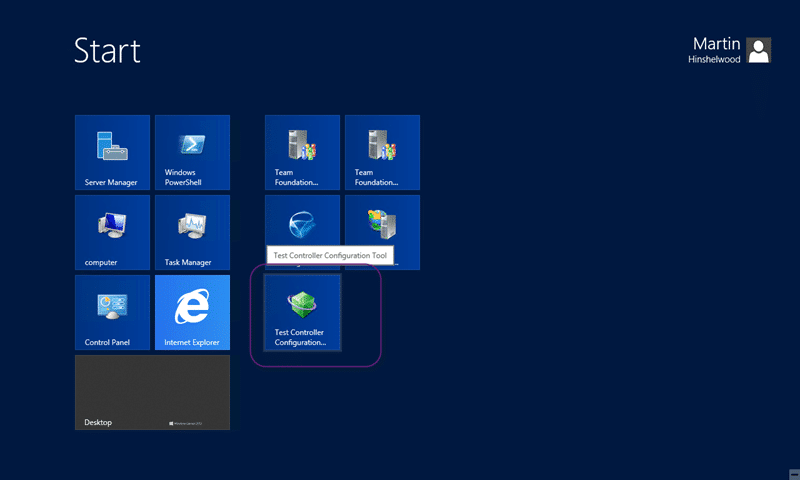
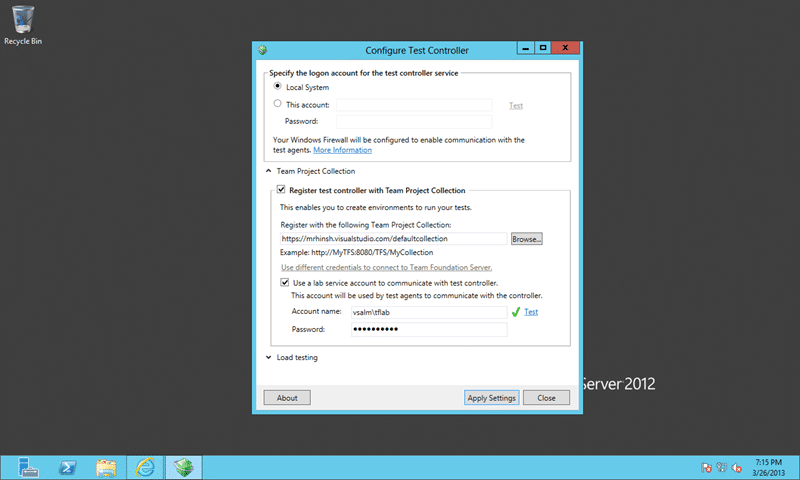
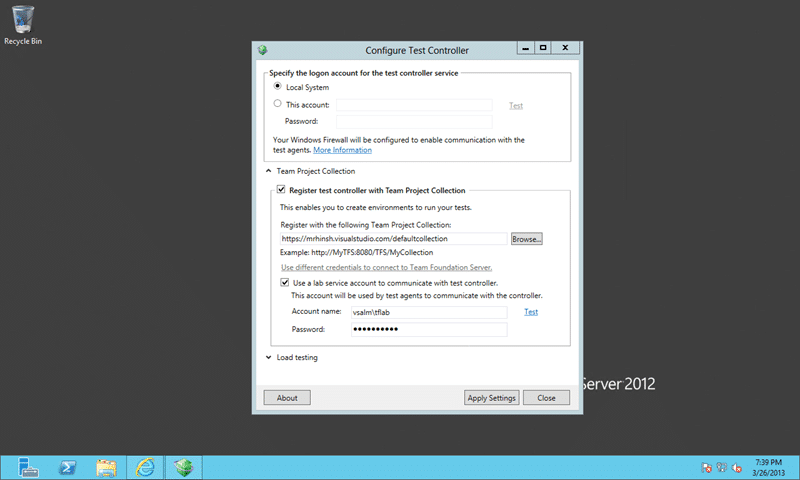

Did you know that you can connect a Test Controller to Team Foundation Service? And if you can do that, can you create [standard environments for automated deployment and testing](http://blog.hinshelwood.com/standard-environments-for-automated-deployment-and-testing/ "Standard Environments for Automated Deployment and Testing") against the cloud?

I did not realise that this was supported and I only stumbled across it as I was tinkering with my local Test Controller and saw my TF Service instance in the connection menu and wondered what would happen.

  
{ .post-img }
**Figure:** [**Connect a Test Controller to Team Foundation Service**](http://msdn.microsoft.com/en-us/library/vstudio/hh546460.aspx)

To get the Test Controller you need to get a hold of the [Agents ISO](http://www.microsoft.com/visualstudio/eng/downloads#d-additional-software) from the download site and run the install.

  
{ .post-img }
**Figure: Run configuration to connect a Test Controller to Team Foundation Service**

Once you have the agent installed you can then get on with the configuration. This is simple and the only surprise was that it worked.

  
{ .post-img }
**Figure: Configure to connect a Test Controller to Team Foundation Service**

This is so simple it is ridicules. Just select your hosted Team Foundation Service environment from the ‘browse’ list. You will likely have to configure the additional account to talk to your local agents as the account that you use to connect to TFS does not have that permission.

Under the covers the controller will be detecting that it is TF Service which is why the “use different credentials to connect to Team Foundation Server” is disabled but that did confuse me for a while. That was until I remembered that the Build Controller automatically retrieves the [Service Credentials](http://blog.hinshelwood.com/tfs-service-credential-viewer/) from TF Service and this was likely doing the same. It is however not that obvious and as I am in a hotel on a hotel speed connection I battled with error messages for a while. But they were all in the tubes and not in the controller.

  
{ .post-img }
**Figure: TF400324 Team Foundation services are not available from server**

This however is a red hearing as you can see from the log:

```
E, 2013/03/26, 19:22:10.502, Microsoft.TeamFoundation.TeamFoundationServiceUnavailableException: TF400324: Team Foundation services are not available from server https://mrhinsh.visualstudio.com/defaultcollection.
Technical information (for administrator):
  The underlying connection was closed: An unexpected error occurred on a receive. ---> System.Net.WebException: The underlying connection was closed: An unexpected error occurred on a receive. ---> System.IO.IOException: Unable to read data from the transport connection: An existing connection was forcibly closed by the remote host. ---> System.Net.Sockets.SocketException: An existing connection was forcibly closed by the remote host
at System.Net.Sockets.Socket.Receive(Byte[] buffer, Int32 offset, Int32 size, SocketFlags socketFlags)
at System.Net.Sockets.NetworkStream.Read(Byte[] buffer, Int32 offset, Int32 size)
--- End of inner exception stack trace ---
at System.Net.Sockets.NetworkStream.Read(Byte[] buffer, Int32 offset, Int32 size)
at System.Net.FixedSizeReader.ReadPacket(Byte[] buffer, Int32 offset, Int32 count)
at System.Net.Security._SslStream.StartFrameHeader(Byte[] buffer, Int32 offset, Int32 count, AsyncProtocolRequest asyncRequest)
at System.Net.Security._SslStream.StartReading(Byte[] buffer, Int32 offset, Int32 count, AsyncProtocolRequest asyncRequest)
at System.Net.Security._SslStream.ProcessRead(Byte[] buffer, Int32 offset, Int32 count, AsyncProtocolRequest asyncRequest)
at System.Net.TlsStream.Read(Byte[] buffer, Int32 offset, Int32 size)
at System.Net.PooledStream.Read(Byte[] buffer, Int32 offset, Int32 size)
at System.Net.Connection.SyncRead(HttpWebRequest request, Boolean userRetrievedStream, Boolean probeRead)
--- End of inner exception stack trace ---
at System.Net.HttpWebRequest.GetResponse()
at Microsoft.TeamFoundation.Client.Channels.TfsHttpWebRequest.SendRequestAndGetResponse(HttpWebRequest webRequest, WebException& webException)
--- End of inner exception stack trace ---

```

**Figure: TF400324 because The underlying connection was closed**

Man I hate hotel connections and their flakiness.

However after a little perseverance and clicking at just the right time to get on the maintenance plunger cycle for the hotel WiFi and you are connected.

  
{ .post-img }
**Figure: Configured to connect a Test Controller to Team Foundation Service**

Now that we are configured we can head over to Microsoft Test Manager, switch to the Lab Centre and configure an environment.

What did you do with your environments connected to TF Service?
