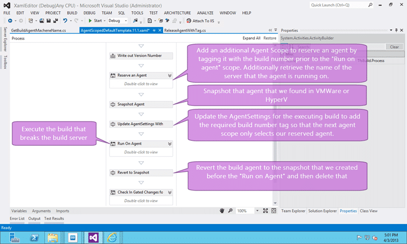
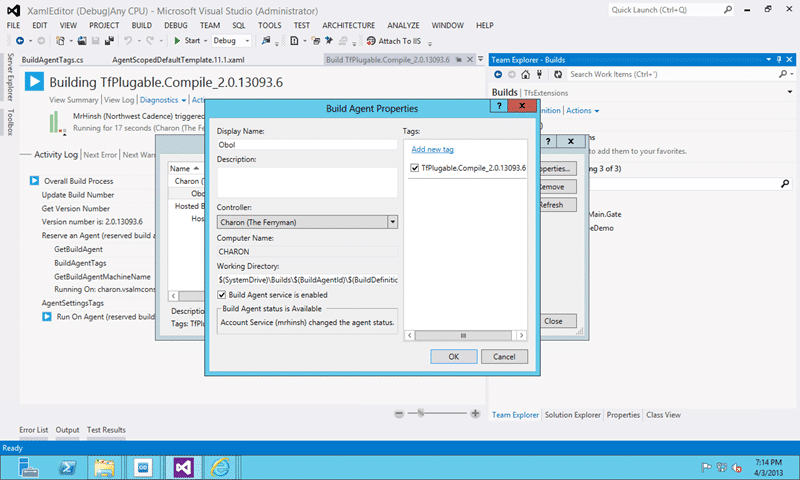
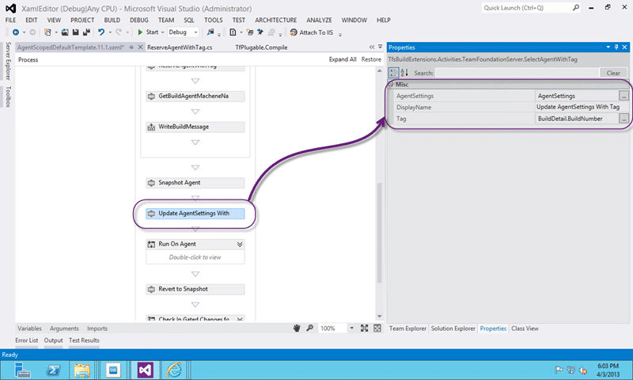
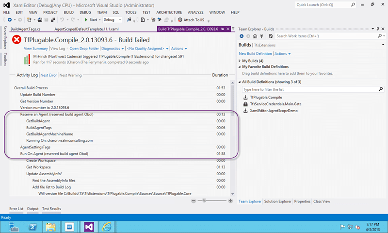

By the time you hit the AgentScope activity in a TF Build workflow you are already running on the agent and if you have things you need to configure you need to figure out some way to reserve an agent before you get there.

- **Update 2013-04-04** - All three of the activities below have been added to the [TFS Community Build Extensions](http://tfsbuildextensions.codeplex.com/documentation) project on Codeplex and will be in a future release

There are a number of reasons that you might want to reserve your TF Build Agent in Visual Studio 2012 Team Foundation Server before you hit the default AgentScope. The one I am working on with a customer is that they have a build that can only be executed once on a Build server and then always fails. Yes, the build breaks the Build Agent. Yes, I know that this is something that the development team responsible should fix but the Software Configuration Management (SCM) team that owns the servers can only encourage good behaviour and not enforce it.

  
{ .post-img }
**Figure: Agent Scope runs on the agent**

The current solution is to revert the build server to a snapshot after every build. This causes a bunch of knock on problems:

1. **Revert to Snapshot**  
   We need to revert the VM Ware server to a Snapshot after every build
2. **Removed from Domain**  
   As the snapshot can be more than 30 days old the Active Directory machine security token may have expired in which case you would need to re-join that server to the domain. The result of this is that the Infrastructure teams will not have these build servers on the domain. And rightly do…
3. **Shadow accounts need to be used**  
   As our computers are now in a workgroup we need to setup and maintain Shadow accounts for access.
4. **You can only use one AppTier**  
   As we need to maintain shadow accounts and thee needs to be one on each AppTier we end up with either AppTier1MyAccount or AppTier2MyAccount. So on the build server we get a conflict of Workgroup as these two accounts vie for workspace mappings.

So what can we do to alleviate this. One idea, the one that we re going to try,  is to take the snapshot at the beginning of the build and revert at the end. That way the Snapshot we are reverting to is only a few hors old at worst and our Build computers can continue to be services normally. Unfortunately we only know the agent… on the agent..

The way to solve this is to either rewrite the AgentScope Activity (not going to happen) or to do something a little sneaky. How about if we add another AgentAcope, reserve the agent in some way and then run the real agent scope…

1. DONE Reserve Agent in some way
2. Execute some action against the Agent
3. DONE Run on Reserved Agent
4. Execute some action against the Agent
5. DONE Reset the Reservation

While this does complicate the build process it does indeed looks to be the best bet in this circumstance.

  
{ .post-img }
**Figure: Reserve an agent before you execute the build for real**

## Reserve an Agent in some way

This should be simple even though it looks a little convoluted.

1. Add additional AgentScope
2. DONE Add a Tag to the Agent
3. DONE Get Machine name of the Agent
4. Exit AgentScope

  
{ .post-img }
**Figure: Add additional AgentScope to reserve an agent**

In this additional Agent Scope we can now call GetBuildAgent to populate the data we need and gain access to the Tags. However we need to do a couple of things that are not normally done:

### Add a Tag to the Agent

In order to add a tag to an agent we need to create our first custom activity. This one, as with all of the activities for this process are really simple. It takes the IBuildAgent variable that we just got and a string Tag that it then adds to that agent.

```
namespace MrHinsh.TfsBuildExtensions
{
    using System;
    using System.Activities;
    using System.ComponentModel;
    using Microsoft.TeamFoundation.Build.Client;
    using Microsoft.TeamFoundation.Client;

    [BuildActivity(HostEnvironmentOption.All)]
    public sealed class BuildAgentTags : CodeActivity
    {
        [RequiredArgument]
        [Browsable(true)]
        public InArgument BuildAgent { get; set; }

        [RequiredArgument]
        [Browsable(true)]
        public InArgument Action { get; set; }

        [RequiredArgument]
        [Browsable(true)]
        public InArgument Tag { get; set; }

        protected override void Execute(CodeActivityContext context)
        {
            if (context == null)
            {
                throw new ArgumentNullException("context");
            }

            IBuildAgent buildAgent = context.GetValue(this.BuildAgent);
            TagActions action = context.GetValue(this.Action);
            String tag = context.GetValue(this.Tag);
            switch (action)
            {
                case TagActions.Add:
                    buildAgent.Tags.Add(tag);
                    break;
                case TagActions.Remove:
                    buildAgent.Tags.Remove(tag);
                    break;
                default:
                    break;
            }
        }
    }

    public enum TagActions
    {
        Add,Remove
    }
}
```

**Figure: Add a Tag to the Agent custom build activity**

Once compiled and added to your custom assemblies location you can then add that new activity to your Build Workflow and configure it.

  
{ .post-img }
**Figure: Add a Tag to the Agent workflow**

We already got the BuildAgent variable from the GetBuildAgent activity and we can pass it in here. I am also choosing to use the Build Number, that we get from the BuildDetail object,  to add as a tag. This makes sure that it is unique to this execution and allows us a simple way to clean it up afterwards.

  
{ .post-img }
**Figure: Tag added to agent**

As you can see this successfully adds the tag to the agent.

### Get Machine name of the Agent

The second activity we need is to retrieve the physical server name for the agent that we are running on. We need to call into wither VMWare or HyperV to snapshot the server and for that I need to know what server to call.

This was even easier to get although it did take a little while poking at the API’s to find the right thread to pull. I had thought that I could get the server name from a property of an existing object but it was conspicuously missing. I decided that rather than trying to be difficult I would just parse it out of a URL. Simples…

```
namespace MrHinsh.TfsBuildExtensions
{
    using System;
    using System.Activities;
    using System.ComponentModel;
    using Microsoft.TeamFoundation.Build.Client;
    using Microsoft.TeamFoundation.Client;

    [BuildActivity(HostEnvironmentOption.All)]
    public sealed class GetBuildAgentMachineName : CodeActivity
    {
        [RequiredArgument]
        [Browsable(true)]
        public InArgument BuildAgent { get; set; }

        [RequiredArgument]
        [Browsable(true)]
        public OutArgument AgentMachineName { get; set; }

        protected override void Execute(CodeActivityContext context)
        {
            if (context == null)
            {
                throw new ArgumentNullException("context");
            }
            IBuildAgent buildAgent = context.GetValue(this.BuildAgent);
            context.SetValue(this.AgentMachineName, buildAgent.Url.Host);
        }
    }
}

```

**Figure: Get Machine name of the Agent custom activity**

You can see that I am just using the build agent object and parsing the servers host name from the URL. This seamed a lot easier than using any of the other methods that I could think of and even after spelunking the API’s for a few hours I could not find a better approach.

  
{ .post-img }
**Figure: URL from Build Configuration page of TFS Administration Console**

This will give me the fully qualified name of the server as it is configured in the Build Configuration of the TFS Administration Console on the Build Agent server.

  
{ .post-img }
**Figure: Get Machine name of the Agent workflow config**

Again I am using the BuildAgent object and passing back the value as AgentMachineName to a veriable that I can use outside of the scope of the “Reserve on Agent” sequence.

## Run on Reserved Agent

Rather than creating something custom we really want to hook into what is already there. When you configured a build you were able to define some information on what agent to select and run on. In this configuration you were able to select things like Agent Name and Tags to filter by.

  
{ .post-img }
**Figure: Selecting the Agent Settings**

Using Agent Name will not provide us any value as we do not want another build to snag this agent but instead to ignore it. To do that we need to set the “Tag Comparison Operator” to “MatchExactly” and make sure that only the agents we want have the desired tag set. In this case it is NONE. With no tags added this build should select any agent with no tags and ignore agents that have even one tag.

So when we execute the first agent scope above our agent will be selected and we harvest the name and add a tag that is the same as the build number. Now all we need to do is update the Agent Settings above to include a tag that is the same as the build name and the second Agent Scope with only be able to choose our tagged Agent. And for that we need another custom Activity.

```
namespace MrHinsh.TfsBuildExtensions
{
    using System;
    using System.Activities;
    using System.ComponentModel;
    using Microsoft.TeamFoundation.Build.Client;
    using Microsoft.TeamFoundation.Client;
    using Microsoft.TeamFoundation.Build.Workflow.Activities;

    [BuildActivity(HostEnvironmentOption.All)]
    public sealed class AgentSettingsTags : CodeActivity
    {
        [RequiredArgument]
        [Browsable(true)]
        public InArgument AgentSettings { get; set; }

        [RequiredArgument]
        [Browsable(true)]
        public InArgument Action { get; set; }

        [RequiredArgument]
        [Browsable(true)]
        public InArgument Tag { get; set; }

        protected override void Execute(CodeActivityContext context)
        {
            if (context == null)
            {
                throw new ArgumentNullException("context");
            }
            AgentSettings agentSettings = context.GetValue(this.AgentSettings);
            TagActions action = context.GetValue(this.Action);
            String tag = context.GetValue(this.Tag);
            switch (action)
            {
                case TagActions.Add:
                    agentSettings.Tags.Add(tag);
                    break;
                case TagActions.Remove:
                    agentSettings.Tags.Remove(tag);
                    break;
                default:
                    break;
            }
        }
    }
}

```

**Figure: Add Tag to Agent Settings custom activity**

All this code does is take the Agent Settings object and add a tag to make sure that we get the right agent the second time through the AgentScope.

**  
{ .post-img }
Figure: Add Tag to Agent Settings Workflow**

So we just pass the AgentSettings object and feed it the same build number that we used before as the tag. Now we can only get this agent to “Match Exactly” and thus the build should run on this agent.

## Reset the Reservation

And to reset the reservation all that needs done is to remove that tag from the agent. For this activity we just set the “Action” attribute to be “Remove” and we remove the tag of the build name and free up the Agent for other builds. It is worth noting that if a build is cancelled then you my need a separate clean-up routine that runs and un reserves machines that are reserved due to failed or stopped builds.

## Conclusion

This process while requiring the customisation of your build process can allow you to do a bunch of things with your build server that you may not want to enshrine in it. You may want to do the snapshot and revert not because your developers are breaking the build, but because you want to start with a clean build machine each time to test your install process as well.

  
{ .post-img }
**Figure: Successfully reserved agent and then used same agent**

If we are trying to achieve “configuration as code” then we need to be installing all of our pre-requisites with our build script.
