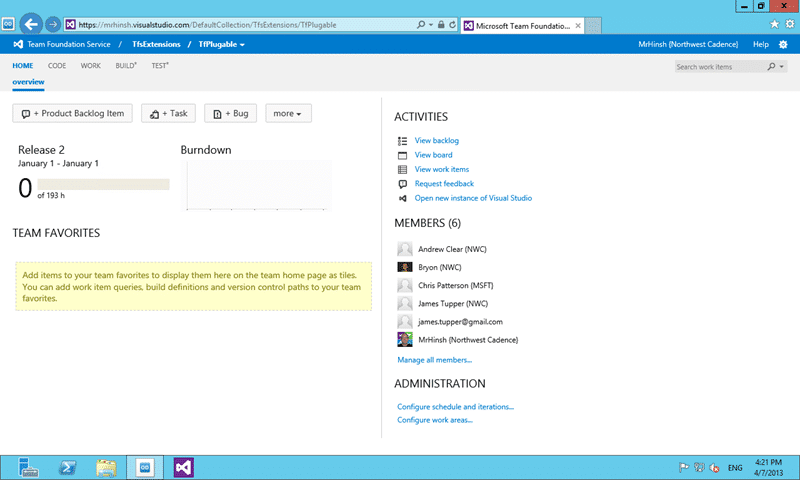
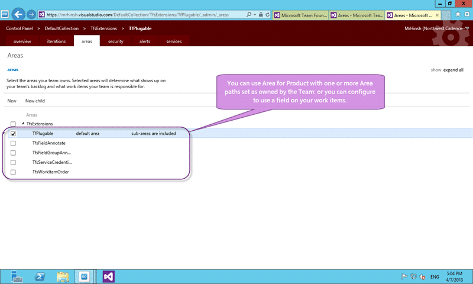
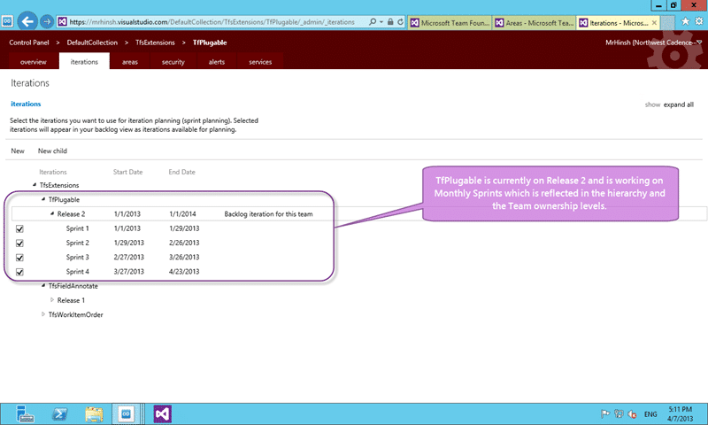

Working within a single Team Project with Team Foundation Server 2012 provides a lot of benefits. There are however many design consideration for working within a single team project and we need to consider all of the complexities that is entails.

One of the customers that I work with has over 200 departments in their organisation that are currently using TFS and each one of those supports one or more teams building multiple products in a single team project. They do not give any of those divisions “Project Administrator” on their Team Projects and in itself sounds like a management nightmare. Why? Well that means that ANY security change needs to go through a central administrator. In order to support this type of situation we need to create some workflow for making sure that everything is setup correctly and some automation so that we can build out the correct permissions without needing direct access. But before we do that we need to look at all of the angles and design our implementation to take advantage of the features in Team Foundation Server 2012.

  
{ .post-img }
**Figure: The TfPlugable Team is part of the TfsExtension Team Project**

Unfortunately the implementation of Team Project is a little flawed as it imposed some technical restrictions that are difficult to live with and if you look at the top items on the [Team Foundation Server User Voice](http://visualstudio.uservoice.com/forums/121579-visual-studio/category/30925-team-foundation-server) site you can begin to get a handle on the issues. Even worse, the inability to rename your Team Project is the least of your worries; You can query across Team Project but that's not the default; You can’t load cross Team Project queries in Excel; You can’t move a work item created in one Team Project to another.

Ultimately we should always have been working in a single Team Project even if we did not know that we were supposed to.

> “_What you describe \[single team project\] is what we generally do internally and what we recommend. We make very heavy use of area path to categorize the work within a larger project_.”  
> – **[Brian Harry](http://blogs.msdn.com/bharry/)**, Microsoft Technical Fellow & Product Unit Manager for Team Foundation Server

## Design considerations for Working within a single Team Project with TFS 2012

Because Team Foundation Server is a group of tightly coupled but flexible services it does not force you into any one way of working like many other tools. So we do need to think about how we are organising our Source Control, Areas, Iterations and Teams to understand how we might be impacted across the board and what our automation workflows are. In our deliberations we have three main entities that we need to cater for:

- **Team** – This automatically creates our Security Group that we will be using and has an Administrator is set for that group
- **Product** – When you create a product you will likely need both a Source Control location for that Product to reside and an Area to contain the related work items. You can break your product down into components inside that Area and you may have branches under the Source Control folder but the layout and organisation should be up to the product owners and the team.
- **Project** – A Project is something time limited so lends itself to an Iteration within TFS but you would not prescribe the cadence. Your Project many be waterfall or Scrum or Kanban and it should not matter.

There many be other things like Work Stream or Cost Code or other flat categorisation elements that you might want to use in your single Team Project. These can easily exist as drop-down-lists on the work items that exist in our requirement work item and don't necessarily impact the workflows described above.

> _“Using areas in existing team project instead of creating a new team project (a.k.a. “prefer small number of big team projects over large number of small team projects”) has been established best practice for long time. Microsoft works that way internally and they recommend everyone should. We use it internally and all of our partners have been thought to use it as well.”_  
> \-[**Ognjen Bajic**](http://ognjenbajic.com/blog), Visual Studio ALM MVP, Product Owner of Team Companion at Ekobit

Note You may want to have Teams own projects. If you have many projects and your teams own more than one at ay time you can use [Teams without areas](http://blog.hinshelwood.com/team-foundation-server-2012-teams-without-areas/) but instead of having a list of “Teams” you create a list of Projects and define which Teams own which projects in the Team configuration.

### Team in a single Team Project

In Team Foundation Server 2012 everything within a Team Project revolves around a new feature called Team. A Team is ultimately a security group with a bunch of meta data and features hanging from it (Yes..unlike a Team Project you can rename a Team). In the agile world a “Team” represents a long running tight group of individuals that operate more like a sports team but building software. If you are not an agile team, or in that half way phase of trying to get there, then you might also think of “Team” as something more akin to “Project”. In that scenario you have a time limited group of individuals that operate either full or part time together only for the duration of said “Project”. While the latter would reduce the effectiveness of the Team and would thus be considered a dysfunction it can often be a reality of that awkward transition towards agility.

  
{ .post-img }
**Figure: Adding teams working in a single Team Project**

In either of these cases you can use Team as the thing that you create instead of Team Project. This Team gives you the bucket of compartmentalisation of work items while allowing those teams to interact in a tightly integrated manor as needed. You also gain the ability to move work items between teams and query cross team with ease. If you are working on a large software project you might have many teams on the same cadence and while you want them to have their own space they still need to integrate and report things together. Or you might have multiple cadences across multiple products and only teams working on the same product work in the same cadence. The Team feature gives you the flexibility to choose you own way and adapt as you grow.

### Product in a single Team Project

Product is a thing that you version, create instances of, and then deploy to production. A version of this entity is what is promoted through your release process although you may need to break it down into components if it is really big. Some of your Products will be built in an agile fashion and release at least every 30 days while other will have longer iterations and be delivered less regularly. We need to come up with some way to wrap all of our Products regardless of the things that may be different between them. This interface will allow us to control creation and security by following a pattern that we can automate.

  
{ .post-img }
**Figure: Area as Product when working in a single Team Project**

Considerations for your Product hierarchy:

- **Area Hierarchy** – Within a Product we may have components or trees of components. Area support roughly 254 nodes per level and can be 11 deep so there are limitations to consider. You will always see all of the nodes and you can control security at each and every level.
- **Version Control Hierarchy** – Each of our Products are going to have source code and other associated files. We need somewhere to keep them in isolation now that we don’t have Team Project so that we can control permissions and isolation.

Note If we maintain the level at which Product exists in both Area hierarchy and in Version Control then we can easily automate against it.

Note The same rules apply and you can use the same physical organisation as [Project of Projects with Team Foundation Server 2010](http://blog.hinshelwood.com/project-of-projects-with-team-foundation-server-2010/).

### Project in a single Team Project

Project is that time limited group of deliverables that results in a new release of one or more Products. The Project may contain many releases or it may be one. A Product may have many Projects or even just one that contains many releases. We need a model that supports whatever our teams need and that is reflected in Iteration Path.

  
{ .post-img }
**Figure: Iteration as Project cadence when working in a single Team Project**

Considerations for Project hierarchy:

- **Iteration Hierarchy** – Creating a hierarchy in Iteration gives us the ability to have single or multiple strands of time allocation. It can be split by Team or Product or Project and each of those things can have their own cadence. That cadence should not be determined arbitrarily by the process overlords, but instead we can allow each unit to determine their own cadence.

## Conclusion

While I can’t hope to provide a method of using Team Foundation Server 2012 and its features that work for everyone I am trying to create a versatile wrapper for any sort of work that is done within a Team Project. Ideally you would have only a single Team Project within your Team Project Collection and using Teams, Area Hierarchy and Iteration Hierarch we can map to but not into Teams, Products and Projects. The hope is that this wrapper described in the design guidelines above can allow you to automate against the TFS API’s and thus minimise your administration overhead while providing that versatility. There is an awesome post on [backlog grooming](http://osnabrugge.wordpress.com/2013/04/07/tfs-as-perfect-tool-for-scrum-part-2-product-backlog-grooming/) that shows you how to configure more advanced team organisation in Team Foundation Server with Teams and there are plenty of other options.

If you are using Team Foundation Server already then there may be a lot of work that needs to be done to reorganise your existing work before you start as well as implementing your new and specific workflows based on the generic implementation above. This is however the only way for an enterprise, or really any organisation with more than one team, to take advantage of the new Agile Project Planning features of Visual Studio Team Foundation Server 2012.

It can however be a lot of work and the [great god Murphy](http://en.wikipedia.org/wiki/Murphy's_law) can strike at any time. Plan carefully and make deliberate and tested changes to TFS and your structure to support this.
