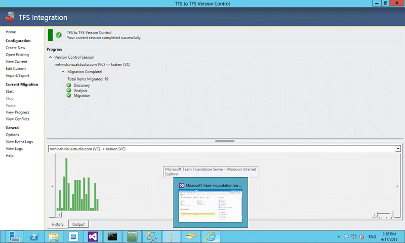

Are you worried that you will not be able to migrate from [http://tfs.visualstudio.com](http://tfs.visualstudio.com) when they start charging for it and you don’t want to pay? Fear not as we have the technology to migration from TF Service to TF Server with the TFS Integration Platform.

  
{ .post-img }
**Figure: Successful migration from TF Service to TF Server**

We are working with a customer next week who is using [http://tfs.visualstudio.com](http://tfs.visualstudio.com) but due to a misapplication of the rules governing the management of data they are having to move their Team Foundation Service data local.

You see many organisations come under HIPA, SOX or CFR-11 which requires separation of duties and that none of your data ends up at risk. This is awesome as it is designed to protect your organisation and your customers from the risks associated with restricted data. However this almost never needs to be interpreted as something that governs your code, your builds or your work item tracking data.

Sometimes it is for simple ‘warm and fuzzes’ and sometimes it is because of the way that your internal compliance department has interpreted the rules. But wrongly or rightly you  have to move your data…

## Configuring the migration from TF Service to TF Server

Wither you are familiar with the TFS Integration Platform or not there are only a couple of ‘small’ things that we need to worry about for this migration. Both of those things revolve around user accounts.

In TF Service all of the user accounts are Microsoft Accounts (was Live ID) and they do not directly relate to anything that you have in your Domain. Even if you [configure Corporate Live ID’s](http://blog.hinshelwood.com/using-corporate-ids-with-visual-studio-11-team-foundation-service/) they will still never match what you have locally in your Active Directory controlled environment.

- [TFS Integration Platform – What is the Lookup Service? Q&A-27](http://blogs.msdn.com/b/willy-peter_schaub/archive/2010/04/10/tfs-integration-platform-what-is-the-lookup-service-q-a-27.aspx)
- [TFS Integration Tools – How do I map users between domains or systems? Q&A-44](http://blogs.msdn.com/b/willy-peter_schaub/archive/2011/02/05/tfs-integration-tools-how-do-i-map-users-between-domains-or-systems-q-amp-a-44.aspx)
- [TFS Integration Tools – How do I define user mappings for version control using the SVN adapter?](http://blogs.msdn.com/b/willy-peter_schaub/archive/2011/08/15/tfs-integration-tools-how-do-i-define-user-mappings-for-version-control-using-the-svn-adapter.aspx)

We effectively have two places we need to do a little mapping. Source Control and Work Item Tracking. Both of these are done is slightly different ways…both are however easy to configure.

We can use the [TFS Integration Platform](https://tfsintegration.codeplex.com/) to pull all of your data for Source and Work Items, including the relationships and attachments but we do leave behind some information.

- No Labels
- No Builds
- No Lab
- No Test Cases

Probably the one least easy to swallow is the Test Cases. You may be able to write something against the API afterwards to get it to work but I have not tried…

### Source Control

The thing to remember for Source Control is that your identity is referenced as “Windows Live IDmartin@hinshelwood.com” in source. This means that you need to collect every users Live ID and create a mapping file from old to new.

In this case we are moving from our Live ID to a Domain account and this method can just as easily be used to move between two TF Service instances or to move into TF Service.

Once you have this mapping created you can update the “UserIdentityMappings” section of your TFS Integration Platform configuration.

### Work Item Tracking

Work Item tracking is, if anything, easier to configure. You can use the built in field mapping to equate “Martin Hinshelwood (MrHinsh) {NWC}” to whatever you use in your domain.

In this scenario you need have both a “FieldMap” and “ValueMap” to push them together based on the value you would select in the work item Assigned To drop-down.

You will need to collect the _exact_ display name of each person and ask them not to change them until you have pushed across the work items.

## Conclusion

While you can move from Team Foundation Service to Team Foundation Server it will take some planning and forethought…the scenarios detailed above will maintain continuity of your users between the two systems and authentication methods.

It is not however for the faint of heart… it took us a few hours to figure out the solution above and about 12-15 failed migrations to get it right…

All of this is in the documentation for the TFS Integration Platform…
