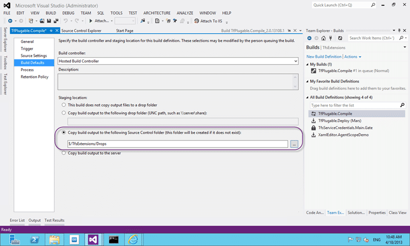
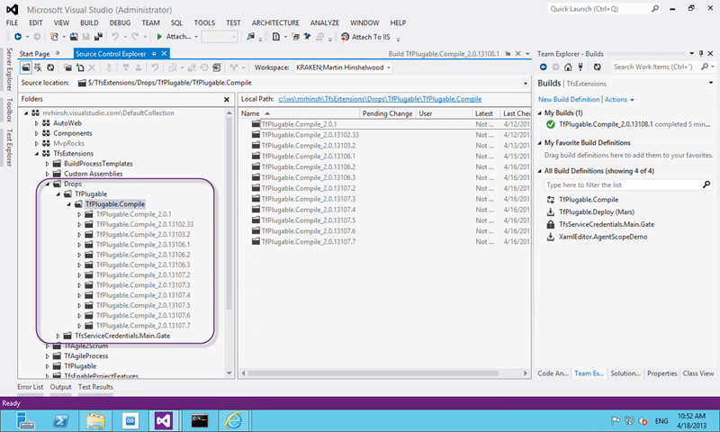
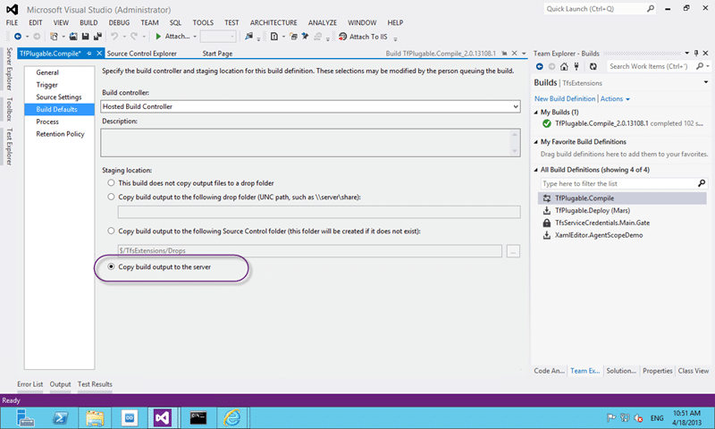
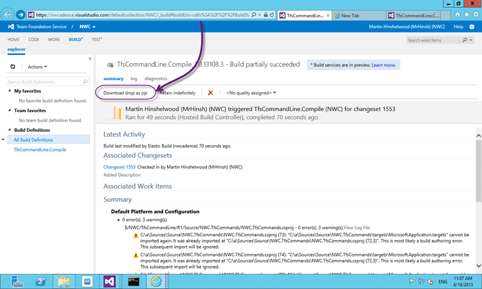
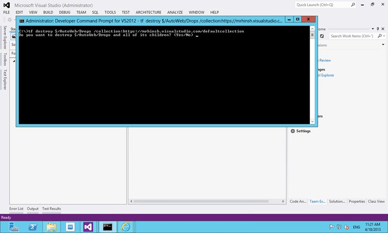

In the last wave of updates to Team Foundation Service the product team has added a new “staging location” and we now have an un-versioned repository in TFS 2012.

Why do you care you might ask… well I will tell you.

## Why we needed an un-versioned repository in TFS 2012

Usually we store our build drops on a network share. As part of a build you have always (with Team Foundation Service) been able to store those build drops inside of your Version Control repository… and this has been both a blessing and a curse.

  
{ .post-img }
**Figure: Copy build output to the following source control folder.**

It allowed us to remove the dependency on a network share to store our drop files and more importantly it results in our drop folders being backed up with the same rigor as TFS.

  
{ .post-img }
**Figure: Drops in version control**

Unfortunately it also meant that  we clogged up our version control repository with files and sometimes big files. When files are added to a versioned repository there are a lot of computing power used to figure out versions and deltas and other need things, but for a drop folder we don't need those.

Worse when you want to remove old stuff you need to call a “[destroy](<http://msdn.microsoft.com/en-us/library/bb386005(v=vs.100).aspx>)” command to be sure that you don’t leave all of those files taking up space forever.

## Using the new un-versioned repository in TFS 2012

To the rescue comes an un-versioned repository for storing your build drops.

  
{ .post-img }
**Figure: Copy build output to the server**

By editing your build definition and changing the staging location for your build defaults to the new option you can remove all of your files from Version Control and have them stored somewhere else. Select “Copy build output to the server” to enable this feature.

  
{ .post-img }
**Figure: Download from un-versioned repository in TFS 2012**

Now when we click “Open Drop Folder” we get redirected to the build page in Team Web Access and are presented with a “Download drop as zip”.

Currently there is no ‘browser’ for the files that are stored in the un-versioned repository in TFS 2012 but I would expect one to be fourth coming. This is however an REST API that you can use to access not just zips but the individual files as well. More to come on that…. but to fill in the gap:

- [TfsDropDownloader from the SharePoint Team](https://officesharepointci.codeplex.com/releases/view/102774)

## Cleaning up after the versioned build repository in TFS 2012

You will likely want to remove all of the old files that you have been pumping into version control and the only way to do that is to use the Destroy command:

```
tf destroy $/TfsExtensions/Drops /collection:https://mrhinsh.visualstudio.com/defaultcollection

```

This will completely remove all of the files from source control and eradicate them from history.

  
{ .post-img }
**Figure: Destroy a folder from TFS version control**

While heavy handed it does clean up things nicely.

## Conclusion

We can only hope that this will be a feature of dev12! And what else might the product team decide to do with an un-versioned store? Symbols; Nuget Packages… the options are endless…

