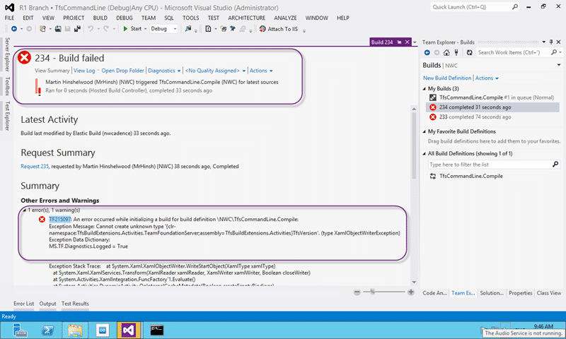

When you are running a build you get a “TF215097 an error occurred while initializing a build for build definition” message and you don’t even get a build number.

  
{ .post-img }
**Figure: TF215097 an error occurred while initializing a build for build definition**

And you get the following nasty long error.

```
TF215097: An error occurred while initializing a build for build definition NWCTfsCommandLine.Compile:
Exception Message: Cannot create unknown type '{clr-namespace:TfsBuildExtensions.Activities.TeamFoundationServer;assembly=TfsBuildExtensions.Activities}TfsVersion'. (type XamlObjectWriterException)
Exception Data Dictionary:
MS.TF.Diagnostics.Logged = True

Exception Stack Trace:    at System.Xaml.XamlObjectWriter.WriteStartObject(XamlType xamlType)
   at System.Xaml.XamlServices.Transform(XamlReader xamlReader, XamlWriter xamlWriter, Boolean closeWriter)
   at System.Activities.XamlIntegration.FuncFactory`1.Evaluate()
   at System.Activities.DynamicActivity.OnInternalCacheMetadata(Boolean createEmptyBindings)
   at System.Activities.Activity.InternalCacheMetadata(Boolean createEmptyBindings, IList`1&amp; validationErrors)
   at System.Activities.ActivityUtilities.ProcessActivity(ChildActivity childActivity, ChildActivity&amp; nextActivity, Stack`1&amp; activitiesRemaining, ActivityCallStack parentChain, IList`1&amp; validationErrors, ProcessActivityTreeOptions options, ProcessActivityCallback callback)
   at System.Activities.ActivityUtilities.ProcessActivityTreeCore(ChildActivity currentActivity, ActivityCallStack parentChain, ProcessActivityTreeOptions options, ProcessActivityCallback callback, IList`1&amp; validationErrors)
   at System.Activities.ActivityUtilities.CacheRootMetadata(Activity activity, LocationReferenceEnvironment hostEnvironment, ProcessActivityTreeOptions options, ProcessActivityCallback callback, IList`1&amp; validationErrors)
   at System.Activities.Validation.ActivityValidationServices.InternalActivityValidationServices.InternalValidate()
   at Microsoft.TeamFoundation.Build.Workflow.WorkflowHelpers.ValidateWorkflow(Activity activity, ValidationSettings validationSettings) in d:a1ddalmtfs_coreBuildWorkflowWorkflowHelpers.cs:line 392
   at Microsoft.TeamFoundation.Build.Hosting.BuildProcessCache.LoadFromXaml(String workflowXaml, TextExpressionImports textExpressionImports) in d:a1ddalmtfs_coreBuildMachineHostingBuildProcessCache.cs:line 136
   at Microsoft.TeamFoundation.Build.Hosting.BuildControllerWorkflowManager.PrepareRequestForBuild(WorkflowManagerActivity activity, IBuildDetail build, WorkflowRequest request, IDictionary`2 dataContext) in d:a1ddalmtfs_coreBuildMachineHostingBuildControllerWorkflowManager.cs:line 652
   at Microsoft.TeamFoundation.Build.Hosting.BuildWorkflowManager.TryStartWorkflow(WorkflowRequest request, WorkflowManagerActivity activity, BuildWorkflowInstance&amp; workflowInstance, Exception&amp; error, Boolean&amp; syncLockTaken) in d:a1ddalmtfs_coreBuildMachineHostingBuildWorkflowManager.cs:line 628

 No zip file of logs was created because the archive operation failed: System.AggregateException: One or more errors occurred. ---> System.AggregateException: One or more errors occurred. ---> System.Exception: Getting list of logs to archive failed with Http reason: Not Found
   at Microsoft.TeamFoundation.Build.Hosting.BuildControllerWorkflowManager.ArchiveLogsInvoker.<archivelogs>d__5.MoveNext() in d:a1ddalmtfs_coreBuildMachineHostingBuildControllerWorkflowManager.cs:line 985
   --- End of inner exception stack trace ---
   --- End of inner exception stack trace ---
   at Microsoft.TeamFoundation.Build.Hosting.BuildControllerWorkflowManager.ArchiveLogsInvoker.End(IAsyncResult result) in d:a1ddalmtfs_coreBuildMachineHostingBuildControllerWorkflowManager.cs:line 954
   at Microsoft.TeamFoundation.Build.Hosting.OperationInvokerPool.EndInvoke(IAsyncResult result) in d:a1ddalmtfs_coreBuildMachineHostingOperationInvokerPool.cs:line 212
---> (Inner Exception #0) System.AggregateException: One or more errors occurred. ---> System.Exception: Getting list of logs to archive failed with Http reason: Not Found
   at Microsoft.TeamFoundation.Build.Hosting.BuildControllerWorkflowManager.ArchiveLogsInvoker.</archivelogs><archivelogs>d__5.MoveNext() in d:a1ddalmtfs_coreBuildMachineHostingBuildControllerWorkflowManager.cs:line 985
   --- End of inner exception stack trace ---
---> (Inner Exception #0) System.Exception: Getting list of logs to archive failed with Http reason: Not Found
   at Microsoft.TeamFoundation.Build.Hosting.BuildControllerWorkflowManager.ArchiveLogsInvoker.</archivelogs><archivelogs>d__5.MoveNext() in d:a1ddalmtfs_coreBuildMachineHostingBuildControllerWorkflowManager.cs:line 985< ---
<---
.
```

## Applies to

- Team Foundation Server 2010
- Team Foundation Server 2012
- Team Foundation Service

## Findings

If you delve into the error and exception log above it looks like it is failing to load a perticulat type

```
{clr-namespace:TfsBuildExtensions.Activities.TeamFoundationServer;assembly=TfsBuildExtensions.Activities}TfsVersion

```

This type is actually from the [Community TFS Build Extensions](https://tfsbuildextensions.codeplex.com/) project and not one of the built in assemblies. Either the built in build workflows have been changed to include new funcationality or this is a completely custom workflow that loads non standard components.

## Solution

You need to load those assemblies into Source Control and set a reference to that location for your controller.

  
{ .post-img }
**Figure: Set the version control path to custom assemblies path**

To do this, go to your “**Build**” page in the new Team Explore. So Go to “**Team Explorer| Build | Actions | Manage Build Controllers**” and look at your list of Controllers. You should be able to figure out which controller your build is going through from your build settings and if you are on Team Foundation Service it will be called “Hosted Build Controller (Hosted)”.

Select your desired controller and click “**Properties**” to see the settings that are configured. The one that we care about is the “**Version control path to custom assemblies**”. Here we need to select a single source folder from which our controller will load any custom assemblies referenced.
