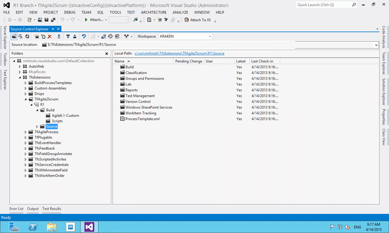

Upgrading your process template from MSF for Agile 4 to Visual Studio Scrum 2.x can be a daunting and scary task. While you do need to be careful it is relatively simple to achieve safely.

_UPDATE For a newer version of this script check out:  [Process Template migration script updated](http://nkdagility.com/tfs-process-template-migration-script-updated/)_

Although I describe this process in [Process Template Upgrade #7 – Rename Work Items and Import new ones](http://blog.hinshelwood.com/process-template-upgrade-7-overwrite-retaining-history-with-limited-migration/) I wanted to pull it together as a simple script to do the upgrade so that you can easily upgrade your Team Project. This process and these exact scripts can be used to also upgrade from Visual Studio Scrum 2.0 (Team Foundation Server 2012) and Visual Studio Scrum 2.1 (Team Foundation Server 2012.1) to Visual Studio Scrum 2.2 (Team Foundation Server 2012.2).

There are two stages that we need to go through:

1. DONE Setting up for upgrading your Process Template
2. DONE Completing upgrading your Process Template

WARNING: It is easy to loose data when doing this. Make sure that you read all supporting material before attempting!

## Setting up for upgrading your Process Template

The first thing to consider is wither you have made any customisations to your existing process templates. You will need to identify what those are and reapply them to the new Visual Studio Scrum template before you proceed with the scripts below. Ideally you should download your target Process Template, in this case the Visual Studio 2.x from Team Foundation Server and put it under source control.

  
{ .post-img }
**Figure: Downloading a Process Template from Team Foundation Server 2012**

Having a good format for keeping your Process Template under source control will make things easier going forward.

  
{ .post-img }
**Figure: Process Template under source control in Team Foundation Server 2012**

One of the other things that I always do when setting up is to export all of the existing work item types and save them under Builds\[OldTemplate\]. This allows us to push forward with the upgrade even if we have forgotten something. We can always get back to our old fields…

On of my colleagues has created an awesome utility to hep you [keep track of your Team Projects Process Template version](http://osnabrugge.wordpress.com/2013/04/04/keep-track-of-your-team-projects-process-template-version/). This utility simply allows you to keep track of your team project version in your team project.

## Completing upgrading your Process Template

Now that you have your old template and new template under version control in TFS and you have migrated all of your customisations into the new template we can do the migration:

First lets set a couple of variables so that we can keep our commands short and sweet:

```
set pt=C:ws\ProcessTemplateR1Source
set tpc=http://kraken:8080/tfs/tfs01
set tp=MyAgileTP

```

This sets out Process Template (pt) location as well as our Team Project Collection (tpc) URL to variables and allows it then ignore that complexity. I have set the Process Template location to the “Sources” folder that I did a get latest for locally from TFS. This way when I make tweaks during the migration they are preserved and can just be checked in.

Then we get down to the Nitti-gritty of changing the template. The goal is to end up with a functional Visual Studio Scrum 2.2 process template.

```
REM #1 Do Renames
witadmin renamewitd /collection:%tpc% /p:%tp% /n:"User Story" /new:"Product Backlog Item" /noprompt
witadmin renamewitd /collection:%tpc% /p:%tp% /n:"Issue" /new:"Impediment" /noprompt

```

First priority to make sure we maintain the fidelity of your requirement data is to do a couple of renames. We are renaming the existing “User Story” work item type to “Product Backlog Item” so that when we upload the new “Product Backlog Item” from the Process Template all of our existing work items are kept.

```
#2 REM Apply new Template
witadmin importwitd /collection:%tpc% /p:%tp% /f:"%pt%WorkItem TrackingTypeDefinitionsBug.xml"
witadmin importwitd /collection:%tpc% /p:%tp% /f:"%pt%WorkItem TrackingTypeDefinitionsCodeReviewRequest.xml"
witadmin importwitd /collection:%tpc% /p:%tp% /f:"%pt%WorkItem TrackingTypeDefinitionsCodeReviewResponse.xml"
witadmin importwitd /collection:%tpc% /p:%tp% /f:"%pt%WorkItem TrackingTypeDefinitionsFeedbackRequest.xml"
witadmin importwitd /collection:%tpc% /p:%tp% /f:"%pt%WorkItem TrackingTypeDefinitionsFeedbackResponse.xml"
witadmin importwitd /collection:%tpc% /p:%tp% /f:"%pt%WorkItem TrackingTypeDefinitionsImpediment.xml"
witadmin importwitd /collection:%tpc% /p:%tp% /f:"%pt%WorkItem TrackingTypeDefinitionsProductBacklogItem.xml"
witadmin importwitd /collection:%tpc% /p:%tp% /f:"%pt%WorkItem TrackingTypeDefinitionsSharedStep.xml"
witadmin importwitd /collection:%tpc% /p:%tp% /f:"%pt%WorkItem TrackingTypeDefinitionsTask.xml"
witadmin importwitd /collection:%tpc% /p:%tp% /f:"%pt%WorkItem TrackingTypeDefinitionsTestCase.xml"

```

This is where you needed to think about the customisations you have made and the field differences  between your source and target Process Templates. If you have not added all of the fields from the old template to the new one, and at least the field definition then you will not ‘see’ the field changes listed in the history. This is just a quirk of how the work item trackign system is implemented and it will only enumerate the fields that it knows about.

I usually add the old fields ‘only’ to the field list and not to the UI so that users scan see the data in the history, but not interact with it. It is important not to add all of the of fields to the new Work Item UI as that will encourage users to use it. If they still want to use all of the old fields in the old process then you likely don’t want to be doing any of this!

```
REM #3 Import Link Types just in case coming from 2008
witadmin importlinktype /collection:%tpc% /f:"%pt%WorkItem TrackingLinkTypesSharedStep.xml"
witadmin importlinktype /collection:%tpc% /f:"%pt%WorkItem TrackingLinkTypesTestedBy.xml"

```

It is likely not required to import the Link types but I always do for two reasons. The first is that you might be coming from a 2008 environment, which you will already know. If your server as ever a 2008 server and this project was created then it is likely that no one eve added the new new link types. So fix it now…

```
REM #4 Import Categories
witadmin importcategories /collection:%tpc% /p:%tp% /f:"%pt%WorkItem Trackingcategories.xml"

```

Adding the correct categories will start the main configuration efforts and configures which of the work item types are viable, which are hidden and which sit is which category. So for example in the MSF Agile template only “**User Story**” is in the “**Requirement Category**” while in the Scrum template both “**Product Backlog Item**” and “**Bug**” are considered requirement items and would be visible on the Product Backlog.

```
REM #5 Upload the new Common Config and Agile Config
witadmin importcommonprocessconfig /collection:%tpc% /p:%tp% /f:"%pt%WorkItem TrackingProcessCommonConfiguration.xml"
witadmin importagileprocessconfig /collection:%tpc% /p:%tp% /f:"%pt%WorkItem TrackingProcessAgileConfiguration.xml"
```

There are WAY to many things configured as part of these two files. They effectively control how the tooling that is built on top of Work Item Tracking interprets that data from the Product Boards to the Task Boards and how [Teams are configured](http://blog.hinshelwood.com/team-foundation-server-2012-teams-without-areas/). There is [good documentation on MSDN for both the Agile & Common configuration](http://msdn.microsoft.com/en-us/library/hh500413.aspx).

Are you Done now? Well, nearly…

There are however a few thins that we did not change that might be part of the process template that we just moved to.

- **Permissions** – You may need to tweak the permissions but they are largely the same between the three stock templates. There may be new security groups added as the template moves forward to support filtering of Assigned To, but you will need to deal with that as it comes.
- **Reports** – You will want to upload the reports that go with your new template. This can be done manually or through the Power Tools “addprojectreports” command.
- **SharePoint Portal** – This is easy to accomplish manually, but there is also a “addprojectportal” command in the Power Tools.
- **Queries** – All of your queries will be broken once you are finished. There is a queries folder under your process template that will provide you with the stock queries that you can import with visual studio.
- **Areas** – No help here… manual configuration and depends on how you are currently using them
- **Iterations** - No help here… manual configuration and depends on how you are currently using them

## Conclusion

If you are willing to accept the limitations then changing your process template is a fairly strait forward exercise ( unless of course you are using the Scrum for Team System templates: sorry)  and is easily achievable even across many Team Projects.
