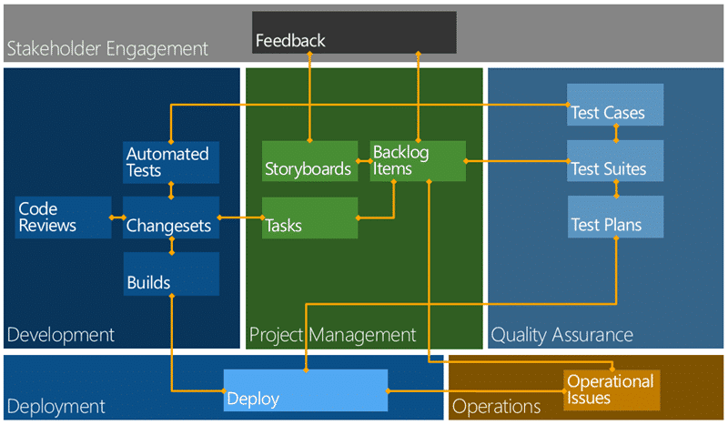
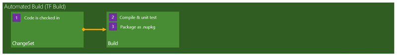
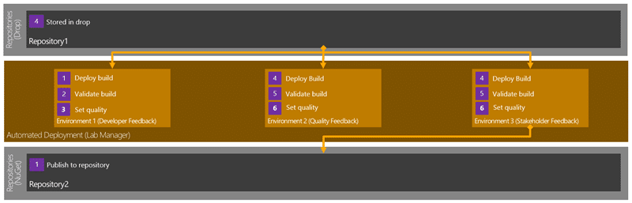
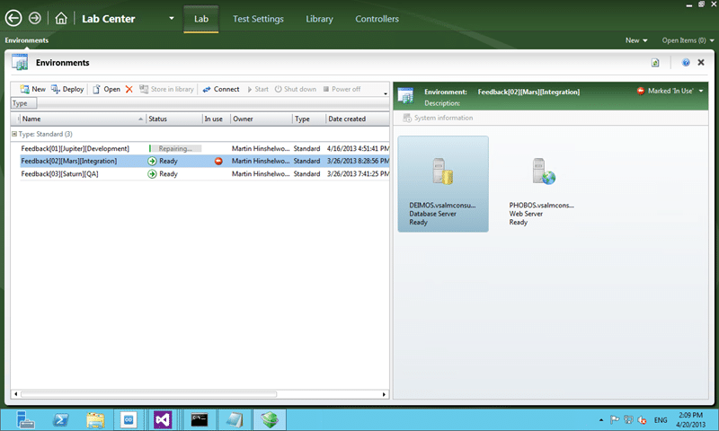
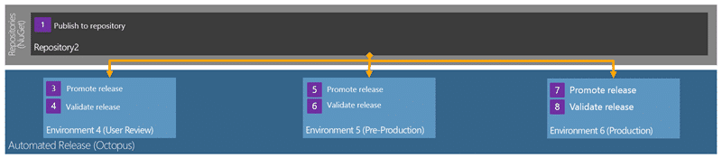
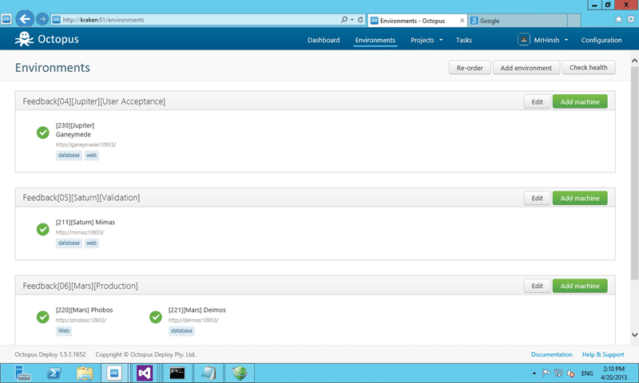
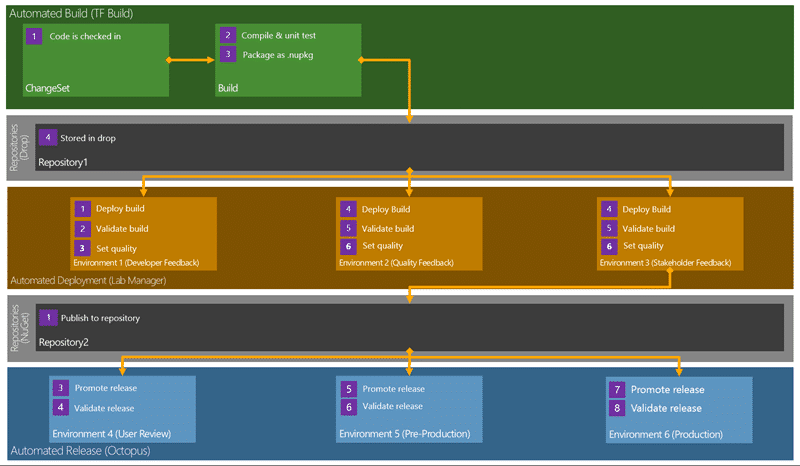

Northwest Cadence has been working hard with customers to improve their release management in Team Foundation Server 2012. While on the surface it looks like TFS 2012 has little in the way of support for release management, you would be wrong. There are many features in Team Foundation Server, many of them added in TFS 2010 that can aid you in creating a release management strategy.

> _A professional Development Team is supposed to create potentially shippable quality output that has no further work required for delivery._

There are many facets to release management and contrary to popular belief not a single one of them revolves around branching or code. There, I said it, its not about the code. Its about what you deploy. You may have a passing resemblance between code branching and your release process but they are two independent and only occasionally related processes. Intertwining them is where many organisations start to see friction, it is however avoidable.

  
{ .post-img }
**Figure: Workflow and relationships in Team Foundation Server 2012**

Above I have a rough workflow for working with Team Foundation Server 2012. In this model you would create a ‘build’ from source control and the output would be ‘dropped’ to a well known location. I have builds that just output binaries to network shares and I have builds that create Chocolatey packages. I even have builds that continuously deliver the output to production…

  
{ .post-img }
**Figure: Automated Build in Team Foundation Server 2012**

So now that I have a uniquely identifiable “build” I now need some way to repeatedly and consistently promote it through my environments. This is about deployment and we need to make sure that we deploy the same artefacts, hence the unique build, through the same process. Why, well so that we can be sure that not only does our application work, but that our deployment does as well.

In the case of most customers a hap hazard mish mash of technologies is then used by an overworked and under manned Configuration Management team, or worse Operations is just left of their own, to deploy that application to a variety of environments through to production.

_**Not only is this unnecessary for modern teams delivering modern software it is wholly unprofessional!**_

If you have people doing repetitive and mundane manual tasks then you not only doing them a disservice, but you are injecting unnecessary risk into the process. Automate everything and use your knowledge workers effectively!

The first thing that we need to consider for release management is some sort of delivery interface.

You, or your configuration management team, are not going to be able to really understand all of the tens and maybe thousands of applications that you will be asked to deploy. And nor should they; Microsoft does not ask us to understand the complexities of Office, they have an auto installer.

We need some rules around which our teams can create a concrete interface that shields teams beyond the development organisation from the complexities of delivery. We have Engineering, Configuration Management, DevOps and likely Operations that all need to consume this interface. We could come up with our own, but there are well defined interfaces out there that were specifically designed around solving some of these, or similar, problems.

Creating ‘installers’ has been the tool of choice from yesteryear but they are wildly clunky and unwieldy in modern software development. I for one have always hated them…

So what to use instead?

You may have been using a little technology called [NuGet](http://nuget.org/) recently. As of Visual Studio 2012 it ships out of the box and is a packaging and deployment technology for adding references to projects within Visual Studio. It has many satellite implementations that are based on that technology, Chocolatey for one, and you can implement it however you like. What is it? Well, it is fundamentally a Zip file with a Manifest, a Script and some files. It also takes care of dependency management.

There is a learning curve… its not all sweetness and light and there is no silver bullet. You still need to get the development teams to create and maintain the package and to fix it when things go wrong. But make no mistake… this **is** the responsibility of a processional development team.

**A professional Development Team is supposed to create potentially shippable quality output that has no further work required for delivery.**

So lets assume that we have some quality output and that output includes the scripts necessary for deployment, ideally contained within a NuGet package. Even in that happy state we need to take that output and get it to an environment, deploy it and potentially tests it.

## Lab Management for Release Management

For delivery to environments owned by your engineering teams you can use Lab Management to deploy to almost any sort of environment that you want. Remembering that just because I say ‘engineering teams’ does not mean that there are not representatives from operations on those teams, because there should be.

  
{ .post-img }
**Figure: Release Management with Lab Management for Feedback**

_Note This can be used to deploy all the way to production but it tends not to be. Operations frown upon installing development tools in production for some unknown reason._

You can [create Standard Environments](http://blog.hinshelwood.com/standard-environments-for-automated-deployment-and-testing/) or use System Centre Virtual Machine Manager (SCVMM) dynamic environments that are constructed from one or multiple machines into a single identifiable thing that we can deploy to.

  
{ .post-img }
**Figure: Environments in Lab Centre for Release Management**

Lab Management leverages Team Foundation Build (TFB) and allows you to not only see each of the machines within an environment but also to deploy a pre-compiled build to that environment and orchestrate running of your integration tests against it. This is fantastically powerful as with no customisation we can have a scheduled and automatic deployment of our software to an environment and then have a chosen set of automated tests run against it.

_Note Team Foundation Build (TFB) is not just for compile and test. It is built around Windows Workflow and can do pretty much anything your want across one or many machines._

In addition if we are able to spring for a System Centre Virtual Machine Manager (SCVMM) environment you can have your environments automatically spun-up from template environments and snapshots created prior to the deployment and test. And all that is still out of the box functionality. You could add some capabilities with some simple customisation of the build workflow to for example; deploy and verify an environment for each of our 20 testers. The capabilities are endless…

_Note You do not need Hyper-V or SCVMM to take advantage of Standard Environments. You can use VMWare or even bare metal._

So if we are building, deploying, verifying and testing within our engineering teams then we would gain the most capabilities from using Lab Management. Lab Management is likely part of your existing licensing (you just need > \[Test Professional | Premium | Ultimate\] ) and can be used at no additional cost. You can setup and configure ‘standard environments’ in minutes to start taking advantage of this now…

## Octopus for Release Management

Remember I mentioned earlier that your operations teams would be… uncooperative… if you wanted to use Lab Management deploy to production? While I have some customers that are perfectly happy to have a Build Agent or Test Agent installed on their servers it does feel a little… dirty. We really want a clean orchestration engine that is much less invasive and our operations will accept.

At this stage we already have a ‘package’, probably a NuGet package, that has been deployed and promoted by the engineering teams through their verification paths and they have marked certain ‘builds’ as ‘done’. Those ‘done’ builds have likely, if they are NuGet packages, been deployed to a repository that we can easily call for our operational deployments.

  
{ .post-img }
**Figure: Release Management with Octopus for Production**

The reason that I am again mentioning NuGet again is that there is an application called Octopus that has been specifically designed to deploy NuGet packages with ease. Make no mistake, this is an operations tool that has been designed from the ground up to support deploying the output from professional Development Teams to production.

  
{ .post-img }
**Figure: Octopus for Operations**

You create Environments and then Releases and you can have those releases promoted through those Environments. You can control permissions on who can promote releases through which environments and generally get and idea of what is deployed where.

If you are using NuGet packages you will even know what is deployed.

## Conclusion

There are lost of options for the automation of your application deployment. I can’t say this enough but:

> _**A professional Development Team is supposed to create potentially shippable quality output that has no further work required for delivery.**_

If we fail any sort of stage gate that occurs after the engineering team has said that it is ‘done’ then we need to seriously look at why that happened and what we can put in place to make sure that it never happens again. That sort of attitude will improve the quality of your software and reduce the risk of delivery vastly.

  
{ .post-img }
**Figure: Release Management Workflow in Team Foundation Server 2012**

This flow of building once and then repeated validation will help weed out those last quality issues so that you don’t get many, if any, issues in production. Teams that follow models like this, when combined with good engineering practices, spend less time fighting fires and more time delivering real customer value. The goal would be to get from Check-In to your Production Environment at least every 30 days. That means that you need to be using the very best Processes, Practices and Tools to make it as slick as possible.

**How long is your release process?**

**How sure are you of your quality?**
