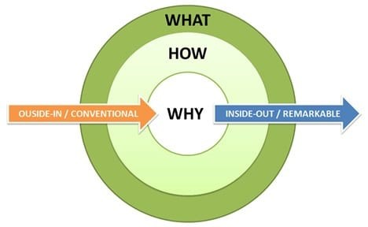

For a long time now I have been searching for that perfect domain that epitomised the vision, the why, of what I am trying to achieve with my customers and the industry at large. Now I have found it in [http://nkdagility.com](http://nkdagility.com)

I have bought a number of domains over the years that caught my eye but none of them really resonated with me on a deeper level and I lost interest after only a few short weeks. There is a lot of pain and suffering with a healthy dose of monitoring in changing your domain. Its just hassle…and not one you want to take lightly.

1. [http://realitydysfuncation.co.uk](http://realitydysfuncation.co.uk) – just as long as Hinshelwood and I have found that most folks can’t spell ‘dysfunction’ correctly.
2. [http://rddotnet.com](http://rddotnet.com) – shot and sweet if a little bit of an inside joke, but it just did not have the ring that I wanted. I completely discounted it when I moved into the world of ALM from that of software development alone
3. [http://vsalmconsulting.com](http://vsalmconsulting.com) – While I was enamoured, and indeed traded under, with this for  while it ties me to specifically to Visual Studio. While I expect to continue to be in the Visual Studio space it is a product that provides the mechanics of the solution and not the solution in, and of, itself.
4. [http://vsalm.co.uk](http://vsalm.co.uk) – Again I would be tied to tightly to Visual Studio and while short, which is awesome, I could not get [http://vsalm.com](http://vsalm.com) which is owned by Mr Cogan in Australia.

I did try to get [http://visualstudioalm.com](http://visualstudioalm.com) but it has been bought be another ALM focused guy in Poland. There were may other short lived ideas over the years and I did seriously consider using [http://hinshelwood.com](http://hinshelwood.com) and potentially reviving my fathers company name “Hinshelwood & Co.” at some point in the future. Unfortunately no matter what font you use you just can’t fit “Hinshelwood” on anything of a reasonable size. Its one of the reasons that when picking a name for his estate agency he ended up with “Allan & Harris” even though there was never an “Allen” or a “Harris” in the organisation.

## Getting naked

My boss, Steven Borg, has been encouraging all of the consultants to think about how consulting works and how to give our customers a much better experience. Steve was so impressed with the book that he bought all of his consultants a copy of [Getting Naked: A Business Fable About Shedding The Three Fears That Sabotage Client Loyalty](http://www.amazon.com/gp/product/B0032ZD0OI/ref=as_li_ss_tl?ie=UTF8&camp=1789&creative=390957&creativeASIN=B0032ZD0OI&linkCode=as2&tag=martinhinshe-20). This book really made me think about how we offer ALM services and how we might improve our interaction with our customers.
{ .post-img }

We are engaged by customers to delve into the layers of process that have built up over years to get to the root cause of their inability to quickly, easily and consistently deliver software. If you hire an ALM consultant their job is not really to do just do what you ask, it is to figure out what you need to do to deliver more value. There are many ‘ins’ to this process and sometimes, when we are called in to solve a purely technical problem we will spot some the putter showing through. This process of discovery is the real reason for or being.

No matter the maturity level of the customer, when we start to peel away the layers of ceremony and rhetoric, we discover all sorts skeletons and blemishes that are a drag on the slick and agile process that they aspire to.

## Starting with why

At around the same time one of my colleagues, [Bryon Root](http://b4root.wordpress.com/), suggested a [talk by Simon Sinek](https://www.ted.com/talks/simon_sinek_how_great_leaders_inspire_action "Simon Sinek: How great leaders inspire action") that inspired me to read the speakers book, [Start with Why: How Great Leaders Inspire Everyone to Take Action](http://www.amazon.com/gp/product/B002Q6XUE4/ref=as_li_ss_tl?ie=UTF8&camp=1789&creative=390957&creativeASIN=B002Q6XUE4&linkCode=as2&tag=martinhinshe-20), and that started me on **why** I do Application Lifecycle Management (ALM) and **why** I am trying to help my customers.
{ .post-img }

 Figure: Simon Sinek’s golden circle
{ .post-img }

Starting with why is utterly obvious once it has been explained and the golden circle enabled us to focus on our core mission and formulate our **why** that guides or every action…

> I believe that every company deserves working software that frequently, successfully and consistently meets their consumers needs.My why

There is nothing more frustrating as a consumer of software for that software to; not be what I need; crash when I need it; not be updated frequently. These are all forgivable once and a while but not when it happens time and time again. There is a better way and you can be part of it…

## Conclusion

I believe that every company deserves working software that can be delivered on a consistent cadence. That cadence needs to be shorter than 30 day) and they need to get continuous feedback that is fed back into their backlog.

No matter how far away from this desired state your software process is right now, there are things that you can do to create a steady movement towards that dream of better software more frequently. That is what I am trying to achieve with my career and this blog embodies my journey in convincing customers to change and helping them stretch towards agility.
