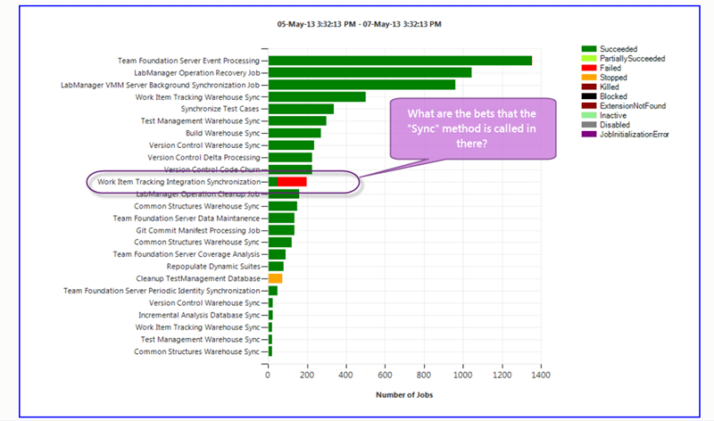

You may get an exception when working with Areas or Teams in Team Foundation Server 2012.2 that results in an Object not set to instance of object with TF51011, TF400898, TF53010 & TF30065 errors.

It may affect only one collection or all of them.

  
{ .post-img }
Figure: TF51011: The specified area path does not exist

As well as this error you may get many other errors doing other actions from both the web interface and Visual Studio around the interaction with and use of Areas and Iterations.

## Applies to

- Visual Studio Team Foundation Server 2012.2

## Findings

I first encountered this error on TF Service where I could really access no event or exception information. I raised it with the Product Team and they fixed it in place. I have however now encountered this error on an on premises server running Visual Studio Team Foundation Server 2012.2 and this has been identified as a know bug with Update 2.

The two main error number you will see in the event log really give us very little information. There is the TF400898 message that is thrown in the UI whenever there is a problem that can’t be identified. In addition the TF30065 number represents an unhandled internal exception. In either case you will need to do a little investigation to find the real cause. The TF51011 error shown above can happen if you have deleted an area and the UI has not caught up.

Note if at this point your are on TF Service then you need to raise it on the [Team Foundation Service](http://social.msdn.microsoft.com/Forums/en-US/TFService/threads) forum for the product team to investigate.

If you look in your event log and you see a whole bunch of TF30065 exceptions, that catch all number I mentioned, we need to take a look at the details. In this case there were many “Object reference not set to an instance of an object” references for the same method.

```
The description for Event ID 3000 from source TFS Services cannot be found. Either the component that raises this event is not installed on your local computer or the installation is corrupted. You can install or repair the component on the local computer.

If the event originated on another computer, the display information had to be saved with the event.

The following information was included with the event:

TF53010: The following error has occurred in a Team Foundation component or extension:
Date (UTC): 5/7/2013 3:35:43 PM
Machine: tfs01
Application Domain: /LM/W3SVC/1/ROOT/tfs-1-130124092008301462
Assembly: Microsoft.TeamFoundation.Framework.Server, Version=11.0.0.0, Culture=neutral, PublicKeyToken=b03f5f7f11d50a3a; v4.0.30319
Service Host: 6c1bb0c0-680e-43df-9b8a-597b6115b996 (Applications)
Process Details:
  Process Name: w3wp
  Process Id: 15084
  Thread Id: 14752
  Account name: mycompanyuser1

Detailed Message: TF30065: An unhandled exception occurred.

Web Request Details
    Url: http://tfs.company.com:8080/tfs/Applications/ProcessManager/_admin/_Areas/UpdateAreasData?__v=3 [method: POST]
    User Agent: Mozilla/5.0 (Windows NT 6.1; WOW64) AppleWebKit/537.31 (KHTML, like Gecko) Chrome/26.0.1410.64 Safari/537.31
    Headers: Connection=keep-alive&Content-Length=330&Content-Type=application%2fx-www-form-urlencoded&Accept=application%2fjson%2c+text%2fjavascript%2c+*%2f*%3b+q%3d0.01&Accept-Charset=ISO-8859-1%2cutf-8%3bq%3d0.7%2c*%3bq%3d0.3&Accept-Encoding=gzip%2cdeflate%2csdch&Accept-Language=en-US%2cen%3bq%3d0.8&Cookie=__RequestVerificationToken_L3Rmcw2%3dbSrXe1NADPk0KOFx1ZMoJpOaQ1kF89uytx2_2uRy0q4VMov6se_B1HSGJf2b8L-B_bGnCWJmXh1gNEM3Cb9m9izhd7o2EEUjFzJZoCyJm9XX4Lytj-t8oKeqFvCSkA37IMchvg2%3b+__RequestVerificationToken2a5503d65-91f7-467c-b1ed-39dffe94a223%3dbSrXe1NADPk0KOFx1ZMoJpOaQ1kF89uytx2_2uRy0q4VMov6se_B1HSGJf2b8L-B_bGnCWJmXh1gNEM3Cb9m9izhd7o2EEUjFzJZoCyJm9XX4Lytj-t8oKeqFvCSkA37IMchvg2&Host=tfs.dlgroup.com%3a8080&Referer=http%3a%2f%2ftfs.dlgroup.com%3a8080%2ftfs%2fApplications%2fProcessManager%2f&User-Agent=Mozilla%2f5.0+(Windows+NT+6.1%3b+WOW64)+AppleWebKit%2f537.31+(KHTML%2c+like+Gecko)+Chrome%2f26.0.1410.64+Safari%2f537.31&Origin=http%3a%2f%2ftfs.dlgroup.com%3a8080&X-Requested-With=XMLHttpRequest
    Path: /tfs/Applications/ProcessManager/_admin/_Areas/UpdateAreasData
    Local Request: False
    Host Address: 10.1.140.59
    User: companyuser [authentication type: NTLM]

Exception Message: Object reference not set to an instance of an object. (type NullReferenceException)
Exception Stack Trace:    at Microsoft.TeamFoundation.WorkItemTracking.Server.SyncBase.ProcessStructureChanges()
   at Microsoft.TeamFoundation.WorkItemTracking.Server.DataAccessLayerImpl.SyncTree(String userSid, String projectURI)
   at Microsoft.TeamFoundation.Server.WebAccess.WorkItemTracking.Common.KanbanUtils.CreateExtensionPredicate(TeamFoundationRequestContext requestContext, CommonStructureProjectInfo project, TeamFoundationTeam team, IEnumerable`1 allowedStates)
   at Microsoft.TeamFoundation.Server.WebAccess.WorkItemTracking.Common.KanbanUtils.CreateExtension(TeamFoundationRequestContext requestContext, CommonStructureProjectInfo project, CommonProjectConfiguration commonSettings, ITeamSettings teamSettings, TeamFoundationTeam team, Int32 reconcileTimeout)
   at Microsoft.TeamFoundation.Server.WebAccess.WorkItemTracking.Common.KanbanUtils.CreateBoardSettings(TeamFoundationRequestContext requestContext, CommonStructureProjectInfo project, TeamFoundationTeam team, Int32 reconcileTimeout, Boolean validateTeamSettings)
   at Microsoft.TeamFoundation.Server.WebAccess.WorkItemTracking.Common.TeamConfigurationService.EnsureKanbanBoardIsProvisionAndUpToDate(TeamFoundationRequestContext requestContext, TeamFoundationTeam team)
   at Microsoft.TeamFoundation.Server.WebAccess.WorkItemTracking.Common.TeamConfigurationService.SaveTeamFields(TeamFoundationRequestContext requestContext, TeamFoundationTeam team, ITeamFieldValue[] fieldValues, Int32 defaultValueIndex)
   at Microsoft.TeamFoundation.Server.WebAccess.Admin.AdminAreasController.UpdateAreasData(TeamFieldData saveData)
   at lambda_method(Closure , ControllerBase , Object[] )
   at System.Web.Mvc.ReflectedActionDescriptor.Execute(ControllerContext controllerContext, IDictionary`2 parameters)
   at System.Web.Mvc.ControllerActionInvoker.InvokeActionMethod(ControllerContext controllerContext, ActionDescriptor actionDescriptor, IDictionary`2 parameters)
   at System.Web.Mvc.Async.AsyncControllerActionInvoker.<>c__DisplayClass42.b__41()
   at System.Web.Mvc.Async.AsyncControllerActionInvoker.<>c__DisplayClass37.<>c__DisplayClass39.b__33()
   at System.Web.Mvc.Async.AsyncControllerActionInvoker.<>c__DisplayClass4f.b__49()
   at System.Web.Mvc.Async.AsyncControllerActionInvoker.<>c__DisplayClass4f.b__49()
   at System.Web.Mvc.Async.AsyncControllerActionInvoker.<>c__DisplayClass4f.b__49()
   at System.Web.Mvc.Async.AsyncControllerActionInvoker.<>c__DisplayClass4f.b__49()
   at System.Web.Mvc.Async.AsyncControllerActionInvoker.<>c__DisplayClass4f.b__49()
   at System.Web.Mvc.Async.AsyncControllerActionInvoker.<>c__DisplayClass37.b__36(IAsyncResult asyncResult)
   at System.Web.Mvc.Async.AsyncControllerActionInvoker.<>c__DisplayClass25.<>c__DisplayClass2a.b__20()
   at System.Web.Mvc.Async.AsyncControllerActionInvoker.<>c__DisplayClass25.b__22(IAsyncResult asyncResult)
   at System.Web.Mvc.Controller.<>c__DisplayClass1d.b__18(IAsyncResult asyncResult)
   at System.Web.Mvc.Async.AsyncResultWrapper.<>c__DisplayClass4.b__3(IAsyncResult ar)
   at System.Web.Mvc.Controller.EndExecuteCore(IAsyncResult asyncResult)
   at System.Web.Mvc.Async.AsyncResultWrapper.<>c__DisplayClass4.b__3(IAsyncResult ar)
   at System.Web.Mvc.Controller.EndExecute(IAsyncResult asyncResult)
   at System.Web.Mvc.MvcHandler.<>c__DisplayClass8.b__3(IAsyncResult asyncResult)
   at System.Web.Mvc.Async.AsyncResultWrapper.<>c__DisplayClass4.b__3(IAsyncResult ar)
   at System.Web.Mvc.MvcHandler.EndProcessRequest(IAsyncResult asyncResult)
   at System.Web.HttpApplication.CallHandlerExecutionStep.System.Web.HttpApplication.IExecutionStep.Execute()
   at System.Web.HttpApplication.ExecuteStep(IExecutionStep step, Boolean& completedSynchronously)


```

The “Microsoft.TeamFoundation.WorkItemTracking.Server.DataAccessLayerImpl.SyncTree” method is to do with the Area and Iteration trees and Sync’ing them with work item tracking. Something is not right here.

  
{ .post-img }
Figure: TF400898: An Internal Error Occurred

Again the catch all web error, but this time it is for creating a new Team. This is due to Team and Area being tied together by default. You may be able to bypass the error by un-ticking the “Create an area with the name of the team” option, but this does not fix the underlying issue.

You may also experience the list of Areas or Iterations that are listed on a Work Item not matching up with what it says in the Tree. This is again due to that “Sync” method failing.

  
{ .post-img }
Figure: Operational Interface job status graph

If you load operational interface from the [http://mytfsserver:8080/tfs/\_oi](http://mytfsserver:8080/tfs/_oi) (yes you just put “\_oi” after the URL for your TFS server.) Then you should see a graph of all of the running jobs and their status. If the “Work Item Tracking Integration Synchronisation” job is failing and the other characteristics above are also true then you might be hitting a known bug:

> "◦When you create a new area path, and then you move an existing area path under the newly-created one, the "Work Item Tracking Integration Synchronization" job may fail with a "System.NullReferenceException" exception."[KB2835600 Visual Studio 2012 Update 3 RC 1](http://support.microsoft.com/kb/2835600)

## Solution

It looks like this is a known bug in Update 2 that has been fixed in Update 3. As luck would have it the product team just put Update 3 RC1 live and are providing a go-live licence.

Note Go-live refers to a type of licence that allows you to use pre-release software in production in a fully supported manor. These tend to be more tested than hotfixes but less than a ‘released’ product. The TFS team has been using go-live as a medium to allow their product or update to be tested in production before they stick that RTM label on it. As most bugs that are not caught in development are caught by early adopters in the first few weeks of a release this is incredibly valuable for the team.

As I had encountered this error before I knew there was a fix so I asked around and got this response:

> _I’m really sorry but your customers are running into a known bug in Update 2 with the sync between CSS system and WIT system. The bug is fixed in the QU3 RC release that went out today and ideally the customer should upgrade to that to take the fix._

I have absolutely no problems recommending that my customer install [Visual Studio 2012 Update 3 RC 1 (KB2835600)](http://support.microsoft.com/kb/2835600). I have been using the go-live licence with customers for many years with few, but not no, issues. In fact I would say that I have had fewer issues with a TFS go-live version than with most other RTM’ed products.

If you are installing the [Visual Studio 2012.3 (Update 3) “go-live” CTP](http://blogs.msdn.com/b/bharry/archive/2013/05/07/visual-studio-2012-3-update-3-go-live-ctp-is-now-available.aspx) then you just want to make sure that you test it first on a pre-production system and that you install the RTM upgrade as soon as it is available.
