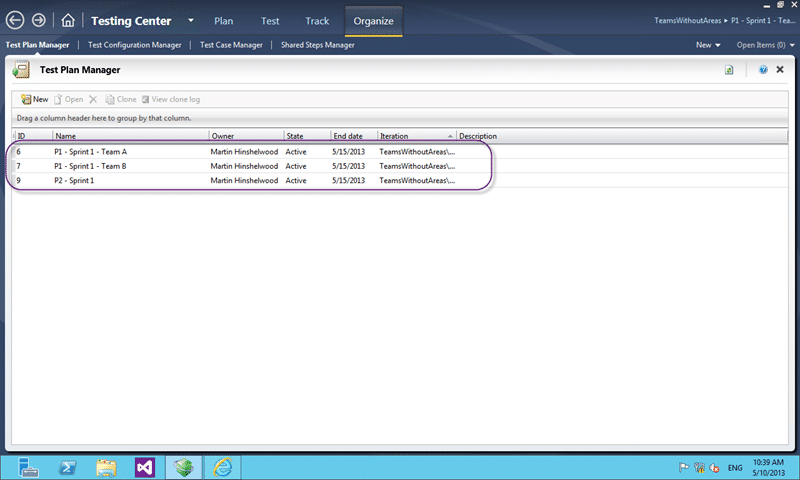
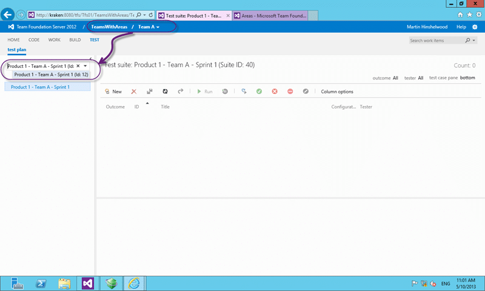
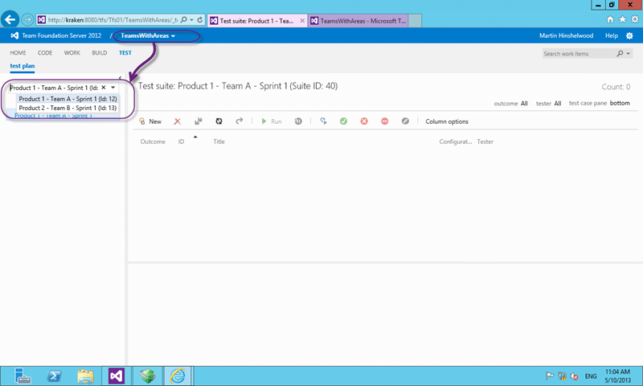
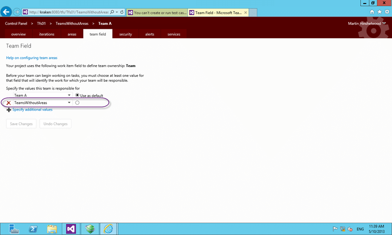

Configure Test Plans for web access in TFS 2012.2 is a little tricky and we need to be very specific on how we configure it so that our Team can see the right test Plans.

If you are working with the Test tab that is new in TFS 2012.2 then you may be wondering where your Test Plans are. In most cases if you have existing Test Plans you will not see any of the ones that you have already created.

- Breaking newsWith [TFS 2013 Update 3 (TFS 2013.3)](http://support.microsoft.com/kb/2933779) the Test team have converted Test Plan and Test Suit to Work Items and enabled Team Field support. Awesome!

  
{ .post-img }
Figure: Test Hub in TFS 2012.2 Web Access

Or you may be wondering where your Test Plans have gone after you change its configuration.

  
{ .post-img }
Figure: Three Test Plan exist but don't show up in the Test Hub

As it turns out you need to have an exact match between the areas of backlog ownership that are configured for your Team and with the Area path set on your Test Plan. The product team also ‘forgot’ to allow this to work with the ‘team field’ configuration so ware are forced to include a work around for that.

  
{ .post-img }
Figure: Your team backlog values must match exactly the Area path set on the Test Plan

While a little annoying that this is not more easily configurable I can only imagine it getting better in the future… well I hope so anyway…

## Configure Test Plans for Area Paths

If you are using Team Foundation Service or an out-of-the-box configured Team Foundation Server then you will be able to assign Area Paths to Teams.

  
{ .post-img }
Figure: Team A is assigned a particular area

So with an area set for the team this gets passed to the Team tab and with “sub-areas are included” we get a filtered list of Test Plans based on that area path.

  
{ .post-img }
Figure: Only showing area paths from “TeamsWithAreasTeam A” and below

In addition this means that my top level, and default, “Product Owner Team” will see both Test Plans I have in here. This is because one Test Plan is set to “TeamsWithAreasTeam A” and the other to “TeamsWithAreasTeam B”. Only Team B sees Team B’s Test Plans but the parent Team sees both.

  
{ .post-img }
Figure: Root team can see both sets of Test Plans

This can be very useful when you have many, many Test Plans and you can use Area Path for Team identification. However if you are currently using Area Path for Product Identification then you will have to specify the Product or Product Component for both the Test Plan and the Team.

  
{ .post-img }
Figure: Duplicate Team nodes to cope with multiple teams

If I now have three Products but I have my same two Teams I then need to have each of the teams represented at all of the leaf nodes for my Area hierarchy so that I can have two web portals with the data split between the teams. This becomes even more complicated if you have 10 teams and 15 products. You can imagine…

- [Multiple Teams with Microsoft Team Foundation Server 2012 & Visual Studio Scrum V2.0](http://blogs.ripple-rock.com/colinbird/2012/11/19/MultipleTeamsWithMicrosoftTeamFoundationServer2012VisualStudioScrumV20.aspx)  
   Colin Bird is a proponent of this type of splitting and it does have some merits. I find it way to complicated to manage even with only a few teams and products within a single team project.

Now that we have this structure we need to have our Test Plans set to “TeamsWithAreas-ProductProduct 1Component 1Team A” in order for them to appear in the web UI and be associated correctly.

There is however another way…

## Configure Test Plans for team field

You can use ‘[team field](http://nkdagility.com/team-foundation-server-2012-teams-without-areas/ "Team Foundation Server 2012 Teams without Areas")’ which allows you to use a drop-down field on your Work Item for Team in order to free up your Area Hierarchy to use for your Product Hierarchy. As your Team structure tends to be fairly flat this this is a good model.

Note If you are an organisation like Microsoft where you can have a dedicated Team for each level of your Product Hierarchy then you would not use Teams without Areas. You would instead use the above option.

However the Product Team for the Test tools  kind of forgot, or more likely did not know, that you can configure the Agile Planning Tools to use a custom drop-down-list for Team and have hard coded the Area Path to Team mapping.

  
{ .post-img }
Figure: No Test Plans show up with a custom Team field

This results in none of your Test Plans ever being able to appear in the Test Hub.

All is not lost however as there is a workaround. Because the Agile Planning tools are doing the right thing and passing back the list of values selected as related to your team we can fake out the Test Hub to do the right thing.

The Test Hob is being passed “Team A” from the drop-down-list rather than the expected “TeamsWithAreas-ProductProduct 1Component 1Team A;TeamsWithAreas-ProductProduct 1Component 2Team A;TeamsWithAreas-ProductProduct 2Component 1Team A;etc.” that it was expecting. It then uses this “Team A” value and matches it against our Area Paths set on our Test Plans and comes up blank…

To work around this we can go to our drop-down-list, which is likely a global list, and add an entry that matches the Test Plan area path that is set. So if we add “TeamsWithoutAreas” to the global Team list we can then add that as an additional entry that the team owns.

  
{ .post-img }
Figure: Add additional values to Team

Now that we have that in place if we refresh the Test Hub we can see all of the Test Plans that ‘exactly’ match that fake area path. Unfortunately there is no supported way to make that recursive like you can with areas but you can do it and I will show that later.

  
{ .post-img }
Figure: Test Plans are now showing up

This means that all of the test plans need to be shown and can get a little cluttered if you have many Test Plans per product. On option may be to have one Test Plan per Product+Sprint but then sub split that by team by using Test Suites.

  
{ .post-img }
Figure: Many Teams on the same cadence and product

This does have some advantages for reporting as you can roll up a little more easily and would be especially good for many Scrum teams working on a single sprint and needing to be integrated by the end of each sprint.

### Danger, danger Will Robinson no filtering allowed

When you try to add an area path of “TeamsWithoutAreasProduct 1” to the global list so that you can filter which Team see which Products you will get a TF26204 as the global list validation things it is a domain account or group.

  
{ .post-img }
Figure: TF26204 when you have a backslash in a global list entry

As, by default, for Teams configured for “team fields” there is no recursion you will never see any Test Plan that is set to anything other than what you can explicitly set in the list. As we can’t add a backslash then we cant get an exact match for any sub levels. This is unfortunate as it means that we have to have all of our Test Plans Area Path set to the root, the same as the team Project name, to be able to see them at all.

### Configure Test Plans Recursion

_Warning Never update the database without explicit instructions from a member of  the product team. You will likely end up with an unsupported instance if you much with the database._

There is however one way to allow your teams to set whatever Area Path on the Test Case they like and have it all match up correctly. To do so we need to set that single “TeamsWithoutAreas” value to be recursive. When you are using Area Path for the value you get an option in the UI to do this. But with the ‘team field’ you don’t…. but you can still do it if needed.

  
{ .post-img }
Figure: Set ‘IncludeChildren’ to true to enable recursion

If you open up “tbl_TeamConfigurationTeamFields” collection table and find the references to the ‘TeamFieldValue’ of “TeamsWithoutAreas” (the Team Project name), which is the root area path that we want to enable recursion on. You can now change the ‘IncludeChildren’  value to ‘True’ for those entries.

This is a completely unsupported way to get all of the Test Plan’s to show even if a specific area has been selected.

## Conclusion

I am finding fewer and fewer companies that are able to use Area Path for Team. This is just a reflection of the maturity increasing while the scale still sits at small to medium companies. This is companies that have two to twenty Teams andor two or more products.

Note I am really hoping that the product team can fix Test Manager so that it supports ‘team field’ by the time that the [Blue wave of updates](http://www.zdnet.com/are-microsoft-updates-like-blue-really-more-than-service-packs-7000015219/) comes along. I don’t expect anything but a dirty fix (so we don’t have to edit the database) in the Update 3 timeframe,  but I am really hoping for a proper fix in Blue.

Get used to the idea that you will likely need to work with a Team drop-down even though it adds come complexity.
