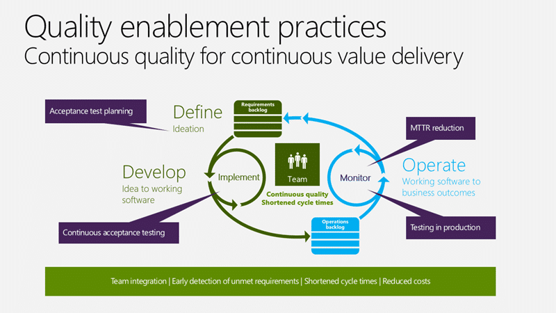
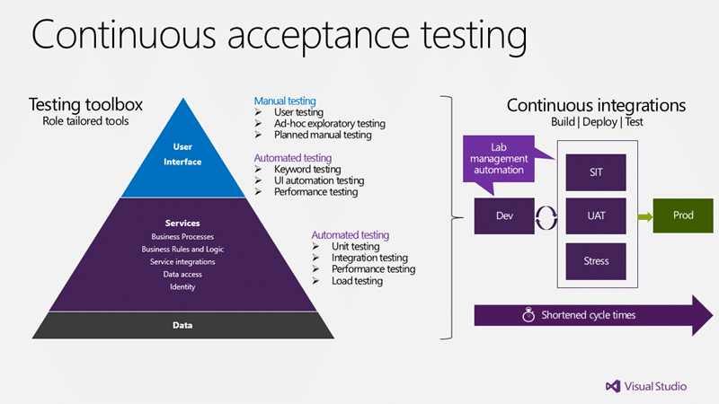
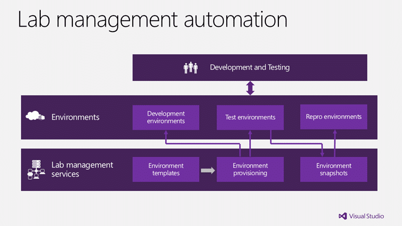
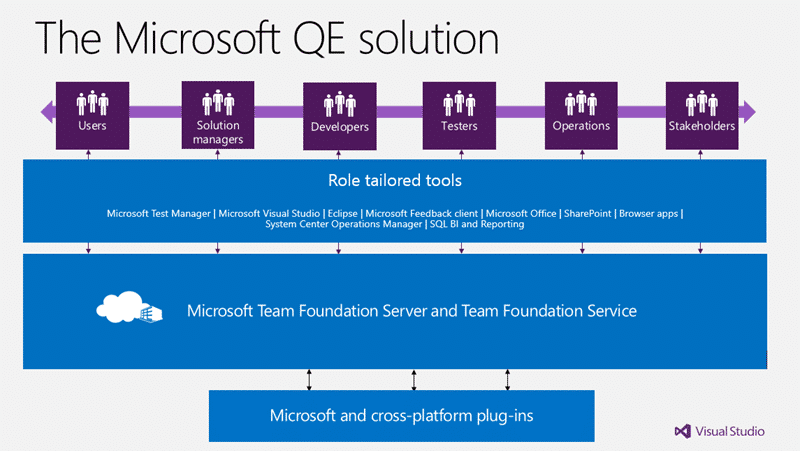
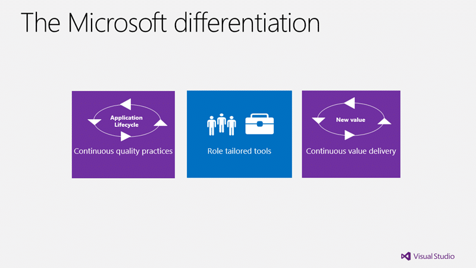

In the modern application lifecycle one of the key messages is one of quality enablement. Quality will be the key differentiator between you and your competitors over the next few years and the old excuses are just that… old.

All companies are now software companies and require more and more to deliver software that is a level of quality that wows your users. Gone are the days when your employees have access to better technology in the office as they are now way ahead at home and upgrading at a faster pace. As this technology has infiltrated the home so the expectations of the consumers (your customers or employees) has increased.

This new level of expectation has added more attributes to the qualities required of even your internal line-of-business applications. Users now expect that you can deliver usable, high-quality applications that work on any platform. This is [the new normal for software development](http://blog.hinshelwood.com/the-new-normal-of-the-modern-application-lifecycle/) and we need to rise to meet it…

  
{ .post-img }
**Figure: Quality Enablement means continuous quality for modern business applications**

In order to achieve this goal we need to stop testing only at the end of our release cycle and start to test continuously and repeatedly to enable the quality levels that we need. We need to change our practices, and we need better tools to help. Visual Studio 2012 is a great tool for this…

### Continuous brand differentiation in quality enablement

You must continuously differentiate your brand in order to compete in the marketplace and to do that you must continuously satisfy consumers whether they are customers or employees … and to do that without crashing and burning you must have a solid quality foundation…

  
{ .post-img }
**Figure: Modern business applications require continuous quality**

The quality of your inventory control systems will denote how quickly and efficiently you can serve your consumers and if your customer care team don’t have the caller’s information to hand how does that make your consumer feel?

#### Systems of engagement in quality enablement

Your systems of engagement are just that: those systems through which your consumers engage with your organisation’s data. These could be your awesome Twitter application that you sell through the Windows Store, or it could be your call centre management system that your customer representatives use to view customer data. Many companies assume that your internal applications are just line-of-business but when they fail it is your customers that feel the pain…

I don’t know how many times I have spoken to a sales representative, either in store or over the phone to hear the fateful phrases “the systems are running slow today”, or “there was a crash, can you call back later?”.  This could be due to a fault, excessive load or the inability of the operator to use it properly. What about call in systems that ask you for your account numbers to get in the queue, only to be asked again when you talk to a representative. These are all deficiencies in the quality of the software that is delivered.

#### Systems of record in quality enablement

The places where you store your single point of truth for your data would be considered your “systems of record” and while users do not directly, or should not, interact with them they do use the services that they provide. You must be able to deliver updates to  your systems of record without breaking your engagement systems and even if these engagement system are not primarily software, this is where you are a software company wither you like it or not. This is one of the core issues that your organisation will need to solve in order to increase quality in response to the changes in modern applications and delivery.

In the last 5 years the consumers of our technology have been asking more of us. Modern applications are demanding, and our previous systems of delivery aren’t enough to meet that demand, we need a modern application lifecycle too.

### Continuous value delivery with modern business applications

In order to be successful at delivering value to the business we know that we need to deliver more frequently. This allows for the business to apply corrective action as needed without interfering in the delivery process.

  
{ .post-img }
**Figure: Continuous value delivery with modern business applications**

In order to be successful at delivering value to the business we know that we need to deliver more frequently. This allows for the business to correct our course as we go and us to build a better product that more closely matches their needs.

Let’s also note that this is not a strictly speaking agile diagram. If you go round this loop in 2 years then it is not agile… If you go round in more frequent iterations it may be Spiral or Iterative. Only once you get this cycle down to 30 days or less can you consider it truly agile…

…why does that matter?

Well these modern applications we’ve been talking about, these are not systems where you can get away with updating them every few years or even yearly. The new normal is really quarterly at a minimum, right, and probably shrinking. Modern app users are not going to wait around for months for a new feature.  So whether you call it agile or something else, the point is, your process needs to be nimble enough to support these more frequent release cycles. Conventional thinking and scheduling will not do.

   
{ .post-img }
**Figure: Conventional QA in the modern application lifecycle**

In a conventional model you would leave QA, UAT and operations verification until you have complete development. Unfortunately this results in:

- Rework of development efforts long after the developer has forgotten how that part of the system works
- Unmet user expectations as users see for the first time things that it is too late to change
- Increased costs as operations teams find performance and deployment issues to late in the game

Ultimately this result in an enormous increase in the cycle time for delivery and most often result in late delivery. We buffer for rework that we think we will get, but we are mostly wrong.

### Quality enablement

Modern applications are delivered continuously and as such you need to practice continuous delivery to build them. In order to begin to deliver continuously we need to discern how to enable the level of quality that we need to achieve for our software. The ideas behind quality enablement are simple.

> Find and fix problems as close as possible to the time that they are created. Accept that acceptance testing is a continuous activity, it starts when the original product or features are imagined and it continues throughout the lifecycle, not just at the end.

This includes problems encountered when testing, building, packaging and deploying in addition to identifying defects from either poorly met requirements, or poorly met expectations.

  
{ .post-img }
**Figure: Continuous quality for continuous value delivery**

There are four key areas that we need to look at to enable our ability to continually deliver high quality working software: acceptance test planning, continuous acceptance testing, testing in production & reducing mean-time-to-resolution.

  
{ .post-img }
**Figure: Acceptance test planning for quality Enablement**

The thing that results in more unmet user expectations than any other single thing is poorly defined requirements. If you are going to succeed at building software you need actionable requirements. While you should consider your backlog of work under lean inventory control you still need firm requirements for your development team to work from. This doesn’t mean you write longer and denser specs that no one reads. Instead it means you engage with stakeholders and constantly check, re-check, get their feedback, show them small samples, you do this as a continuous cycle of feedback and responsiveness.

There are many inputs to actionable requirements and you need to consider not just quality and operations requirements but the goal that your business has. This should be represented in a list of actionable requirements but does not end there. Your requirements are now actionable to the point of being able to break them down into acceptance criteria.

Building out tight acceptance criteria, usually in the Given->When->Then model helps you elicit more actionable details to your requirements and gives you an acceptance test plan. That is you have a short measurable checklist for things that if you fulfil them the customer will accept that you have completed it correctly. This effectively brings User Acceptance Testing (UAT) inside of the continuous quality circle.

  
{ .post-img }
**Figure: Continuous acceptance testing for quality enablement**

So now that we have acceptance criteria we really want to turn them into something that we can execute. This can be done at various levels and certainly at the user interface level it would initially consist of manual testing. But as we build our software and add more features we need to both make sure that we have implanted the correct features and that we have not broken something that we have already delivered. This is hard and time-consuming as it means that we need to be continuously checking our acceptance criteria again and again to be sure. This will increase our cycle time as we move forward if we are adding tens of additional acceptance criteria for each integration. The only way, short of guessing which to run when we hit time constraints, to continuously run our acceptance criteria is to continuously automate them.

On each pass through our cycle we should have all of our tests automated. If we are working against our services, perhaps practicing Test Driven Development (TDD), we are likely starting with automated tests written in a unit testing framework. These tests would consist of unit tests, integration tests and performance / load tests which are likely already automated. Once we start testing the user interface thing get a little more complicated and creating and managing tests and test cases get a little more difficult but regardless, if we don’t automate those tests as well we will end up with an unreasonable and unsustainable burden on our testers.

Just like putting coders under pressure to deliver forces them to increasingly reduce quality to meet the deadline, so putting testers under pressure will encourage them to repeatedly and consistently reduce the breadth of your test coverage.

To make matters worse it is not just the time for testers to execute the tests that impacts on the ability to enable continuous quality but it is also the time it takes to build and deploy your software…

  
{ .post-img }
**Figure: Virtual lab automation for quality enablement**

Whatever types of automation you create will all be for naught if you don't have an automated deployment. And for automated deployment to work we need to have some sort of automated virtual labs so that we can dynamically spin up pre-configured environments to somewhere.

- [Virtual labs in the modern application lifecycle](http://blog.hinshelwood.com/virtual-labs-in-the-modern-application-lifecycle/ "http://blog.hinshelwood.com/virtual-labs-in-the-modern-application-lifecycle/")

We need to be able to quickly and easily provision environments for development, testing and fault reproduction in a consistent and automated manor. The time that this saves can be calculated using the Null Build technique which will show you just how much of your cycle time you are burning with deployments and configuration.

> _I learned about null builds from Brian Harry. A null build is a process by which you measure how long it takes you to deploy from source code. Immediately following a successfully deployment to production, create a new build of the same code and do it again. This time measuring how long it takes and where it gets hung up._

  
{ .post-img }
**Figure: Testing in production for quality enablement**

Even once we get to production we do not stop applying Application Lifecycle Management processes. We need feedback on our application and that comes from two main sources once we hit production; Consumers and supporters. Once we get our completed increment of software in front of our users and stakeholders we can then get real world feedback that allows us to reconcile our backlog with what they now need. In addition our support organisation are monitoring the health of our software and provide the same service to the non-functional aspects of our software.

This can only be done in production.

  
{ .post-img }
**Figure: Mean time to resolution with Quality Enablement**

How quickly can you fix bugs? The quicker that a bug is found, diagnosed and fixed the cheaper it is to fix so the mean time to resolution directly relates to cost of maintenances. But more than that it directly related to your consumers’ satisfaction. Ideally you want to be able to escalate directly from your incident management software to your development tools as well as include actionable diagnostics with the report. You don’t want to give developers access to production so we need enough information to reproduce the problem or at least understand the issue.

In addition, whatever the result we need to make sure that that issue once fixed never rears its ugly head again.

  
{ .post-img }
**Figure: The business value of quality enablement**

So now that we understand what quality enablement means, the impact to our software, our teams and potentially our organisation, what do we get?

> Quality Enablement: What have you done for me lately?

So what do you get?

Well, it is much easier to get to the root of what the business requires when you are able to show them something working now and to have their involvement as you deliver continuous value. As you loop round your cycle at least every 30 days working with the consumers of your application we are able to correct or even change the course of your requirements to achieve a more tailored solution to the objectives of the business.

With the short delivery cycle with smaller changes that your consumer is able to assimilate frequently you are able to get your efforts, the things that you are building, into the hands of your consumers much more quickly. This the results in much higher satisfaction from all of you consumers and stakeholders as they can not only see what you are doing, but give you suggestions and feedback that you can quickly iterate on.

The resulting reduction of cost is directly attributed to the increased quality in your software. Not only do you more closely meet the needs, so less rework, but you also have fewer defects in production so less of those expensive maintenance costs.

  
{ .post-img }
**Figure: Measure for quality enablement**

And now that we know what we get and we want it… how do we measure where we are in this process? How do we know whether it is working?

The first thing that we can measure is value delivered to our business. For every requirement that you deliver you should have a “value” figure. This can be in dollars or time, but is often a relative value estimate. Just as we will be asking your development teams to create relative effort estimates so that we can gauge how many things that they can achieve your business can do relative value estimates to give you an idea how you might order items on a backlog. If you are ordering items by value or ROI (value / effort) then you will quickly see the most relevant requirements float to the top. This will help you reduce the cycle time on your releases as you can stop when there is no longer enough ROI in the backlog to continue with the project.

Measuring how long it takes, on average, to deliver a single unit of work can help you identify places in your software where things are overly complex or places where your process can be improved to help reduce that number. If it takes two weeks for a tester to get to something that the coders built, or to verify a bug then this gives us an idea of where to focus our improvement efforts and how well we are doing.

In addition we want to look at the numbers of defects being found and fixed. There should be fewer defects found over time not more. If there are more defects being found then you may be looking at a reduction in quality (or an increase in the skill of your testers) and whatever the reason it will help you focus on quality.

All of this goes to reducing the amount of rework and thus reducing the cost.

  
{ .post-img }
**Figure: Solution characteristics in quality enablement**

In order to solve the problems that I am sure you have been envisaging throughout we need tools to help manage some of the complexities around continuous quality practices and the work that we have to do to achieve them.

To do this we need tools that are tailored specifically for the types of user (their role) that will be using them. You don’t really want your business users to have to learn your development IDE tools, do you?

They need to be extensible because there is no way that any one company can provide you the tools to solve all of your problems, but we still want our problems to be solved. Above all we need to have a toolset that supports any conceivable platform that we might be developing for…

  
{ .post-img }
**Figure: Solution architecture requirements for Quality Enablement**

At a high level we are talking about having a set of tools that are tailored for all of your roles that are on a unified set of services that includes the ability to connect to any platform…

  
{ .post-img }
**Figure: Solution architecture for quality enablement**

… And if we delve in deeper into the roles actions and requirements we can start to build a profile of what is required, and its complex… we could build this by knitting together a plethora of open source tools and building custom integration between them…or we could find a single unified Application Lifecycle Management solution that does it all…

Where might we find one of those \[looks confused and rub chin\]….

### The Microsoft Solution

For the last seven years Microsoft has been working on a system that embodies that quality enablement.

  
{ .post-img }
**Figure: The Microsoft solution for quality enablement**

Microsoft Team Foundation Server (on-premises) and Team Foundation Service (cloud) services are the backbone that provides features for both Windows and Java clients.

For each hat that your users may wear that equates to roles there are separate tailored tools that allow then to interact with Team Foundation Services in a way that is specific to their role.

  
{ .post-img }
**Figure: Differentiation for quality enablement**

With these continuous quality practices, coupled with tools that are tailored for each role we are able to more easily and effectively achieve continuous value delivery at least every 30 days.

_Originally published at Where Technology Meets Teamwork by [Martin Hinshelwood](http://blog.hinshelwood.com/about), Senior ALM Consultant. ([source](http://blog.nwcadence.com/quality-enablement-with-microsoft-visual-studio-2012/))_
