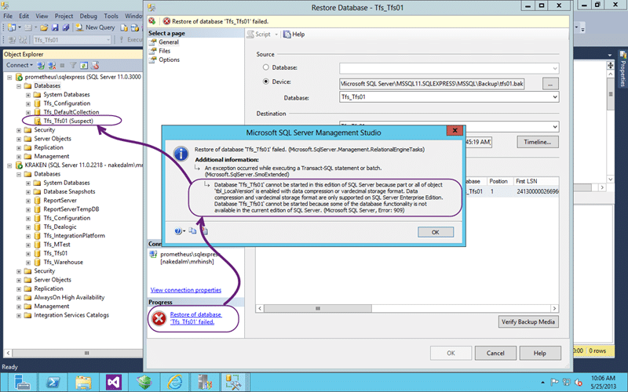
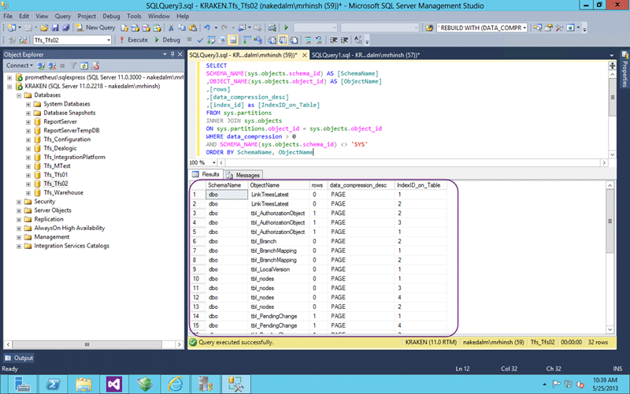

You can get an error when trying to restore TFS backups that certain features are only supported on SQL Server Enterprise Edition.

If you try to restore a SQL Server database that you backed up from an Enterprise version of SQL Server (and that includes Developer Edition) you may encounter an error when trying to restore that database to another SQL Server that is Standard or Express edition.

- Update I got an email from [Grant Holiday](http://blogs.msdn.com/b/granth/) with a little titbit of information.
  > Instead of running a bunch of ALTER INDEX commands, you can just follow the instructions at http://support.microsoft.com/kb/2712111, which is what the error message refers to. Essentially, run this command in each of the TFS Configuration & Collection databases:
  >
  > ```
  > EXEC [dbo].[prc_EnablePrefixCompression] @online = 0, @disable = 1
  >
  > ```
  >
  > \-[Grant Holiday](http://blogs.msdn.com/b/granth/)

  
{ .post-img }
Figure: Error restoring databases that uses compression to SQL Express

This is due to features that are provided in the Enterprise edition of SQL that are not present in anything lower. What sometimes gets folks confused is that Developer Edition has feature parity with Enterprise.

```
TITLE: Microsoft SQL Server Management Studio
------------------------------

Restore of database 'Tfs_Tfs01' failed. (Microsoft.SqlServer.Management.RelationalEngineTasks)

------------------------------
ADDITIONAL INFORMATION:

An exception occurred while executing a Transact-SQL statement or batch. (Microsoft.SqlServer.SmoExtended)

------------------------------

Database 'Tfs_Tfs01' cannot be started in this edition of SQL Server because part or all of object 'tbl_LocalVersion' is enabled with data compression or vardecimal storage format. Data compression and vardecimal storage format are only supported on SQL Server Enterprise Edition.
Database 'Tfs_Tfs01' cannot be started because some of the database functionality is not available in the current edition of SQL Server. (Microsoft SQL Server, Error: 909)

For help, click: http://go.microsoft.com/fwlink?ProdName=Microsoft%20SQL%20Server&EvtSrc=MSSQLServer&EvtID=909&LinkId=20476

------------------------------
BUTTONS:

OK
------------------------------

```

In this case some of the objects (tables & indices) have compression enabled and compression is only available in SQL Enterprise and Developer Editions.

You also can’t say that you were not warned as when you detached the collection from your old TFS server you ignored the warning that resulted in the very message above. How do I know that you did? Coz I did as well…

  
{ .post-img }
Figure: This collection has SQL Enterprise features enabled

When you detach a collection you will get a warning if it is using enterprise features. I had always gotten into the habit of ignoring this as I had never encountered any issue. Now I have…

```
This collection has SQL Enterprise features enabled. If you are moving the collection across SQL Server Editions please read the documentation (http://go.microsoft.com/fwlink/?LinkId=166007) to see how this impacts you.

```

Now that we know what the problem is we need to take steps to remove the compression that is enabled on the objects within our collection. When you create a collection with the enterprise features enabled TFS enabled the compression automatically so we will always need to down-level our databases if we encounter this issue. But first we need to find the objects…

```
SELECT
SCHEMA_NAME(sys.objects.schema_id) AS [SchemaName]
,OBJECT_NAME(sys.objects.object_id) AS [ObjectName]
,[rows]
,[data_compression_desc]
,[index_id] as [IndexID_on_Table]
FROM sys.partitions
INNER JOIN sys.objects
ON sys.partitions.object_id = sys.objects.object_id
WHERE data_compression > 0
AND SCHEMA_NAME(sys.objects.schema_id) <> 'SYS'
ORDER BY SchemaName, ObjectName

```

This SQL statement allows you to find all of the index objects that are currently enabled for compression. Just because it is enabled does not mean that it is in use, but just having it enabled will disallow your ability to import your database into SQL Standard or SQL Express.

  
{ .post-img }
Figure: List of objects that have compression enabled in SQL Enterprise

We can then use this list to alter the objects and remove the compression. To do this we need to rebuild the indices without compression enabled as it is not just an on/off flag.

```
ALTER INDEX ALL ON LinkTreesLatest REBUILD WITH (DATA_COMPRESSION = None);
ALTER INDEX ALL ON tbl_AuthorizationObject REBUILD WITH (DATA_COMPRESSION = None);
ALTER INDEX ALL ON tbl_Branch REBUILD WITH (DATA_COMPRESSION = None);
ALTER INDEX ALL ON tbl_BranchMapping REBUILD WITH (DATA_COMPRESSION = None);
ALTER INDEX ALL ON tbl_LocalVersion REBUILD WITH (DATA_COMPRESSION = None);
ALTER INDEX ALL ON tbl_nodes REBUILD WITH (DATA_COMPRESSION = None);
ALTER INDEX ALL ON tbl_PendingChange REBUILD WITH (DATA_COMPRESSION = None);
ALTER INDEX ALL ON tbl_PendingChangeRecursive REBUILD WITH (DATA_COMPRESSION = None);
ALTER INDEX ALL ON tbl_PendingMerge REBUILD WITH (DATA_COMPRESSION = None);
ALTER INDEX ALL ON tbl_PendingRollback REBUILD WITH (DATA_COMPRESSION = None);
ALTER INDEX ALL ON tbl_PropertyValue REBUILD WITH (DATA_COMPRESSION = None);
ALTER INDEX ALL ON tbl_RegistryItems REBUILD WITH (DATA_COMPRESSION = None);
ALTER INDEX ALL ON tbl_SecurityAccessControlEntry REBUILD WITH (DATA_COMPRESSION = None);
ALTER INDEX ALL ON tbl_Version REBUILD WITH (DATA_COMPRESSION = None);
ALTER INDEX ALL ON tbl_WorkingFolder REBUILD WITH (DATA_COMPRESSION = None);
ALTER INDEX ALL ON tbl_WorkingFolderHistory REBUILD WITH (DATA_COMPRESSION = None);
ALTER INDEX ALL ON tbl_WorkspaceMapping REBUILD WITH (DATA_COMPRESSION = None);
GO

```

If you have a large amount of data than this can and will take some time. Or considerably longer!

For me, my collection was less than 100mb so the entire script ran in milliseconds. On hundreds of gigabyte's I would  expect this to take a very long time.

  
{ .post-img }
Figure: SQL backup restore is now successful

Woot.. now that I have removed that enterprise only feature SQL Express now no longer chokes on the restore.

## Conclusion

Although the enterprise features are useful at scale they can get in the way when you are tinkering or if your instance is just that small. If your TFS instance is small enough to go into SQL Express I would recommend using [http://tfs.visualstudio.com](http://tfs.visualstudio.com) instead as you will always have the latest features and someone else maintains your server.
