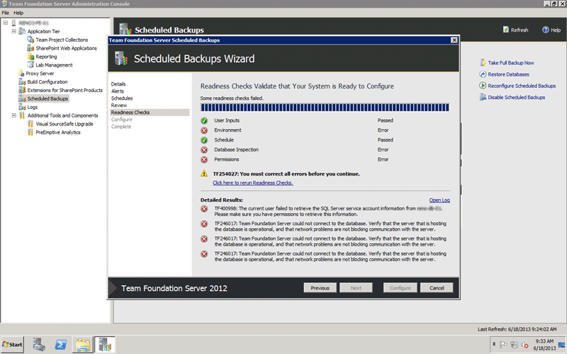

After a server migration Scheduled Backups gives a TF400998 when you try to reconfigure it. You may also see timeouts and errors when trying to add Team Foundation Console Users.

  
{ .post-img }
Figure: You get TF400998 and TF246017 when anything hits Scheduled Backup

## Applies to

- Team Foundation Server 2012
- Team Foundation Server 2012.2 (QU2)
- Team Foundation Server 2012.3 (QU3)
- Team Foundation Server 2013

## Findings

We had the Scheduled Backups configured for the old environment (const-dt-01 & const-at-01) that was in the old domain. We then did a full backup and restore of TFS to the new domain and followed the documentation for both a hardware and environment move.

It looks like there are a bunch of referenced, specifically in the “Scheduled Backups” tools that are left at the old server. If you just try to reconfigure you get the nasty errors above and the log below.

```
[Info   @16:26:10.509] ====================================================================
[Info   @16:26:10.510] Team Foundation Server Administration Log
[Info   @16:26:10.510] Version  : 11.0.60521.0
[Info   @16:26:10.510] DateTime : 06/18/2013 09:26:10
[Info   @16:26:10.510] Type     : Scheduled Backups
[Info   @16:26:10.510] User     : CONSTMrHinsh
[Info   @16:26:10.510] Machine  : CONST3-AT-01
[Info   @16:26:10.510] System   : Microsoft Windows NT 6.1.7601 Service Pack 1 (AMD64)
[Info   @16:26:10.510] ====================================================================
[Info   @16:30:26.252] -----------------------------------------------------
[Info   @16:30:26.252]
[Info   @16:30:26.252] +-+-+-+-+-| Running VerifySqlServiceAccountCanBeGrantedPermission: Verifying SQL service account is not a local account |+-+-+-+-+-
[Info   @16:30:26.252]
[Info   @16:30:26.252] +-+-+-+-+-| Verifying SQL service account is not a local account |+-+-+-+-+-
[Info   @16:30:26.252] Starting Node: SQLISNOTLOCAL
[Info   @16:30:26.252] NodePath : Container/Progress/SQLISNOTLOCAL
[Info   @16:30:26.268] Verify that account 'CONSTCONST3web' is not local service or local system.
[Info   @16:31:30.603] Node returned: Error
[Error  @16:31:30.603] TF400998: The current user failed to retrieve the SQL Server service account information from CONST-DT-01. Please make sure you have permissions to retrieve this information.
[Info   @16:31:30.604] Completed VerifySqlServiceAccountCanBeGrantedPermission: Error
[Info   @16:31:30.656] -----------------------------------------------------
[Info   @16:31:30.656]
[Info   @16:31:30.656] +-+-+-+-+-| Running VerifyCollectionDatabases: Verifying connection strings are valid |+-+-+-+-+-
[Info   @16:31:30.657]
[Info   @16:31:30.657] +-+-+-+-+-| Verifying connection strings are valid |+-+-+-+-+-
[Info   @16:31:30.657] Starting Node: BACKUPDBSREACHABLE
[Info   @16:31:30.657] NodePath : Container/Progress/BACKUPDBSREACHABLE
[Info   @16:31:30.657] Verifying connection strings to all backup databases
[Info   @16:31:30.658] Looking for database Tfs_Configuration on CONST3-DT-01
[Info   @16:31:30.699] Checking if database Tfs_Configuration on CONST3-DT-01 is online
[Info   @16:31:30.732] Looking for database Tfs_IMF on CONST3-DT-01
[Info   @16:31:30.760] Checking if database Tfs_IMF on CONST3-DT-01 is online
[Info   @16:31:30.790] Looking for database ReportServer on CONST-DT-01
[Info   @16:31:52.103] Node returned: Error
[Error  @16:31:52.103] TF246017: Team Foundation Server could not connect to the database. Verify that the server that is hosting the database is operational, and that network problems are not blocking communication with the server.
[Info   @16:31:52.103] Completed VerifyCollectionDatabases: Error
[Info   @16:31:52.117] -----------------------------------------------------
[Info   @16:31:52.117]
[Info   @16:31:52.117] +-+-+-+-+-| Running VerifySqlServerPermissionsGranted: Verifying TFS Job Agent has permissions to create and alter databases |+-+-+-+-+-
[Info   @16:31:52.121]
[Info   @16:31:52.121] +-+-+-+-+-| Verifying TFS Job Agent has permissions to create and alter databases |+-+-+-+-+-
[Info   @16:31:52.121] Starting Node: ALTERCREATEDATABASE
[Info   @16:31:52.121] NodePath : Container/Progress/ALTERCREATEDATABASE
[Info   @16:32:56.264] Node returned: Error
[Error  @16:32:56.264] TF246017: Team Foundation Server could not connect to the database. Verify that the server that is hosting the database is operational, and that network problems are not blocking communication with the server.
[Info   @16:32:56.264] Completed VerifySqlServerPermissionsGranted: Error
[Info   @16:32:56.264] -----------------------------------------------------
[Info   @16:32:56.264]
[Info   @16:32:56.264] +-+-+-+-+-| Running VerifySqlDatabasesPermissionsGranted: Verifying TFS Job Agent has permissions to backup databases, create tables, and execute stored procedures |+-+-+-+-+-
[Info   @16:32:56.268]
[Info   @16:32:56.268] +-+-+-+-+-| Verifying TFS Job Agent has permissions to backup databases, create tables, and execute stored procedures |+-+-+-+-+-
[Info   @16:32:56.268] Starting Node: BACKUPEXECUTECREATE
[Info   @16:32:56.268] NodePath : Container/Progress/BACKUPEXECUTECREATE
[Info   @16:32:56.268] Granting account CONSTCONST3web permissions to initiate database backups of Tfs_Configuration
[Info   @16:32:56.309] Granting account CONSTCONST3web permissions to initiate database backups of Tfs_IMF
[Info   @16:32:56.619] Granting account CONSTCONST3web permissions to initiate database backups of ReportServer
[Info   @16:33:17.634] Node returned: Error
[Error  @16:33:17.634] TF246017: Team Foundation Server could not connect to the database. Verify that the server that is hosting the database is operational, and that network problems are not blocking communication with the server.
[Info   @16:33:17.634] Completed VerifySqlDatabasesPermissionsGranted: Error
[Info   @16:33:17.634] -----------------------------------------------------
```

This then prevents us from being able to reconfigure however you can disable and reset.

## Solution

If we instead click “Disable Scheduled Backup” and weight for the timout we get a “Network Path not found” exception when it tries to access the backup location but it has actually done the disable.

  
{ .post-img }
Figure: Disable results in path not found

If you hit the refresh button above the Scheduled Backup node will return to its un-configured state.
