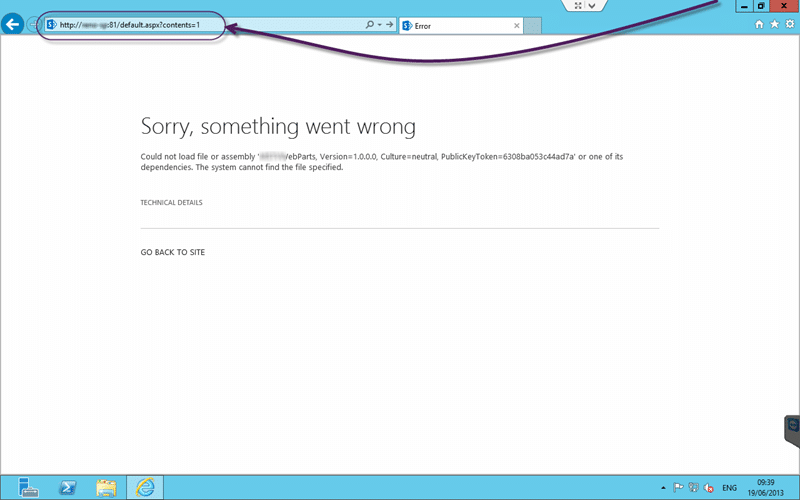
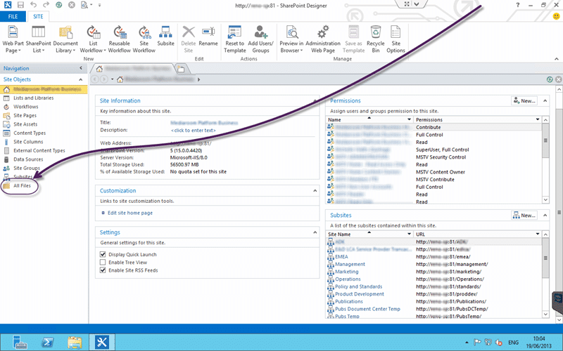

After an upgrade of a SharePoint 2010 content database to SharePoint 2013 you may get an error message “Could not load file or assembly ‘MyCustomWebPart, Version=1.0.0.0, Culture=neutral, Public Token=6912jju2191j213ggv10’ or one of its dependants. The system cannot find the file specified” when you try to access a page.

This is fairly common when upgrading but the solution is very hard to find.

  
{ .post-img }
Figure: Could not load file or assembly

You may not have access to the custom Web Part or it may only work in SharePoint.vLast.

## Applies to

- SharePoint 2013
- SharePoint 2010

## Findings

If you just take the SharePoint databases and restore them to the new environment you may not have, or even be able to migrate the custom web parts that have been added.

In this case the custom web part was created and compiled for SharePoint 2010 and we will not be recompiling it for SharePoint 2013 but we still need to get the site running now. There are two main ways to solve this problem:

- **Reset to Site Definitions** – This will reset an individual page or the entire site to the out-of-the-box definition of the page.
- **Edit with SharePoint Designer** – This is a much more invasive option, but if things have been edited with SharePoint Designer you may be left with no choice.

Always start with resetting to Site Definitions option as it is the easiest, least invasive and quickest option.

## Solution #1 – Reset to Site Definitions

This is the solution of first resort. It will fix most small issues and minimises the impact and risk to all users. If you reset your site to the site dentitions all of the little customisations that have been made to pages will be reset to the defaults. So if customisations have been made through the UI this will work a dream.. there is however one problem first… how do we get into the admin.

  
{ .post-img }
Figure: To access the admin page use ?content=1

If you add “?content=1” to the end of the URL you will find the SharePoint “Web Part Page Maintenance” screen for that page. Here you will have access to the rest of the settings that you need. And it shows that the site works, just not that page that we had a problem with.

  
{ .post-img }
Figure: Getting to the Web Part Page Maintenance

We can then see the little cog (settings) button on the top right and we get access to Site Settings.

  
{ .post-img }
Figure: Finding Reset to site definition on Site Settings

Go to “Site Settings | Site Actions | Reset to site definition” to get access to the feature that we need to fix this issue.

  
{ .post-img }
Figure: Reset all pages in this site to site definition version

Once on the “Reset Page to Site Definition Version” page you should select the “Reset all pages in this site to site definition version” so that we don’t have to do it for every page. This is something that I have always done for upgraded sites as the definition that you are resetting to is the one from the new version (SharePoint 2013 in this case) and that will improve the look and feel of the pages.

Unfortunately in this case there have been customisations made to the “default.aspx” file using SharePoint Designer and we need SharePoint Designer to fix them.

## Solution #2 – Edit with SharePoint Designer

SharePoint Designer is a [free download from Microsoft](http://www.microsoft.com/en-us/download/details.aspx?id=35491) and will let you edit each individual page. I would never recommend using SharePoint Designer to edit pages but sometimes its evil has already been instilled in the pages and we need to get rid of it.

  
{ .post-img }
Figure: Open SharePoint Designer and the Site that you need to edit

Once you open the site (use “Open Site | [http://myshareppoint:81/](http://myshareppoint:81/)”)

  
{ .post-img }
Figure: Switch to All Files to get access to the default pages

We need to find the ‘default.aspx’ file in this case and for that we need to access “All Files”.

  
{ .post-img }
Figure: Check Out to Edit

In order to edit files in SharePoint you need to check them out first. This prevents random tampering and makes you check the changes in deliberately before they are visible on the site.

  
{ .post-img }
Figure: Some of the code is Protected

Now that I have found the culprit I can edit the page to remove it… except that I cant. In SharePoint Designer 2013 all of the wrapper code for the page is protected and cant be edited. The yellow highlight around the text is the indication that it is in this protected mode. if you want to exit it you need to switch to scary evil mode first.

This is a good thing as it will help limit the scope of the changes that people make with this tool unless they know what they are doing.

  
{ .post-img }
Figure: Switch to Advanced Mode (Scary evil mode)

Once in Advanced mode you will be able to edit all of the protected sections. We need to delete the line that references the Assembly that we do not have in the new instance. Make sure that you search for the Tag Prefix (In this case “WpNs5”) to make sure that you are not leaving any orphaned controls. You would need to remove them as well.

Once you have made your changes you can save and remember to check in to see the changes.

In this case all of the Register tags with the TagPrefix of "WpNs\*" needs to be removed and any associated controls removed.

This will fix any issues with the pages loading.
