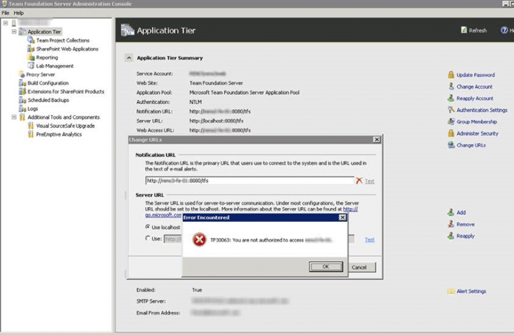
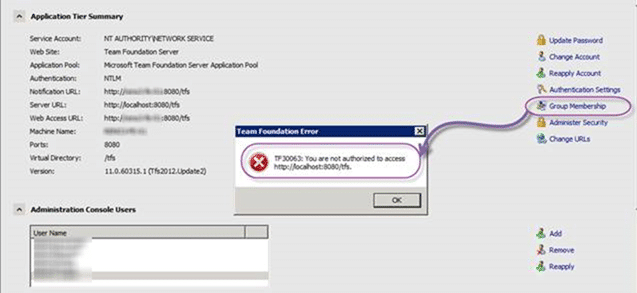

If you have TFS 2012 Update 2 (2012.2) installed you might get an error after you [move Team Foundation Server from one environment to another](http://msdn.microsoft.com/en-us/library/ms404883.aspx) (change domain.)

  
{ .post-img }
Figure: TF30063 you are not authorised to access server

## Applies to

- Team Foundation Server 2012.2

## Findings

Not only are you unable to change the URL but you are also to edit permissions or in any way connect to TFS even from the server.

  
{ .post-img }
Figure: TF30063 you are not authorised to access localhost

This is not one that I have encountered before and was at a loss to help the customer. I ran the flag up and got a little help from [Grant Holiday](http://blogs.msdn.com/b/granth/). He identified this as a bug…

## Solution

This bug is fixed in Team Foundation Server 2012.3. 2012.3 is currently  at RC2 but it does come with a Go-Live licence meaning that it is fully supported in production. After installing 2012.3 all of the problems went away and the server started functioning normally.

Woot… yet another reason for 2012.3 and Go-Live…
