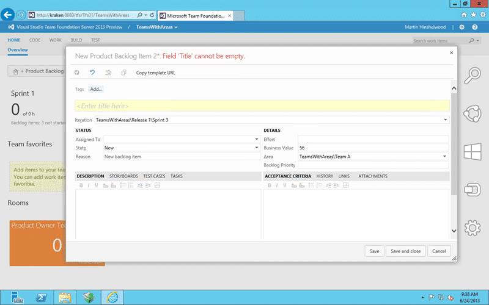

In some cases you want to be creating a Work Item with defaults in Team Foundation Server so that you can give access to users but also give them guidance on what to fill out.

The best option for this is to create your own UI that leverages the TFS API and gives the users access to only the fields that you deme pertinent. This would be the full control option. If however you don’t have time or want to do that there is a simple solution. You can create a ‘template URL’ that pre-populated the field values of a Work Item.

  
{ .post-img }
Figure: New PBI form with defaults

To do this you need to open your Team Project in the Web Access and click to create a new Work Item for whatever type that you want. In this case it is the Product Backlog Item. I have then gone ahead and changed the Area Path, Iteration Path and added a value for Business Value.

  
{ .post-img }
Figure: Copy template to clipboard

Now that we have the customisations how we like we can click the “Copy template URL” button and it will create a URL with the field data on it and save it to your clipboard.

> [http://kraken:8080/tfs/Tfs01/TeamsWithAreas/\_workItems/create/Product%20Backlog%20Item?%5BMicrosoft.VSTS.Common.BusinessValue%5D=56&%5BSystem.AreaPath%5D=TeamsWithAreas%5CTeam+A&%5BSystem.IterationPath%5D=TeamsWithAreas%5CRelease+1%5CSprint+3](http://kraken:8080/tfs/Tfs01/TeamsWithAreas/_workItems/create/Product%20Backlog%20Item?%5BMicrosoft.VSTS.Common.BusinessValue%5D=56&%5BSystem.AreaPath%5D=TeamsWithAreas%5CTeam+A&%5BSystem.IterationPath%5D=TeamsWithAreas%5CRelease+1%5CSprint+3 "http://kraken:8080/tfs/Tfs01/TeamsWithAreas/_workItems/create/Product%20Backlog%20Item?%5BMicrosoft.VSTS.Common.BusinessValue%5D=56&%5BSystem.AreaPath%5D=TeamsWithAreas%5CTeam+A&%5BSystem.IterationPath%5D=TeamsWithAreas%5CRelease+1%5CSprint+3")

You you look closely at the URL you will see that it has the field name “Microsoft.VSTS.Common.BusinessValue” followed by the value of “56” pre filled out in the URL.

  
{ .post-img }
Figure: New PBI form with custom defaults

If you drop that URL into a browser you will see the new work item page with your work item pre-populated. Now if you want you can now create a simple html page that has a list of predefined links to create work items of different types and defaults…

Simples…
