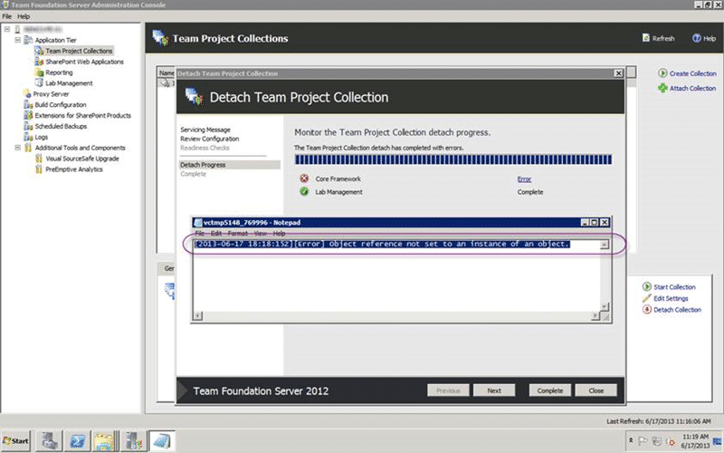

When you try to detach a Team Project Collection in Team Foundation Server the process fails on SnapshotIdentities with an "object reference not set to an instance of an object" error. While this does not inhibit the execution of TFS there is likely a good reason that you wanted to detach and found this issue.

[](http://nkdagility.com/files/2013/06/image131.png)  
{ .post-img }
Figure: object reference not set to an instance of an object

In this case I was trying to move the Collection to another server and this is a blocking issue.

## Applies To

- Team Foundation Server 2012
- Team Foundation Server 2012.1
- Team Foundation Server 2012.2
- Team Foundation Server 2012.3
- Team Foundation Server 2013 Preview

## Findings

When you get these sorts of errors make sure that you look in the Event Log of the server and at the logs generated by TFS. In the event of an error there will be a link on the page that will open the relevant log in the Team Foundation Server Administration Console.

```
[11:16:24.010] ++ Executing - Operation: Snapshot, Group: Snapshot.TfsIdentities
[11:16:25.010] Executing step: Copy identities to collection database
[11:16:25.010]   Executing step: 'Copy identities to collection database' Identity.SnapshotIdentities (16 of 28)
[11:18:15.873]   [Error] Object reference not set to an instance of an object.
[11:18:15.877]   System.NullReferenceException: Object reference not set to an instance of an object.
[11:18:15.877]      at Microsoft.TeamFoundation.Framework.Server.IdentityTransferHandler.Transfer()
[11:18:15.877]      at Microsoft.TeamFoundation.Framework.Server.IdentityTransferHandler.Execute()
[11:18:15.877]      at Microsoft.VisualStudio.Services.Framework.IdentityStepPerformer.SnapshotIdentities(TeamFoundationRequestContext requestContext, ServicingContext servicingContext)
[11:18:15.877]      at Microsoft.TeamFoundation.Framework.Server.TeamFoundationStepPerformerBase.Microsoft.TeamFoundation.Framework.Server.IStepPerformer.PerformStep(String servicingOperation, String stepType, String stepData, ServicingContext servicingContext)
[11:18:15.877]      at Microsoft.TeamFoundation.Framework.Server.ServicingStepDriver.PerformServicingStep(ServicingStep step, ServicingContext servicingContext, ServicingStepGroup group, ServicingOperation servicingOperation, Int32 stepNumber, Int32 totalSteps)
[11:18:15.877] Step failed: Copy identities to collection database. Execution time: 110 seconds.
[11:18:15.883]   Clearing dictionary, removing all items.

```

In the log you can clearly see that the step that is failing is the “Snapshot.TfsIdentities”. What I believe that this does is create a package inside of the Collection database for the new TFS Instance that you are moving it to. This package needs to contain all of the Identities that have interacted with this TFS Instance. The likely cause of this error is that there are orphaned group memberships in the Configuration database that do not exist within the Collection.

I would suggest that this would be the result of a TFS server that has backed up without the use of a ‘marked transaction log’ and that backup restored at some point. If you have large databases and you don't use the [built in Scheduled Backups tool](http://msdn.microsoft.com/en-us/library/vstudio/hh561429.aspx) or the documented process to [manually back up Team Foundation Server](http://msdn.microsoft.com/en-us/library/vstudio/ms253070.aspx) then you are leaving yourself open for this type of inconsistency.

To find out if your have any orphaned identities then you should run:

_Warning Do not make any changes to any of your TFS Databases manually unless specifically instructed by the Product Team. If you do then you can no longer be supported by Microsoft._

```
SELECT  gm
FROM    tbl_GroupMembership gm
WHERE   gm.PartitionId = 1
    AND NOT EXISTS (
        SELECT  *
        FROM    tbl_Group g
        WHERE   g.PartitionId = 1
            AND g.Id = gm.MemberId
    )
    AND NOT EXISTS (
        SELECT  *
        FROM    tbl_Identity i
        WHERE   i.PartitionId = 1
            AND i.Id = gm.MemberId
    )

```

If you get results from this query then you have this problem and you should immediately raise a support ticket with Microsoft to get this fixed.

## Solution

You need to remove all of the orphaned identities from your server in order to fix this. To achieve that you should work with Microsoft by raising a support ticket and cleaning the instance.  If an invalid backup has been restored there are likely other things that need to happen to get into a supported state and changing the database yourself will not get you there.

Raise a ticket and get your server into a supported state…
