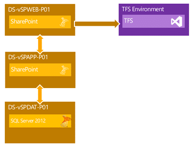

I have been working with a company in Silicon Valley that is doing one of the most complex Team Foundation Server migrations that I think I have ever seen. Just to pile on the complexity they also threw a SharePoint consolidation at me so I caught that as well.

As with the previous TFS Edition we are moving SharePoint data through multiple environments and in the case of SharePoint we are only worried about consolidation. There are many SharePoint sites used by this organisation that are strung around the corporate network and we first need to consolidate them onto a single server so that we can easily migrate them to SharePoint 2013.

  
{ .post-img }
Figure: Production SharePoint Environment

Initially we are doing a single server trial consolidation and upgrade to prove out the process and make sure that everything works. Here we will find all of the issues and tribulations that will inhibit our ability to make this transition easy. Lets get started…

## Setting up the environment

We have a bunch of things that need to be installed and I have previously documented each one. As these installations are consistent with how I always install these products and the only variants are referenced.

1. [Install SQL Server 2012 SP1](http://nkdagility.com/installing-tfs-2012-on-server-2012-with-sql-2012/) (Step #2 only & use default accounts)
2. [Installing SharePoint Server 2013](http://nkdagility.com/install-sharepoint-2013-on-windows-server-2012-without-a-domain/) (but use a Domain Account and do not create a Site Collection)
3. [Installing Project Server 2013](http://nkdagility.com/integrating-project-server-2013-with-team-foundation-server-2012/) (Step #3 only)

If you are able to create a snapshot at each stage then it may save you time if you forget to add a feature or if something fails. Once you have these three steps complete then you should remove all of the old Snapshots and create a new clean one for the server.

## For each Content database you are consolidating

There are only a few simple steps to importing and upgrading your SharePoint 2010 content databases to SharePoint 2013. Note that there are additional steps listed below that you can run each time or all at the end.

1. Copy backup locally
2. Restore the SharePoint 2010 Content Database
3. Create a Web Application to host the Content Collection (the first one will already exist)
4. Call SP PowerShell: “Mount-SPContentDatabase -Name iptvsigportal -DatabaseServer reno-sp -WebApplication [http://reno-sp](http://reno-sp)”
5. Upgrade the site collection to 2013: “Site Settings | Site Collection Administration | Site Collection Upgrade”

Note: You may need to run a few fixes for pages that have been customised with SharePoint Designer ([SharePoint 2013 Issue – Custom Web Part results in Could not load file or assembly after upgrade](http://nkdagility.com/sharepoint-2013-issue-custom-web-part-results-in-could-not-load-file-or-assembly-after-upgrade/).)

## Post Mount Activities

Because we are both moving from multiple server and consolidating with an upgrade to a new version of the product we have a couple of post-consolidation steps to make sure that everything is accessible and above board.

1. Add Firewall rules for other ports
2. Rename Web Applications
3. [Migrate users to Claim Based Authentication](http://nkdagility.com/sharepoint-2013-issue-after-migration-from-2010-user-permission-not-working/?preview=true)
4. Moving environment (domain) {Optional}

These activities are required for good operation and support of SharePoint 2013 with upgraded

### Add Firewall rules for other ports

This one took me by surprise and I had not realised that SharePoint 2013 does not add the firewall rules to allow access when you create a new site on a new port. In this case we have 80, 81 and 82. Only 80 has been granted access by default and we need to add the other two.

You can take the slow approach and add rules through the UI but recently I have been preferring to use the scriptable approach so in PowerShell you do:

```
netsh advfirewall firewall add rule name="SharePoint80" dir=in action=allow protocol=TCP localport=80
netsh advfirewall firewall add rule name="SharePoint81" dir=in action=allow protocol=TCP localport=81
netsh advfirewall firewall add rule name="SharePoint82" dir=in action=allow protocol=TCP localport=82
```

This will allow ports 80 through 82 incoming requests.

### Rename Web Applications

This is a simple piece of PowerShell to do the rename. You can’t do it through the UI except when you do the initial creation and it is easier to determine which site is which if the name reflects the content.

```
$wa=Get-SPWebApplication | where {$_.Name -match "SharePoint - 80"}
$wa.Name="SiteAwesome"
$wa.Update()

```

Simples.

### Moving environment (domain) {Optional}

When we do a domain migration from DomainA to DomainBdomains we will have an additional step of telling SharePoint what the mapping is between the users in DomainA to DomainB.

To do this we need to create a “usermapping.csv” that has “OldUsername” and “NewUsername” columns with a row for each of the users and the mapping.

```
Param(
     [string] $csvusers = "C:spconsolusermapping.csv"
    )
Add-PSSnapIn Microsoft.SharePoint.PowerShell

foreach ($wa in get-SPWebApplication)
{
   $UserList=IMPORT-CSV $csvusers
   Foreach ($Person in $UserList) {
        Move-SPUser –Identity "DomainA$Person.OldUsername" –NewAlias "DomainA$Person.NewUsername"
   }
}

```

This PowerShell will map each of the users across to the new domain and allow them to access the SharePoint sites with the name accounts as well as maintaining traceability.

## Conclusion

Upgrading SharePoint 2012 to SharePoint 2013 is not quite as easy as it is with Team Foundation Server. There are quite a few pitfalls and it took some amount of research to get the above all working.
