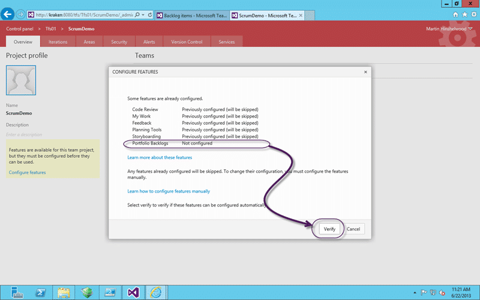
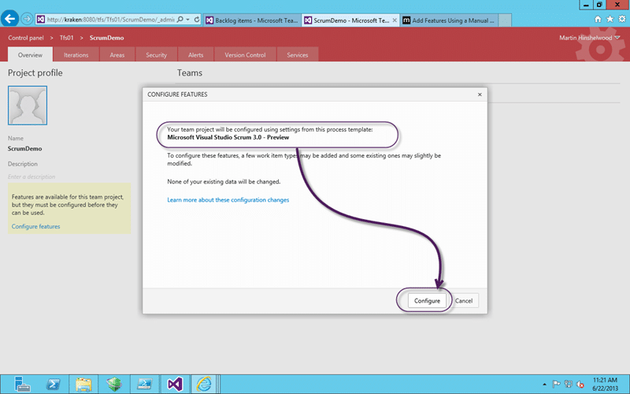
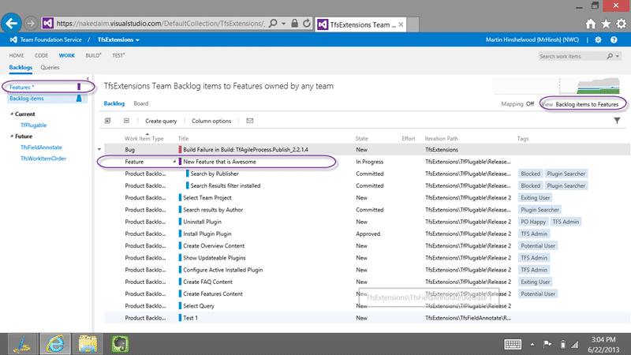

So you have upgraded to Team Foundation Server 2013 but you still don’t have some of the features that you upgraded for. There is a wizard for that but it is not supper discoverable that allows you to configure features in Team Foundation Server 2013.

Note If you want to completely replace your current process template with the new on you can follow [Upgrading to Visual Studio Scrum 3.0 process template](http://nkdagility.com/upgrading-to-visual-studio-scrum-3-0-process-template-in-tfs-2013/) instead.

- [Get Visual Studio 2013 & Team Foundation Server 2013 while its hot!](http://nkdagility.com/get-visual-studio-2013-team-foundation-server-while-its-hot/)

This processes will, depending on the version of TFS that you are upgrading from, add one or more features to your Team Project that are not enabled by default. Strait off  the bat you will get Team Rooms and the new Test hub functionality as well as the better placement and access to the Boards. However you will see a distinct lack of a Feature backlog. This Feature backlog needs a new work item type “Feature” and a a change to the configuration of the underlying boards to support it.

Luckily the TFS Product Team think of everything and have provided a wizard that works in 90% of cases.

  
{ .post-img }
Figure: Open “Team Project | Control Panel”

You need to go to your Team Projects Control Panel by clicking on the little cog on the top right of Web Access, right next to your name.

  
{ .post-img }
Figure: Click “Overview | Project Profile | Configure features”

I am not sure about the placement and discoverability of this panel, but then it is a preview and they may stick it somewhere else. I would like to see a “Features” hub where I can enable and disable features and maybe a dismissible call to action near the heading for enabling things that are new.

> As a Team Administrator I would like to have a Feature hub where I can enable or disable specific features for my teams  
> Suggestion for TFS

Anyhoo, you can click “Configure features” to get started.

Note If you are coming from TFS 2008 or TFS 2010 you will get a much more prominent “Configure features” option as none of the Boards will work without configuring.

  
{ .post-img }
Figure: Discover which features to configure in Team Foundation Server 2013

The configure features in Team Foundation Server 2013 wizard will then let you know what features will be configured. You can see here that I am coming from a Team Foundation Server 2012 instance as I already have most of those features enabled. Go ahead and verify…

  
{ .post-img }
Figure: Check the Process Template match before you configure features in Team Foundation Server 2013

When you verify the configure features in Team Foundation Server 2013 wizard will identify which process template best matches so that it can load the settings from that template. If you get an error at this point because it can’t match the Process Template then you may need to manually configure and there will be a link on the screen to do that.

- [Issue \[ TFS 2013 Preview \] TF400654: Unable to configure Planning Tools](http://nkdagility.com/issue-tfs-2013-preview-tf400654-unable-to-configure-planning-tools/ "TF400654: Unable to configure Planning Tools")

  
{ .post-img }
Figure: Congratulations

And that's it.. you are done…

  
{ .post-img }
Figure: Start using your new features

At this point you should now have access to the new awesome features. Now go play…

- [Get Visual Studio 2013 & Team Foundation Server 2013 while its hot!](http://nkdagility.com/get-visual-studio-2013-team-foundation-server-while-its-hot/)

Be a kid again…

