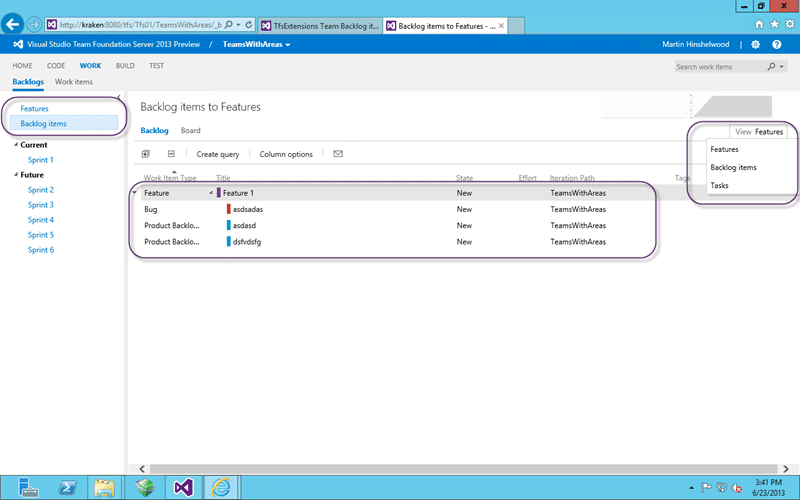
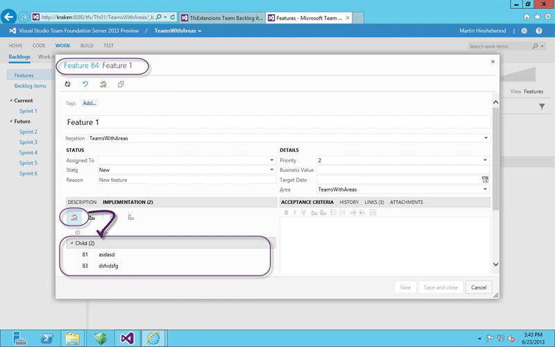
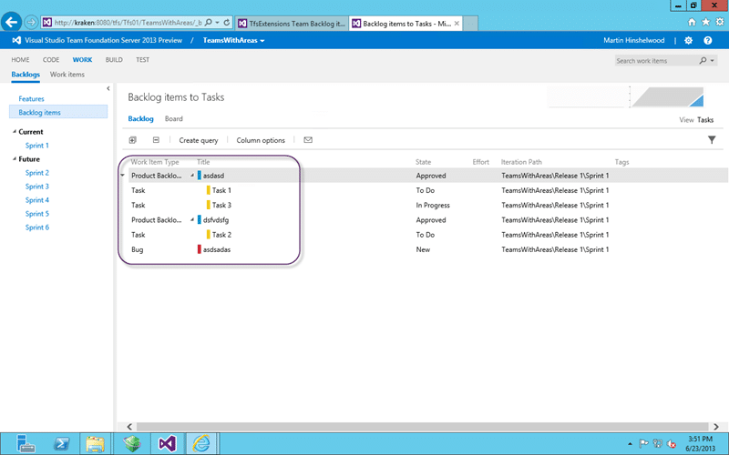
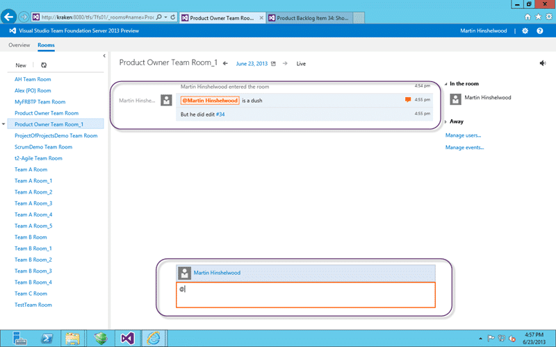
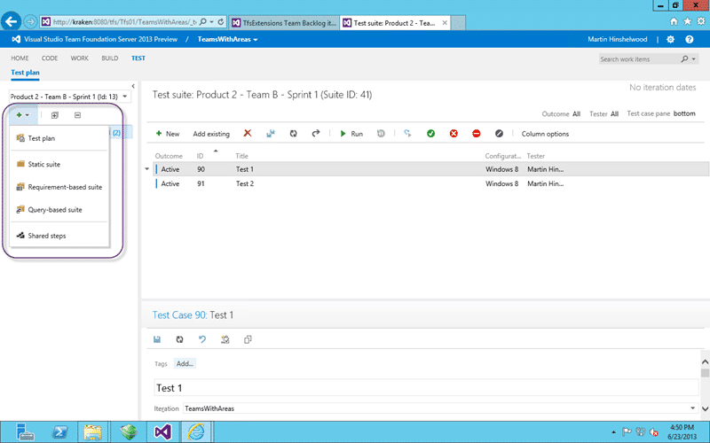
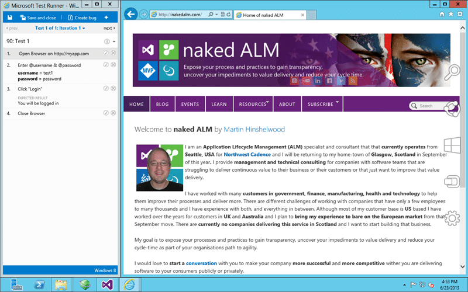
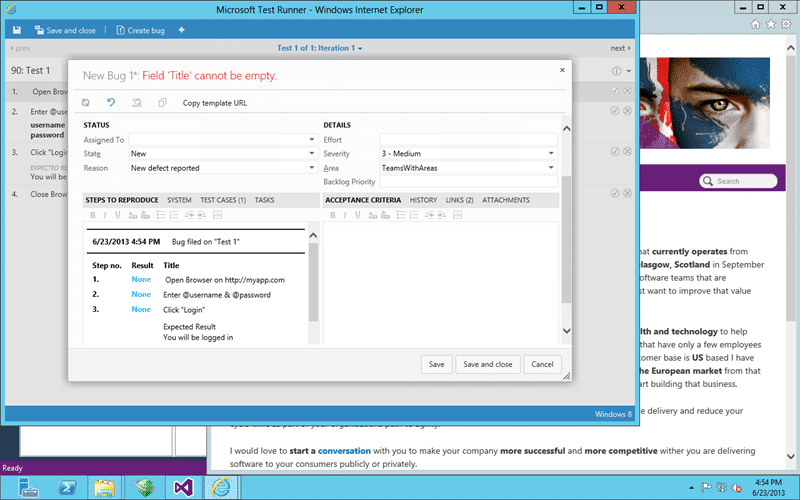

Steve Ballmer just announced the Visual Studio 2013 Go-Live preview at the Build summit not more than an hour ago so get Visual Studio 2013 Team Foundation Server while its hot! Remember that this Preview is covered by a Go-Live licence and is fully supported for production use.

There are tones of new features in both Visual Studio 2013 and Team Foundation Server 2013 and we are all interested in the new Visual Studio ALM features.

{ .post-img }

Go get the download started and while you are waiting let me show you three of the new killer ALM features that you will love:

- **Agile Portfolio Management with Team Foundation Server 2013** – versatile and customisable multi level backlogs
- **Team Collaboration with Team Foundation Server 2013** – Unlimited Team Rooms for collaboration
- **Testing with Team Foundation Server 2013** – Web based test management and execution

Let look at each one…

## Agile Portfolio Management with Team Foundation Server 2013

With the recent announcement of Visual Studio 2013 and some of the bigger rocks that the team have been working on. There will be many, many more announcements, but the bits that I have been waiting on have already arrived on Team Foundation Service. What is amusing is that Team Foundation Service is already a Sprint ahead and there are even more features on there. Its Sprint 48 in the Team Foundation Server 2013 Preview and they are already on Sprint 49 on Team Foundation Service. I am going to try and do a point in time look at the features and will be mentioning both as many of the features that are currently in the service will hit the server on the next drop…

### Main Attributes of Agile Portfolio Management

The new Agile Portfolio Management features are by far my favourite. We have been creating work arounds for years as these features are sorely needed. At last they are here…

  
{ .post-img }
Figure: Top 4 changes with Agile Portfolio Management in 2013

We can start with the idea that we get multiple backlogs. The purpose here is to have high level items at the top and then break them down into smaller items. In the new Out-of-the-box template you get Features that break down into Product Backlog Items. Features are something that transcend a single sprint add you may have to complete many Product Backlog Items across multiple Sprints and maybe even Releases to achieve them.

Add to that the ability to look-up or look-down from that backlog to see how those items fit into the grand schema and you get a powerful Portfolio Management capability while still maintaining your agility.

Up until now the “board” buttons have been a little confusing as they were on different menus and it was difficult to fathom the navigation between them. Now all of the boards are on the same level and this enables the additional feature of being able to view the boards of each sprint as well as the current one. That one was a much requested feature and now it is here..

### From the current backlog you can look-up or look-down

This is going to be a little bit confusing to explain for Team Foundation Server 2013 as this feature is ‘almost’ there.

  
{ .post-img }
Figure: Navigating Portfolio Management

If I am looking at my list of “Backlog Items”, selected above, I get the usual list of Product Backlog Items that I can order and reorder. But I may want to look, from here, **down** at how they are broken down into tasks or up and which **features** they are related to. If my team comes to me and identifies a blocked task I want to see what the impact is up the chain. Conversely if the business want to reprioritise a Feature then I might want to see which backlog items I need to reorder.

Once you are in this mode however you can’t currently reorder the items as you \[cant reorder a hierarchy\] and you need to switch back to the flat list to perform that task.

### Adding PBI’s to Features

There have been parentchild relationships in Team Foundation Server since they were introduced in TFS 2010 but the new tools that are being built on top of that core capability are starting to really take advantage of it.

  
{ .post-img }
Figure: Adding a new Product Backlog Item to a Feature

By far the easiest way to break an item down is to open it and use the Implementation tab. The Feature is no exception and you can easily open it and start creating children.

  
{ .post-img }
Figure: Adding an existing Product Backlog Item to a Feature

When you add a parent or child as an existing item in the Web Access you need to know the ID of one or the other. You open the work item, add  link and add the ID. It will lazy load it to give you a hint that you have the right one but that is about it. In Visual Studio you get a rich search function to help you…

Again as people start to use the new features the product team are getting feedback and iteratively delivering more value to us.

### Portfolio Backlogs

I have been told that you can have up to seven levels of work items from Task at the bottom all the way up. While anyone that has seven levels is ridiculously dysfunctional having a few lets us have different management levels prioritising their needs and seeing that priority reflected at each level.

Some of the demos I have seen have the following hierarchy:

- **Goal** – Embodies the 5-10 high level strategic goals that the organisation has and is likely owned by strategic leadership
- **Feature** – A list of features that reflects what the business need and when it should be delivered and is likely owned by Product Owner Office (POO)
- **Product Backlog Item** – Owned by the Product Owner it embodies their order for delivery

This gives you both the flexibility and visibility require to transparently present each levels desires.

### Colour coding of work items

Making it easier to to tell the work items apart. Watch out for a post on Friday telling you how...

  
{ .post-img }
Figure: Colour code each of your Work Item Types

Each of the Work Item Types are represented on all of the boards by a different colour. This colour can be configured and gives you a left pipe of that colour for lists and cards alike.

## Team Collaboration with Team Foundation Server 2013

Team collaboration is a major focus of the product team this time around. We just discussed features for hierarchical teams but what about getting the communication lines flowing. Email is painful and IM is not persistent enough so there must be some middle ground. In the old days teams used IRC chat and today there are a plethora of these sorts of tools for the community. Many such tools for agile teams are starting to spring up and the TFS team needed a solution as well.

  
{ .post-img }
Figure: Team Room

Each Team gets a Team Room link right on their dashboard that takes them to that teams room. You can create any rooms that you like with any members that you like in addition to the default room.

  
{ .post-img }
Figure: You can tag people and work items

When you are typing messages you can tag people and work items to allow you to have a much more interactive experience. Try it… I think you will be surprised how useful it is.

  
{ .post-img }
Figure: Create alerts

You can create ‘alerts’ that ping onto the team room when work items are edited or is a build completes. You can even have an alert when code changes. These features make team rooms very effective, but be warned… you should have small agile teams for this to work. That does not mean that you can’t have 50 people working on a single product but it does mean that they will probably operate as at least 5 teams…

## Testing with Team Foundation Server 2013

The Test tools were introduced in Team Foundation Server 2010 and made to work in Team Foundation server 2012. From Team Foundation Server 2012 QU2 you have been able to create and edit tests cases in the Web Access and even to run those tests.

  
{ .post-img }
Figure: Creating Test plans and Suits in the Web Access

Now that we are in the first, and early, stages of Team Foundation Server 2013 we can add Test Plan and Test Suite management to that already powerful capability. This allows us to spend more of out time in the web access and enables both user acceptance testing and cross platform capabilities.

  
{ .post-img }
Figure: Edit augmentations in Team Foundation Server 2013

While we were able to edit test steps in the web form 2012.2 there are a plethora of small but significant improvements to the UI that make it eminently more usable. The tabbing has been improved and it is now really intuitive to manage the test steps here. You can even add attachments to a test step which I know a few of my customers asked for.

  
{ .post-img }
Figure: Test Runner in the Web Access for Team Foundation Server 2013

With the web based test runner you get cross platform web test results and while you don’t get the fantastic data adapters that you get in Microsoft Test Manager you do get awesome abilities. If your test team are anything like my customers you might be using Excel and Word to store you test cases and can’t figure our which tests you have run against which build or even if they have been run at all.

Even if you are just using the web capabilities you get reporting and coverage information at your fingertips.

  
{ .post-img }
Figure: Creating bugs was never easier

Even though we don’t have the rich data adapters we still get our steps to reproduce filled out for us… and you can’t turn your nose up at that.

## Conclusion

These are but a few of the new features in Team Foundation Server 2013 let alone what is available in Visual Studio 2013 for developers and don’t forget the new iterative nature of feature delivery mean that thing just keep getting better Sprint on Sprint…

{ .post-img }

I have already done one upgrade of a customers two terabyte TFS 2012 instance with no issues and I am hopefully working on my next one as you read this… Download, install & Play… be a kid again with Team Foundation Server 2013.
