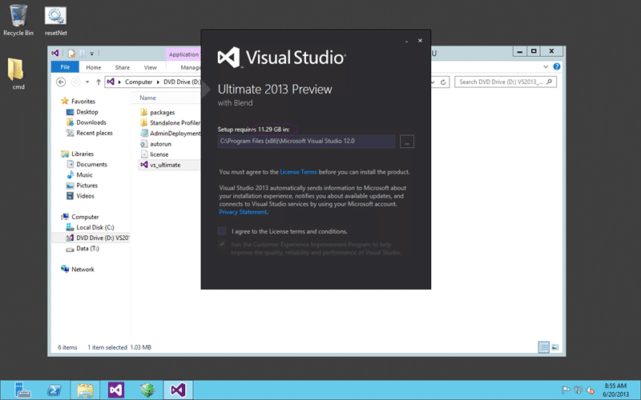
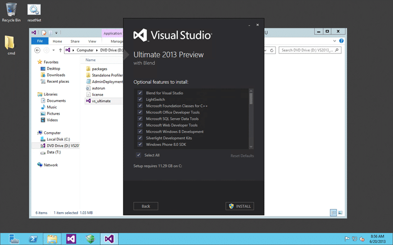
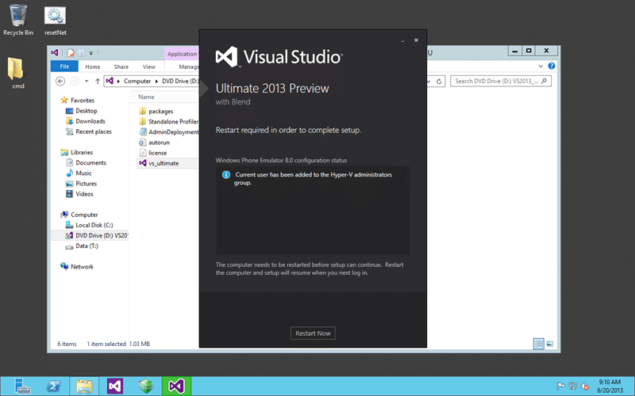
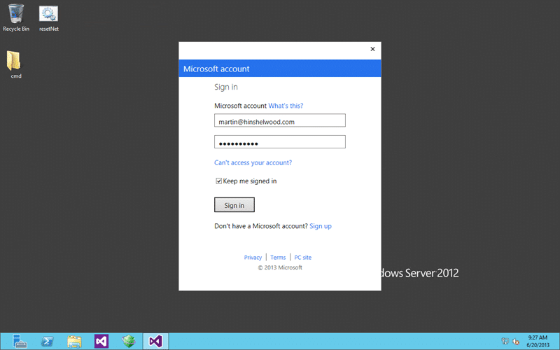
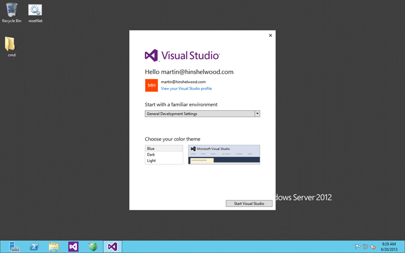
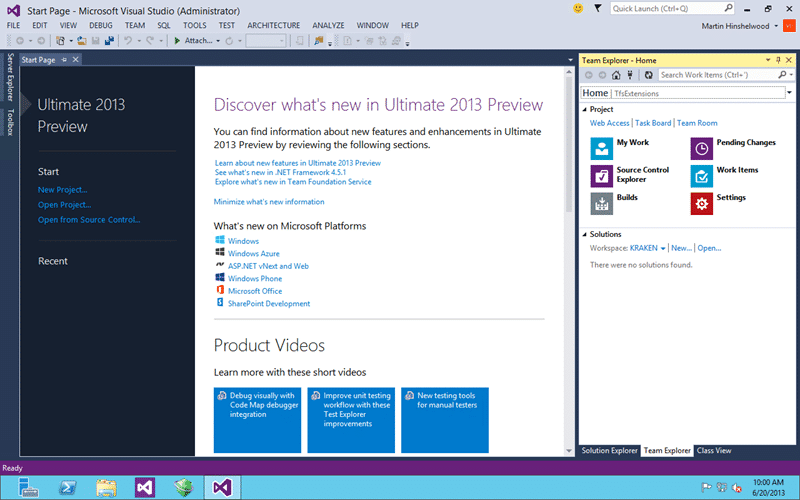

I will be installing Visual Studio 2013 on Server 2012 side-by-side with Visual Studio 2012 on my development rig.

Installing and configuring Visual Studio has always been a cinch and Visual Studio 2013 is no exception. As most of you know I always run developer tools in a VM. The main reason for this is the ability to reinstall my host OS and get up and running very quickly. So for example when Windows8.1 becomes available I will not have to think twice about upgrading and just do it. I will be back up and running with Visual Studio in my VM within 15 minutes of starting the process. This level of flexibility is awesome.

- [Get Visual Studio 2013 & Team Foundation Server 2013 while its hot!](http://nkdagility.com/get-visual-studio-2013-team-foundation-server-while-its-hot/)

In this case both Visual Studio 2012 and Visual Studio 2013 will live side by side on the same system. This has been the case for every major Visual Studio release and I know folks that have Visual Studio 2005 as well.

  
{ .post-img }
Figure: Visual Studio 2013 Ultimate install is huge

One thing I did note is that the installation requirements have jumped from 7.5GB to over 11GB for Visual Studio 2013 Ultimate. I am not sure what they are for Premium or Professional but this is fairly hefty. It is however no big deal and I am happy to give up the space for Visual Studio.

  
{ .post-img }
Figure: Choose what to install with Visual Studio 2013

As a rule I always install everything, which is the default. Too many times I have been hit by missing features whenever I don’t. Its up to you, but removing features does not free up that much disks space as it is the core of Visual Studio that is the largest component by far.

  
{ .post-img }
Figure: Installing Visual Studio 2013 Ultimate

The install itself will take no linger than 5-10 minutes (I am running on SSD’s) unless you have to “Acquire” the contents. I have everything downloaded in an ISO so do need to reach out to the internet for anything large.

  
{ .post-img }
Figure: Reboot during install of Visual Studio 2013 Ultimate

There are a lot of new features under the covers and you may need to reboot, as I did, before you can complete the install.

  
{ .post-img }
Figure: Successful installation of Visual Studio 2013 Ultimate

And that's it… the install end to end including the reboot took less than 10 minutes and I had no errors on a box that has been around the block with preview versions of all sorts of things.

  
{ .post-img }
Figure: New Launch has optional Microsoft ID

As a sign of the times you can optionally log into Visual Studio 2013 with your Microsoft ID. Its not required, but I expect that for things like [http://tfs.visualstudio.com](http://tfs.visualstudio.com) it will make things simpler. You should however be aware that this will likely at some point link into the MSDN licence that you have associated with your Microsoft ID. I currently have no evidence that this is the case but it is a logical next step.

I want all of the cool integrated experiences of Visual Studio linking seamlessly to [http://tfs.visualstudio.com](http://tfs.visualstudio.com) and with my Azure account so I will be signing in.

  
{ .post-img }
Figure: Links into normal Microsoft ID login

Not only does it just display the right stuff it worked seamlessly with two-step authentication that I have enabled. I just entered my code when prompted and away I go.

  
{ .post-img }
Figure: Enter your details for Visual Studio 2013

If you log in with your live credentials you will need to accept the new Terms of Service and provide a few other details.

  
{ .post-img }
Figure: Configure Visual Studio 2013 how you like

Then all you need to do is chose your theme and development settings. Again you guys know I am a stickler for defaults and her is no exception. But you should experiment to see what you like as all of these options are available in “Tools | Options” in the IDE.

  
{ .post-img }
Figure: New Visual Studio 2013 UI

The new UI looks fairly clean and the new Team Explorer interaction looks a lot more intuitive. Only time will tell and I am sure that I will have lots of information for you as I use it more.

- [Get Visual Studio 2013 & Team Foundation Server 2013 while its hot!](http://nkdagility.com/get-visual-studio-2013-team-foundation-server-while-its-hot/)

Go download it now and be a kid again…
