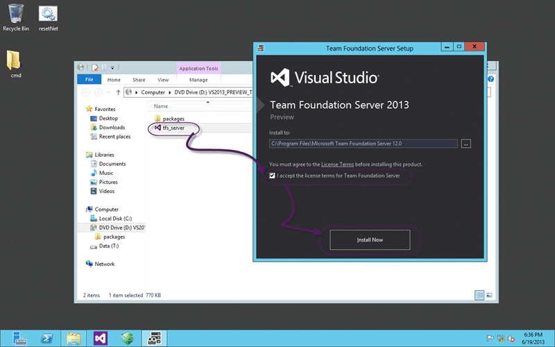
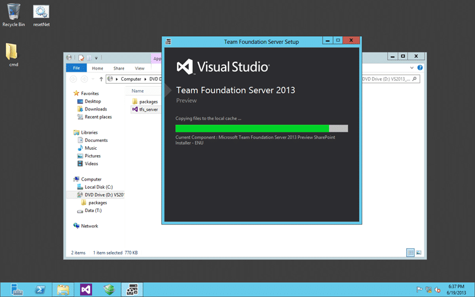
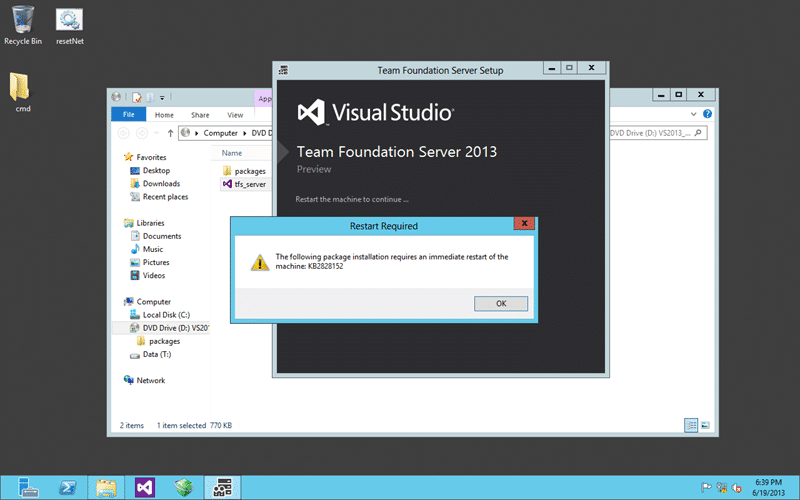
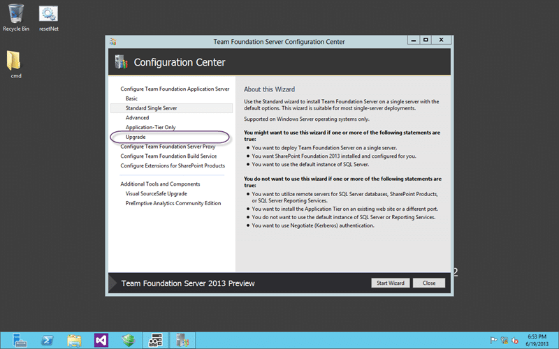
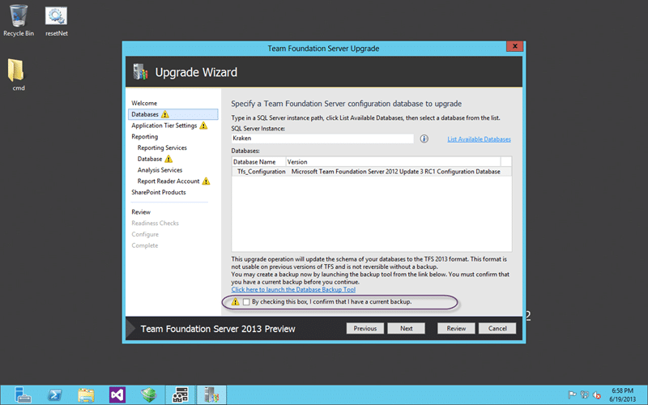
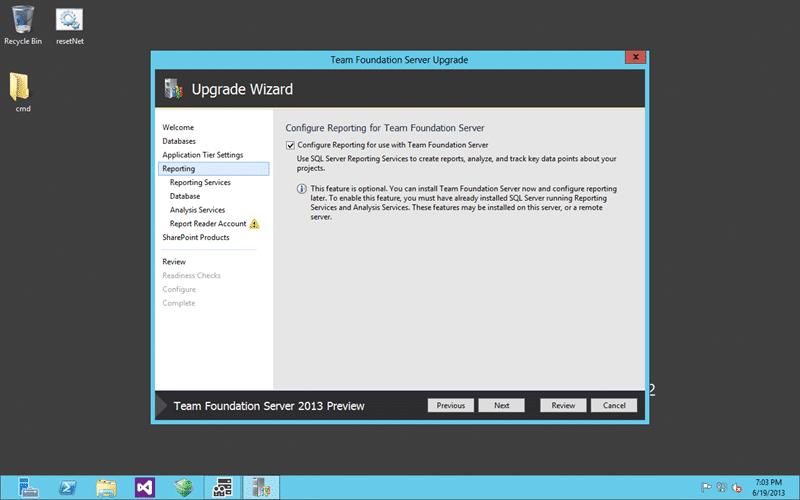
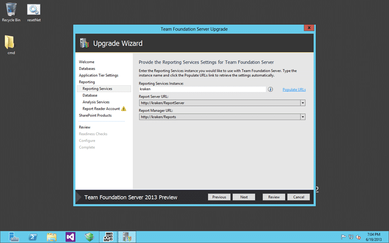
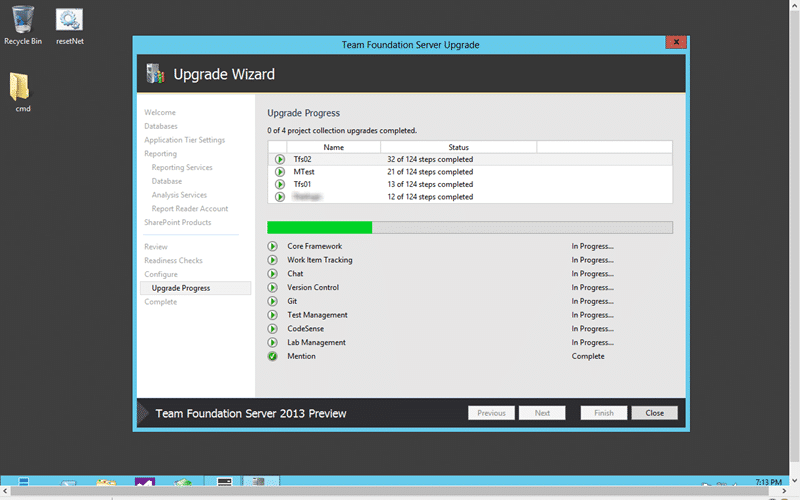
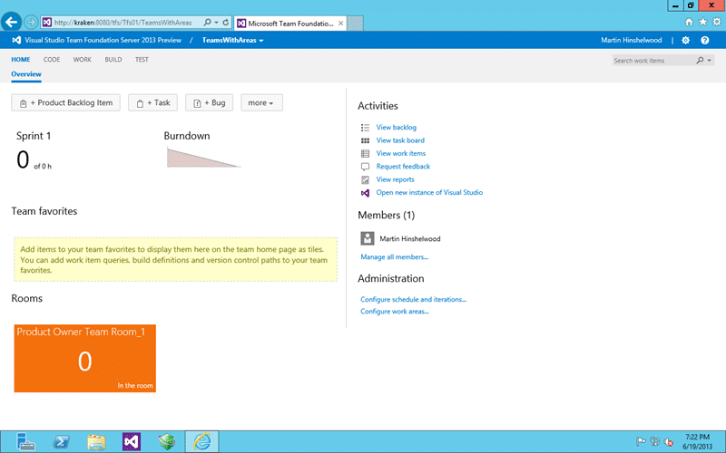

With the release of Team Foundation Server 2013 I need to upgrade all of my servers. I have a few customer installs getting prepped and I wanted to get a look see.

I run a TFS server locally to do demos; prove out the existence, or lack, of bugs; and to figure out what is going on under the covers. This server (Kraken) is a virtual machine running locally and can easily be backed up and restored. My recommendation is to never attempt an upgrade without a backup and preferably upgrade to a new server.

- Update 2013-07-23 - Another seamless upgrade. This time with 8 collection and then a consolidation down to a single Team Project

- [Get Visual Studio 2013 & Team Foundation Server 2013 while its hot!](http://nkdagility.com/get-visual-studio-2013-team-foundation-server-while-its-hot/)

The main reason for a new server is that there are some major changes to the OS as part of the Team Foundation Server install. There is usually some sort of .NET update as well as core Windows components. Backup and Snapshot or use a new VM its up to you…

  
{ .post-img }
Figure: Taking a backup is easy with Scheduled Backups on Team Foundation Server 2012

My first order of business is to take an in place backup and a snapshot of my VM. In this case I am upgrading in place and I can rollback with both of these options. If you are moving to a new server and will be changing the location of the backups make sure you check out [TFS 2012.3 Issue – Scheduled Backups gives a TF400998 when reconfigured](http://nkdagility.com/tfs-2012-3-issue-scheduled-backups-gives-a-tf400998/) as I ran into a little issue with that recently. It is most likely to occur when also doing a domain migration, but can just be moving servers.

  
{ .post-img }
Figure: Set the Install path for Team Foundation Server 2013

I always opt for the default path and recommend that you do the same. This is no value to moving it to another disk and that only adds complexity. Certainly have all of your data on another disk, but putting files that you need to reinstall anyway on another disk is a little silly.

  
{ .post-img }
Figure: Installing Team Foundation Server 2013

The install is smooth as always and the polish is amazing. The only thing that I can grip about is the need to reboot.

  
{ .post-img }
Figure: Rebooting during install of Team Foundation Server 2013

I always feel that this is unnecessary but when you are talking about some of the core components for Windows I guess you have to just suck it up and reboot.

  
{ .post-img }
Figure: 5 minutes later we have Team Foundation Server 2013 installed

No really, it only took 5 minutes to install and I did not prep the machine at all. I am however using Windows Server 2012 with SQL Server 2012 and I have the latest updates for both. And that includes **SQL Server 2012 SP1 which is required** for Team Foundation Server 2013.

- [Download Service Pack 1 for Microsoft® SQL Server® 2012](http://www.microsoft.com/en-us/download/details.aspx?id=35575)

After you have everything up to scratch you can go ahead and configure. I will be using the Upgrade wizard but you may be installing from scratch so read the text on the right for each option carefully to get it right. Pay close attention to anything that mentions SQL Express as you may or may not want that.

  
{ .post-img }
Figure: Running the Upgrade gauntlet with Team Foundation Server 2013

Running the upgrade is pretty easy but you will need a few bits of information. First up is the acceptance that you do indeed have a backup. If you don’t… go make one now… yes… even if this is your trial box. Have a backup..

  
{ .post-img }
Figure: Renter your service account for Team Foundation Server 2013

As all of the account details are encrypted and as a security measure for your data you need to re-enter your passwords to connect everything up. Enter the password and click “test'”.. did you get a green tick?

  
{ .post-img }
Figure: Configure reporting services for Team Foundation Server 2013

As I have all of the reporting bits installed I will need to configure them. SharePoint however I don’t have here, but I will be creating another post for that.

  
{ .post-img }
Figure: Validate your Report Server Instance for Team Foundation Server 2013

Most of these screens are just validation and while I am restoring to the same server you may be having to change a few things to match a new environment. If you are moving your reporting services server off to another environment you should un-tick the box on the first screen for Reporting and reconfigure it after.

Once you have validated all of the details and entered the Report Reader account password (did you get all green ticks) you can move on to the upgrade validation step (remember I have no SharePoint here.)

  
{ .post-img }
Figure: Validate that the settings are correct for Team Foundation Server 2013

The Readiness Checks make sure that everything that can be checked is. It validates that what you entered works and that the servers and services are available. It checks permissions and access so you are fairly certain at this point that everything will work. There be odd and occasional data issues but I rarely see them beyond server that have multi terabyte databases.

I get a TF255193 warning because I am using the same account for reporting as for the TFS Service account and that is deemed a risk. On a production box I agree, here I don't care.

  
{ .post-img }
Figure: Upgrading the Configuration data of Team Foundation Server 2013

The upgrade really happens in three stages. The first stage is the flat installation of the files. TFS 2012 has been uninstalled and the new bits for Team Foundation Server 2013 which we did before we started any configuration of Team Foundation Server.

  
{ .post-img }
Figure: Success at upgrading the Configuration to Team Foundation Server 2013

The second is the setup of the system and upgrade of the Configuration database. This sets up IIS, creates the websites, application pools and configures reporting before upgrading the Configuration database. And we have not yet even looked at the collections

  
{ .post-img }
Figure: Collections upgrade asynchronously in Team Foundation Server 2013

Each of the Team Project Collection will be attached and upgraded asynchrony and the bigger they are the longer they take. In this case I don’t have a Team Project Collection over a couple of gig and it was all over in under 10 minutes. Now you may be thinking "But Martin you have a really small databases of course it only took 10 minutes but I have more data". Well for this I wanted to maintain a table of expectant times as this has often been a common:

How long does it take to upgrade to TFS 2013?
| Instance | Source Version | Component | Size | Time to complete (m) |
| --- | --- | --- | --- | --- |
| #1 - Sandbox | 2012.3 RC2 | Configuration | 1054.88 MB | <1 |
| Tfs01 (Collection) | 727.06 MB | <2 |
| Tfs02 (Collection) | 142.63 MB | <1 |
| Tfs_MTest (Collection) | 217.31 MB | <1 |
| Collection #4 | 156.63 MB | <1 |
| #2 - Customer | 2012.2 | Configuration | 100GB | <2 |
| Collection #1 | 1GB | <1 |
| Collection #2 | 2TB | <4 |
| #3 - Customer | 2012.1 | Configuration | 0.5GB | <3 |
| Collection #1 | 40GB | <5 |
| #4 - Customer | 2012 (RTM) | Configuration | 1GB | <4 |
| Collection #1 | 1GB | <5 |
| Collection #2 | 1GB | <4 |
| Collection #3 | 1GB | <6 |
| Collection #4 | 1GB | <6 |
| Collection #5 | 2GB | <8 |
| Collection #6 | 1GB | <8 |
| Collection #7 | 1GB | <5 |
| Collection #8 | 1GB | <9 |

  
{ .post-img }
Figure: Success upgrading to Team Foundation Server 2013

This upgrade was totally painless (which does not mean that yours will be) and I could not believe that the Team Foundation Server Product Team would yet again make it easier but it just seams a little slicker than before.

So did it work?

  
{ .post-img }
Figure: Successful upgrade to Team Foundation Server 2013

Awesome.. Now all I have to do is upgrade the process templates to the new version and I will get all of the awesome features.

Guess what I am doing next?

## Conclusion

I would definitely recommend that you move to Team Foundation Server 2013 as soon as you are able, especially if you are on 2012.3 already. If you are happy to work with Go-Live then you should look no further than 2013… at least until 2013.1 comes around…

- [Get Visual Studio 2013 & Team Foundation Server 2013 while its hot!](http://nkdagility.com/get-visual-studio-2013-team-foundation-server-while-its-hot/)

Go download it now and be a kid again…
