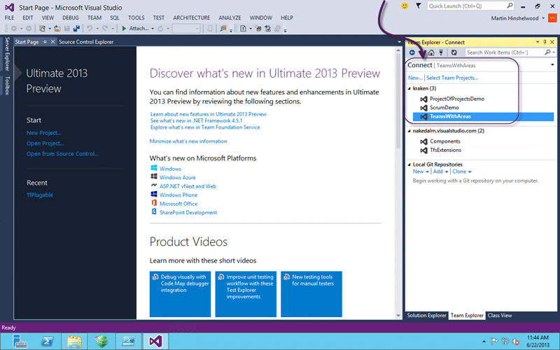
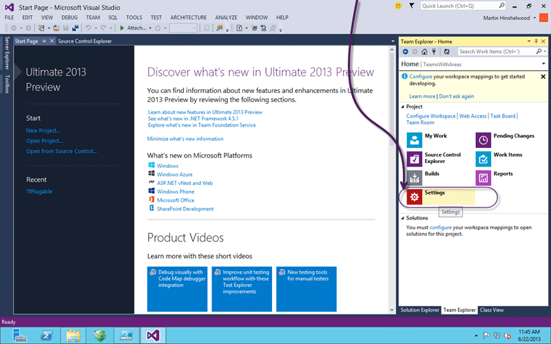
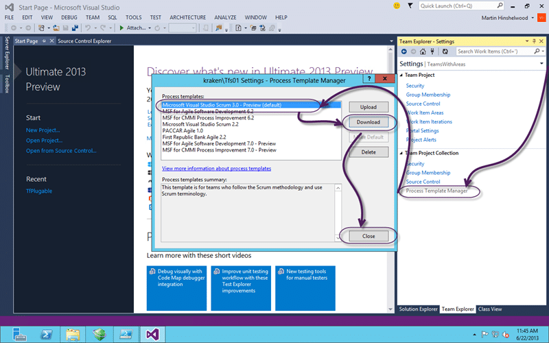

You want to upgraded to the Visual Studio Scrum 3.0 Process Template in Team Foundation Server 2013 but you really want to upgrade your whole process template in place and not jut enable new features.

This will enable the new features and give you the latest layout. Just like creating a new Team Project but with your data intact.

Note If you want to only enable the new features in your existing process template you can follow [Configure features in Team Foundation Server 2013](http://nkdagility.com/configure-features-in-team-foundation-server-2013/) instead.

- [Get Visual Studio 2013 & Team Foundation Server 2013 while its hot!](http://nkdagility.com/get-visual-studio-2013-team-foundation-server-while-its-hot/)

When you upgrade your TFS instance to a new version it does not upgrade the process for any of your existing Team Projects. It is kind of like building a house from blueprints. Once it is built and you have been living in it how happy would you be if the original builder came back and switched the rooms around?

[![image[2]](images/image2_thumb-1-1.png "image[2]")](http://nkdagility.com/files/2013/06/image210.png)  
{ .post-img }
Figure: Feature Backlog is missing from Agile Planning tools

My favourite features in TFS 2013 is the Agile Portfolio Management tools and unless you create a new project you will not get them. I am sure that the product team will include a wizard to add the features once 2013 matures but for right now we need another solution. Indeed when the product team do provide a solution they are usually ‘injecting’ the new features into your already existing template. This means that you don’t get the new template… just the new features. I prefer getting the new template…

Upgrading your Visual Studio Scrum Team Project to Visual Studio Scrum 3.0 is relatively simple.

1. Download Visual Studio Scrum 3.0 Process Template from TFS
2. Re-apply any customisations that you use
3. Import your new Process Template

These are all fairly simple steps but you will need to be an Administrator on the Team Foundation Server 2013 Team Project Collection and be using the latest Visual Studio 2013 Team Explorer tools.

Note No, there is no version of the Power Tools that currently works with Visual Studio 2013. I expect we will see one fairly soon.. just not quite yet.

## Download Visual Studio Scrum 3.0 Process Template from TFS

To get going we need to first download the latest version of the Process Template that we want to move to. In this case it is the Visual Studio Scrum 3.0. To do that we need to use Visual Studio 2013 Team Explorer and be familiar with the WitAdmin.exe tools (remember no Process Template Editor yet and the 2012 tools cant work with the new features.)

  
{ .post-img }
Figure: Use “Team Explorer | Connect” to pick a Team Project

We need to be connected to the Team Foundation Server 2013 that we want to get the Process Template from and the easiest way to do this is to connect to any Team Project in the list.

  
{ .post-img }
Figure: Go to “Team Explorer | Home | Settings”

While you marvel at the new cleaner UI head on over to the “Settings” option for your project.

  
{ .post-img }
Figure: Go to “Process Template Manager | Microsoft Visual Studio Scrum 3.0 – Preview | Download”

We then need only to open the Process Template Manager and download the Process Template to the desktop. If you just select “desktop” the tool will create a folder of the same name as the process template.

## Re-apply any customisations that you use

Now comes the bit that I am only going to give you general guidance on. This one is totally dependant on the types and number of customisations that you have made to your existing template. If you are doing any form of agile and you have not yet migrated to the Visual Studio Scrum process template then I suggest that you do so…

- [Upgrading your process template from MSF for Agile 4 to Visual Studio Scrum 2.x](http://nkdagility.com/upgrading-your-process-template-from-msf-for-agile-4-to-visual-studio-scrum-2-x/ "Upgrading your process template from MSF for Agile 4 to Visual Studio Scrum 2.x")

As I have always maintained that the “MSF for Agile” template was designed for and by Microsoft Consulting Services nearly 10 years ago and there is very little ‘agile’ about it. It is a light weight traditional template that will not help you in your quest for agility.

Anyway… You need to identify all of the customisations that you made to your template and implement them fresh in the new Microsoft Visual Studio Scrum 3.0 template. This will take time and you get to play with the XML until you get it right.

I would always recommend that you practice on a test server and that you make as minimal changes as you can possibly get away with. Some common legitimate changes to the Scrum template:

- **Adding Original Estimate and Completed Work on Task** – Pointless in the agile world but gives some of your more Neolithic project managers warm fuzzies.
- **Enabling ‘team field’ for Teams without Areas** – Many teams already use “Area Path” for product and have a drop down list for Team…

Once you are happy that your template works and that you data maps you can move onto updating your Team Project.

## Import the custom Visual Studio Scrum 3.0 Process Template

Now that we have our custom Process Template we can go ahead and overwrite our old Visual Studio Scrum 2.0 or 1.0 instances. Remember to test this process as well and the easiest way to do that is to clone your TFS instance to other hardware and try out the upgrades there.

Note Don’t forget to change the server ID ([tfsconfig changeserverid](http://msdn.microsoft.com/en-us/library/vstudio/ee349259.aspx)) if you are doing a clone ([Jeff](https://twitter.com/tfsjeff).. that means you)

```
 Param(
       [string] $CollectionUrlParam = $(Read-Host -prompt "Collection (enter to pick):"),
       [string] $TeamProjectName = $(Read-Host -prompt "Team Project:"),
       [string] $ProcessTemplateRoot = $(Read-Host -prompt "Process Template Folder:")
       )

$TeamProjectName = "teamswithareas"
$ProcessTemplateRoot = "C:UsersmrhinshDesktopTfsProcessTemplatesMicrosoft Visual Studio Scrum 3.0 - Preview"
$CollectionUrl = "http://kraken:8080/tfs/tfs01"


$TFSConfig = "${env:ProgramFiles}Microsoft Team Foundation Server 11.0ToolsTFSConfig.exe"
$WitAdmin = "${env:ProgramFiles(x86)}Microsoft Visual Studio 12.0Common7IDEwitadmin.exe"

$witds = Get-ChildItem "$ProcessTemplateRootWorkItem TrackingTypeDefinitions"

foreach( $witd in $witds)
{
    Write-Host "Importing $witd"
    & $WitAdmin importwitd /collection:$CollectionUrl /p:$TeamProjectName /f:$($witd.FullName)
}
& $WitAdmin importcategories /collection:$CollectionUrl /p:$TeamProjectName /f:"$ProcessTemplateRootWorkItem TrackingCategories.xml"
& $WitAdmin importprocessconfig /collection:$CollectionUrl /p:$TeamProjectName /f:"$ProcessTemplateRootWorkItem TrackingProcessProcessConfiguration.xml"
```

The PowerShell above loops through the Work Item Types defined in the downloaded Process Template and uploads each one. It then goes on to update the Categories and the new Process Configuration. In 2012 we had both a Common Process and an Agile Process configuration but it looks like the team have amalgamated it to a single configuration. Which does make sense as one could never remember which order to upload each one and there were dependencies.

DONE

## Conclusion

You should now have not just ‘enabled features’ but we have architected and rebuilt the building to be faithful too the new look and feel for the updated Microsoft Visual Studio Scrum 3.0 Process Template.

- [Get Visual Studio 2013 & Team Foundation Server 2013 while its hot!](http://nkdagility.com/get-visual-studio-2013-team-foundation-server-while-its-hot/)

Enjoy…
