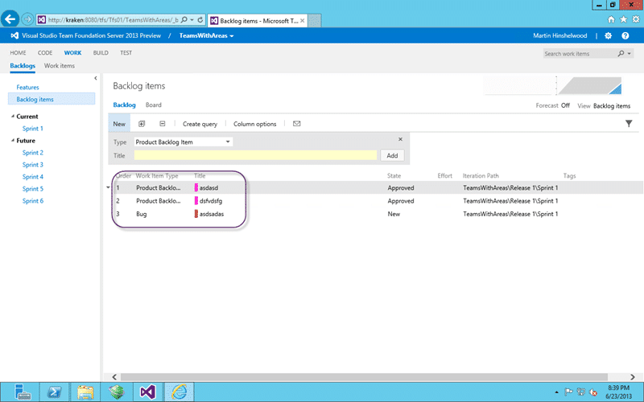

If you want to customise the colours in Team Foundation Server 2013 Agile Planning Tools you need to download and edit the Process Configuration file that tells TFS how to configure many of the features in the Web Access.

There used to be two files in Team Foundation Server 2012 but this was confusing and the amalgamation to a single configuration file just made sense.

[](http://nkdagility.com/files/2013/06/image471.png)  
{ .post-img }
Figure: Colour coded Work Item Types are easy to distinguish

The colours that you pick will be displayed wherever a work item is displayed. Wither that is in a list or a card on one of the boards the same coloured bar will be displayed on the left. This really helps distinguish between them and highlights things like Bugs in a list of Product Backlog Items.

To configure this we need to first export (download) the existing processing configuration to a location we can find.

```
$TeamProjectName = "teamswithareas"
$tempFolder = "C:temp"
$CollectionUrl = "http://kraken:8080/tfs/tfs01"
$WitAdmin = "${env:ProgramFiles(x86)}Microsoft Visual Studio 12.0Common7IDEwitadmin.exe"

# Export the existing Processing configuration
& $WitAdmin exportprocessconfig /collection:$CollectionUrl /p:$TeamProjectName /f:"$tempFolderProcessConfiguration.xml"
```

Once you have that we need to find and edit the colours and Paint as usual does not cut the mustard. You will need to know the hex value of the colours and that can be easily found if you use something like Paint.Net or [http://www.colorpicker.com/](http://www.colorpicker.com/ "http://www.colorpicker.com/") where they let you pick colours.

Note These colours are 8 digit HEX as they include transparency. The first two digits are the setting for transparency and “FF” denotes fully visible.

```
<workitemcolors>
  <workitemcolor name="Product Backlog Item" secondary="FFD6ECF2" primary="FF009CCC" />
  <workitemcolor name="Feature" secondary="FFEEE2F2" primary="FF773B93" />
  <workitemcolor name="Task" secondary="FFF6F5D2" primary="FFF2CB1D" />
  <workitemcolor name="Bug" secondary="FFFAEAE5" primary="FFCC293D" />
  <workitemcolor name="Code Review Request" secondary="FFFCEECF" primary="FFFF9D00" />
  <workitemcolor name="Code Review Response" secondary="FFFCEECF" primary="FFFF9D00" />
  <workitemcolor name="Feedback Request" secondary="FFFCEECF" primary="FFFF9D00" />
  <workitemcolor name="Feedback Response" secondary="FFFCEECF" primary="FFFF9D00" />
  <workitemcolor name="Impediment" secondary="FFFCEECF" primary="FFFF9D00" />
  <workitemcolor name="Shared Steps" secondary="FFFCEECF" primary="FFFF9D00" />
  <workitemcolor name="Test Case" secondary="FFFCEECF" primary="FFFF9D00" />
</workitemcolors>
```

If you open the XML and look for the “workitemcolors” element (no idea why they insist on spelling it wrong) you will find an entry for each of the Work Item Types available.

```
$TeamProjectName = "teamswithareas"
$tempFolder = "C:Temp"
$CollectionUrl = "http://kraken:8080/tfs/tfs01"
$WitAdmin = "${env:ProgramFiles(x86)}Microsoft Visual Studio 12.0Common7IDEwitadmin.exe"

# Import the new Processing configuration
& $WitAdmin importprocessconfig /collection:$CollectionUrl /p:$TeamProjectName /f:"$tempFolderProcessConfiguration.xml"
```

All we need to do is edit the colour codes and then import (upload) the process configuration again. Here I am going to change the PBI to Pink (#FF16D0) which has a value of FFFF16D0 with a secondary (faded) colour of FFFFD1D0.

  
{ .post-img }
Figure: Lovely pink PBI’s

And voilà you now have just what you always wanted… pink PBI’s.
